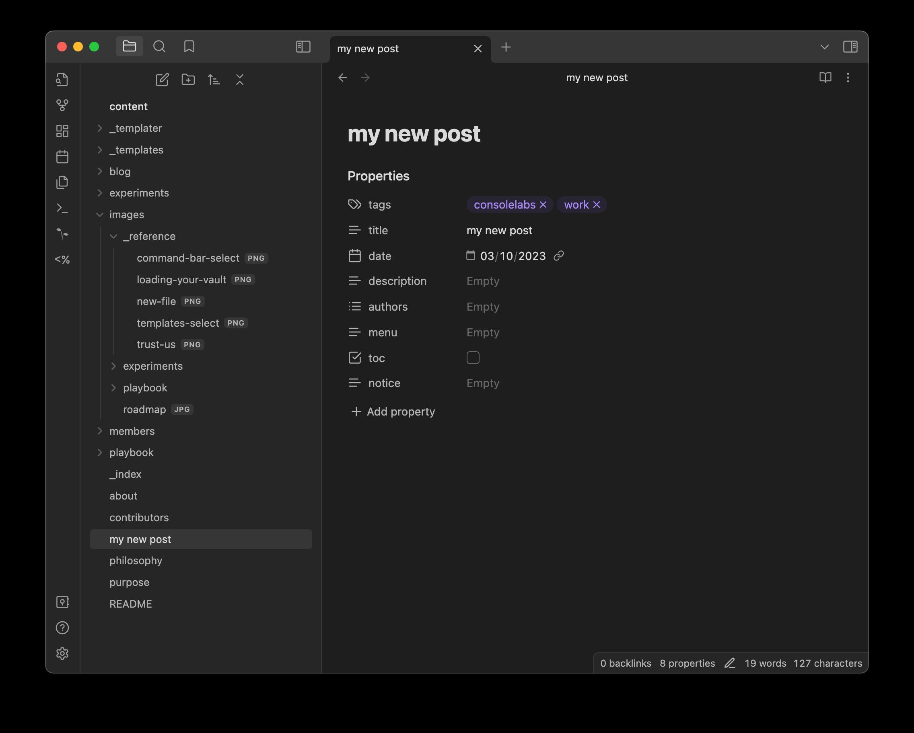
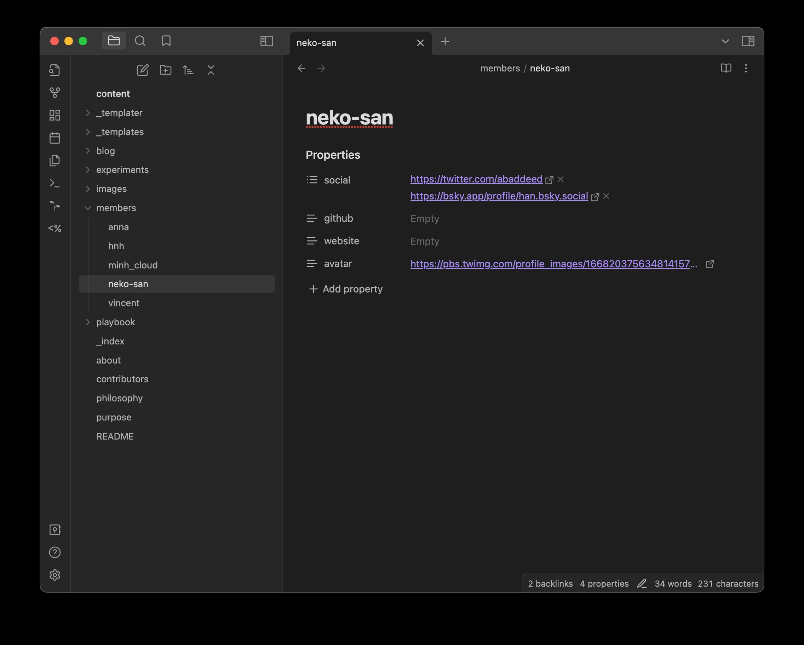
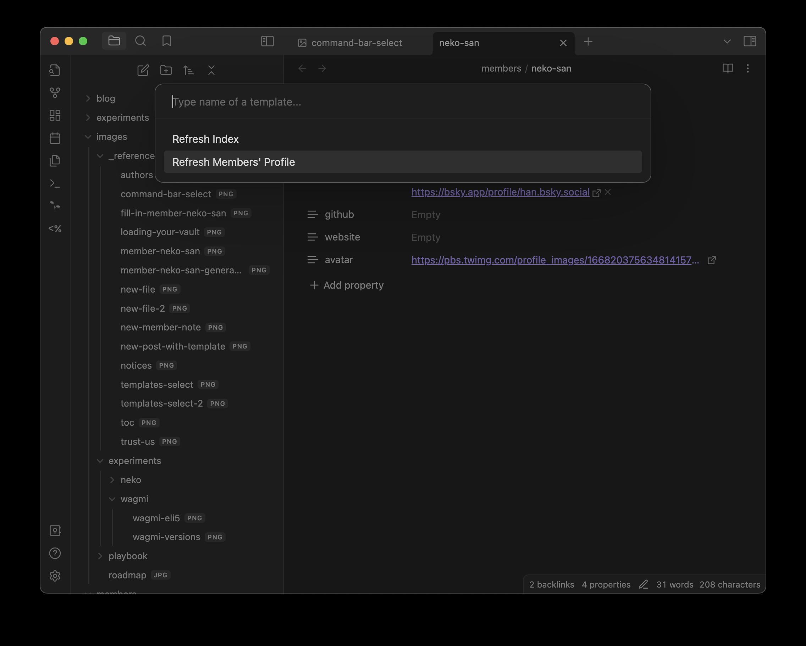

This is an internal README for us writers ✍️. Any file that has the suffix `README.md` will be ignored during deployment to https://note.d.foundation/, so feel free to add upon this and other READMEs.

The contents of this project is mainly managed with [Obsidian](https://obsidian.md/), so you need to download the app from their website to get started. We expect that you also know your way with `git`. You can also use [GitHub Desktop](https://desktop.github.com/) if you aren't too tech savvy.

This repo contains the practices and notes of the Dwarves Foundation, a software development company that builds products with high standards and quality. The content covers various topics such as engineering, design, product management, culture, and more.

We use some plugins to enhance our workflow on Obsidian, such as:

- [Obsidian Git](https://github.com/denolehov/obsidian-git) A plugin that helps with automating git interactions for our non-tech folks.
- [ImageConverter](https://github.com/xryul/obsidian-image-converter): A plugin that helps with mass compression of local images.
- [Local Images Plus](https://github.com/Sergei-Korneev/obsidian-local-images-plus): A plugin that helps compress and localize images.
- [Dataview](https://github.com/blacksmithgu/obsidian-dataview): A SQL-like plugin that helps us query and manage our Obsidian vault as a database.
- [Templater](https://github.com/SilentVoid13/Templater): A plugin to help automate templates and run arbitrary code on our vault.

## Table of Contents

1. [Getting Started](#getting-started)
	1. [Creating a new post](#creating-a-new-post)
		1. [Making your post stand out](#making-your-post-stand-out)
	2. [Creating a new member](#creating-a-new-member)
2. [What gets autogenerated?](#what-gets-autogenerated)
3. [Make sure to compress your images](#make-sure-to-compress-your-images)
4. [How does this all work?](#how-does-this-all-work)

## Getting Started

The general idea is getting this repository to load as a "vault" in Obsidian. The configuration files are baked into the repository, so you don't need to mess with the settings.
### Prerequisites

For our tech people, you only need `git` and some basic knowledge on how to clone a repository, and you should be good. For everyone else, we recommend installing the following packages:

- [Git Credential Manager](https://github.com/git-ecosystem/git-credential-manager/blob/release/docs/install.md)
- [GitHub Desktop](https://desktop.github.com/)

You will also need to add an [SSH key to your GitHub settings](https://docs.github.com/en/authentication/connecting-to-github-with-ssh/adding-a-new-ssh-key-to-your-github-account). You can run our script 

### Working with our content

1. Clone this repository with either git or GitHub Desktop. You can get started with GitHub Desktop here: https://docs.github.com/en/desktop/overview/getting-started-with-github-desktop. Otherwise:
	```
	git clone https://github.com/dwarvesf/content
	```
2. After cloning the repository, open up Obsidian and load your new vault:
	1. Open the folder to where you cloned your repository
	   
	2. Once you've loaded the vault, make sure to trust the plugins and settings. Trust us, we won't do anything bad 🙈:
	      
3. You should then be good to go! Make sure to check out [Obsidian's documentation](https://help.obsidian.md/Home) for more info on how to use it.

### Creating a new post

Making a new post is fairly straightforward. We have a set of templates to help you get started:
1. First, create a new file and name it however you like:
   
2. **We have updated to make it so the metadata/frontmatter for new files will automatically be created**. - You will be able to see your frontmatter (your metadata) populated with some basic data. Fill in your `tags`, `authors`, `description`, and change your title if neccesary:
   - `tags`: a list of tags that have related keywords or arbitrary relationships with other terms
   - `title`: the title of your post, which is independent from the title of your file
   - `date`: an autogenerated date to represent the day that you created the file
   - `description`: a short description of what your content is about
   - `authors`: a list of authors who participated in the writing of the file
   - `menu`: a label to help add the link to the navigation sidebar at https://note.d.foundation/
   - `toc`: a boolean that generates a table of content on the page displayed at https://note.d.foundation/
   - `notice`: a description that is represented as a visual banner to notify disclaimers or notices
   
### Creating a new member

We have a folder of members to profile who contributes to the vault. We use this as reference for the `authors` list when creating a new post.

Creating a new member has a similar process to creating a new post, with some extra stuff:

1. First, you can create a note in a targeted directory. Create a note in the members folder: 
   
2. Then name your note to whichever username you find fits you the most:
   
3. Press **`⌘ + Shift + P`** to open Obsidian's command bar and choose the template `New Member`:
   
4. You will then see your file generated with some properties. Fill in your social details and whatever you find is appropriate:
   - `social`: a list of social media website profiles that you have
   - `github`: a link to your GitHub profile page
   - `website`: a link to your personal website
   - `avatar`: an image link to your avatar. If you don't supply one, a placeholder will be displayed on the website instead
   
5. **(Optional)** If you've written some notes before and want your profile to be generated, press `⌘ + Shift + P` to bring up Templater and select `Refresh Members' Profile`
   
6. When you re-open up your note, you will see that your member file will have generated a profile card, along with some of their contributed written notes in the vault:
   
7. **Committing your work**: If you're well-versed with `git`, you should be okay here. If you're using GitHub desktop, make sure to commit and push your changes:
	1. Commit your changes: ![[commit-changes-github-desktop.jpg]]
	3. Push your changes: ![[assets/_reference/push-origin-github-desktop.jpg]]

## What gets autogenerated?

You may have noticed that we have 2 template systems: one that comes with Obsidian called `Template` and another that comes from a community plugin called `Templater`. We use a combination of plugins like `Templater` and `Dataview` to help programmatically generate content based on our writer's work.

There are 2 specific templates that use `Templater` that will be ***autogenerated when you startup Obsidian***:

1. `Refresh Index`: a template to populate the index page with all of our written articles in the vault.
2. `Refresh Members' Profile`: a template to update our member's profile whenever there are changes to the frontmatter.
3. `Refresh Earn`: a template to update our earn and bounty program list.
4. `Refresh Memo`: a template to update our memos.

If you ever find that you see changes and need to commit the `_index.md` file or the `members/` folder, **don't mind just commit your work with them**. Do make sure nothing funny is going on with those files 👀. If you do see that, contact your nearest dev guy.

## Make sure to compress your images

We use the Obsidian plugin [Local Images Plus](https://github.com/Sergei-Korneev/obsidian-local-images-plus) to help localize and compress our images to jpeg. You can also use [ImageOptim](https://imageoptim.com/mac) to compress your images and make them load faster on the web. It helps save on disk space and bandwidth.

## How does this all work?

We essentially have 2 repositories:
1. One to manage the compilation and deployment of Obsidian markdown to static HTML: https://github.com/dwarvesf/note.d.foundation
2. One to manage the vault that everyone interacts with; think of Obsidian as our IDE or local CMS: https://github.com/dwarvesf/content

Any changes to any one of these repositories will initiate a deployment workflow on the first repository, which will then update changes to https://note.d.foundation.
