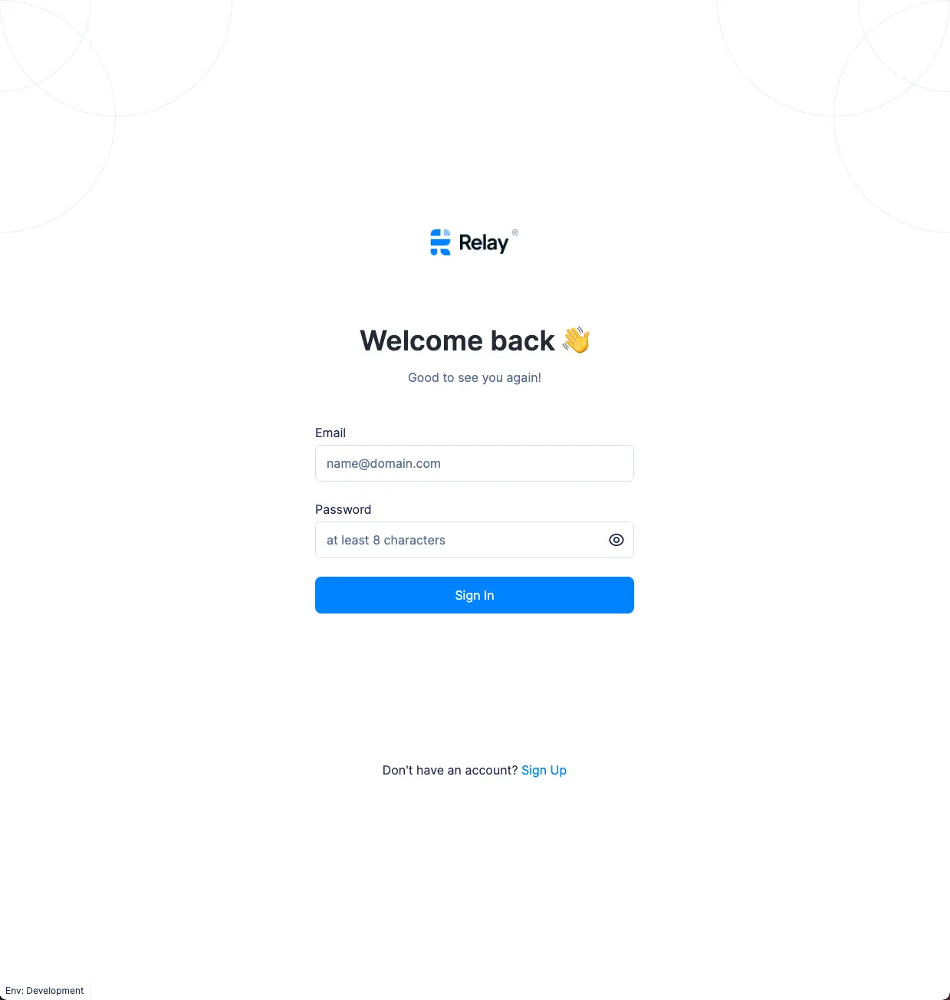
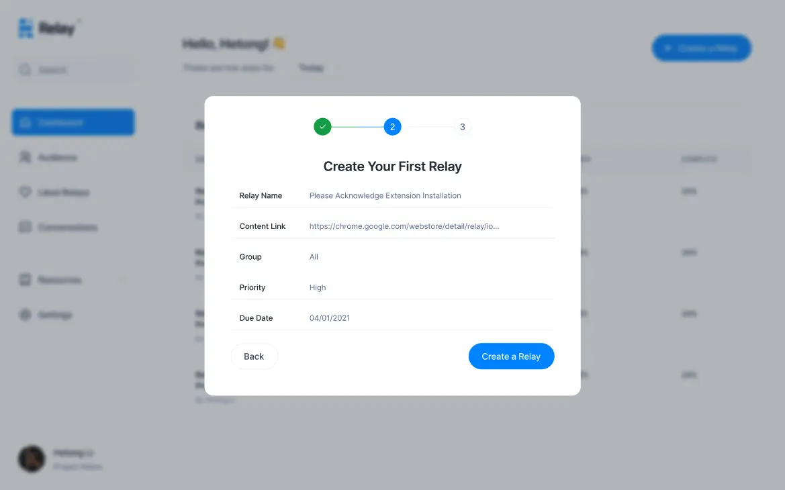
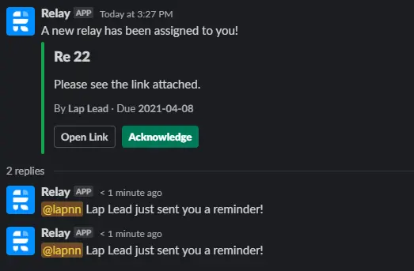
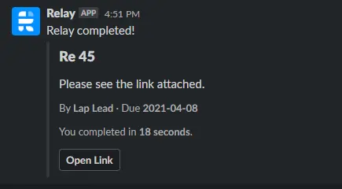

# Apr 9th, 2021 - Weekly Changelog
## New
- New design for signup/signin, called the Self serve flow.  

More details can be found [here](https://www.figma.com/file/NjwZ2u5knUttuDuucU2u59/Dashboard?node-id=0%3A1)

- Some changes to Slack
- Reminders are now represented by replies in a thread

- Sync data between extension/dashboard and Slack

## Planning for next week
- Lap will continue with Slack integration
- Tuan will handle the new Self serve flow/design