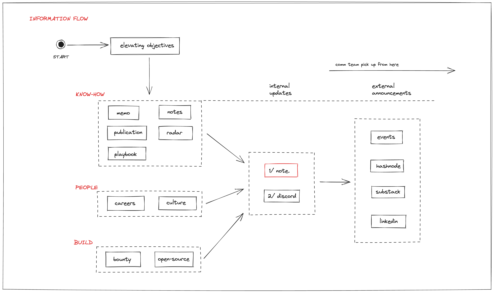

```
Heading components section
```

# Heading 1 

## Heading 2

### Heading 3

#### Heading 4

##### Heading 5

###### Heading 6

------

```
Alternate Syntax for Heading 1 and Heading 2 under Headings sections
```

Heading 1
===============

Heading level 2
---------------

------
```
Paragraph components section
```

Paragraph example

```
Line Break components section
```

Paragraph example  
Line break paragraph example

------

```
Emphasis components section
```

This is component Bold

**Bold example**

This is component Italic

*Italic example*

This is component Bold and Italic

***Bold and Italic example***

This is component Blockquotes

>Blockquotes example

This is component Nested Blockquotes

>Blockquotes example
>>Nested Blockquotes example
>>>For more Nested Blockquotes, can put > before the first one
>Unnested Blockquote
>>Another nested blockquote

> Blockquote
>
> > Indented blockquote
> > > Nested Blockquotes example
>
> Continuation of original

------

```
List components section
```

Ordered Lists

1. First item example
2. Second item example
3. ...

Unordered Lists

- First item example
- Second item example
- ...

Adding Elements in Lists

Paragraphs

* This is the first list item.
* Here's the second list item.

    I need to add another paragraph below the second list item.

* And here's the third list item.

Blockquotes

* This is the first list item.
* Here's the second list item.

    > A blockquote would look great below the second list item.

* And here's the third list item.

Code Blocks
1. Open the file.
2. Find the following code block on line 21:

        <html>
          <head>
            <title>Test</title>
          </head>

3. Update the title to match the name of your website.

Images

1. Open the file containing the Linux mascot.
2. Marvel at its beauty.

    

3. Close the file.

Lists

1. First item
2. Second item
3. Third item
    - Indented item
    - Indented item
4. Fourth item

-----

```
Code components section
```

`Code example`

Escaping Backticks

``Use `code` in your Markdown file.``

Code blocks

    <html>
      <head>
      </head>
    </html>

-----

```
Horizontal components section
```

Horizonal

---
Example

-----

```
Link components section
```

Adding titles

* Link [example](https://www.google.com)

URLs and Email Address

* <https//www.google.com>
* <nhuthm@d.foundation>

Formatting Links

* With bold example: **[Bold Example](https://www.google.com)**
* With italic example: *[Italic Example](https://www.google.com)*
* With code example: [`Code example`](#code)
* With in-style link with title: [Inline-style link with title](https://www.google.com "Google's Homepage")

-----
```
Image components section
```
Inline-style:
![[assets/common-component/fe9d47fb207a78f2ab92b1b77ffcd46b_MD5.png|"Logo Title Text 1"]]

Reference-style:
![alt text][logo]

[logo]: https://github.com/adam-p/markdown-here/raw/master/src/common/images/icon48.png "Logo Title Text 2"

![[assets/common-component/8539fc2364a6deb0d63e6fa6bd60aaf0_MD5.png]]
![[assets/common-component/d45f91af580deb773c11b9fea4eabd4c_MD5.png|"The Stormtroopocat"]]

Like links, Images also have a footnote style syntax

![Alt text][id]

With a reference later in the document defining the URL location:

[id]: https://octodex.github.com/images/dojocat.jpg  "The Dojocat"

----- 

**Syntax Highlighting:**

- SQL:
```sql
SELECT * FROM users
```

- Python:

```python
# This is a comment
def hello_world():
    print("Hello, world!")
```

- HTML:

```html
<!-- This is a comment -->
<h1>Hello, world!</h1>
```

- JavaScript:

```javascript
// This is a comment
function helloWorld() {
    console.log("Hello, world!");
}
```

- C++:

```cpp
// This is a comment
#include <iostream>
using namespace std;

void helloWorld() {
    cout << "Hello, world!" << endl;
}
```

- Markdown:

```markdown
<!-- This is a comment -->
# Hello, world!
```
