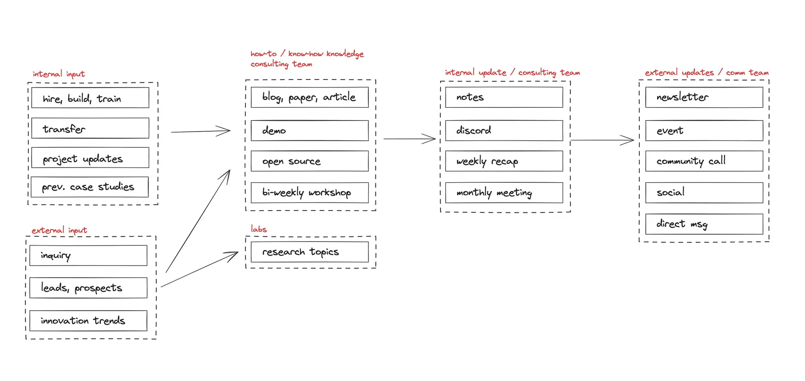
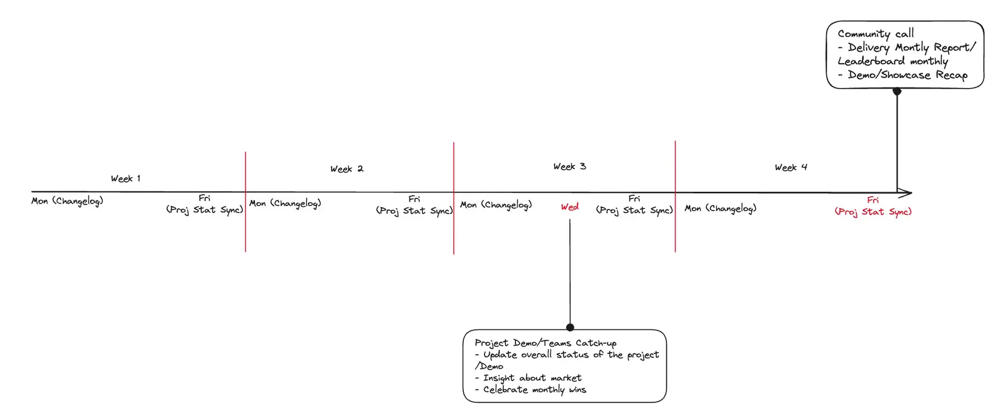
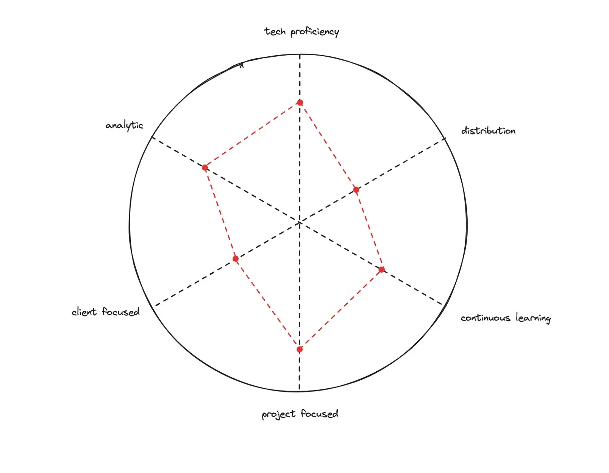
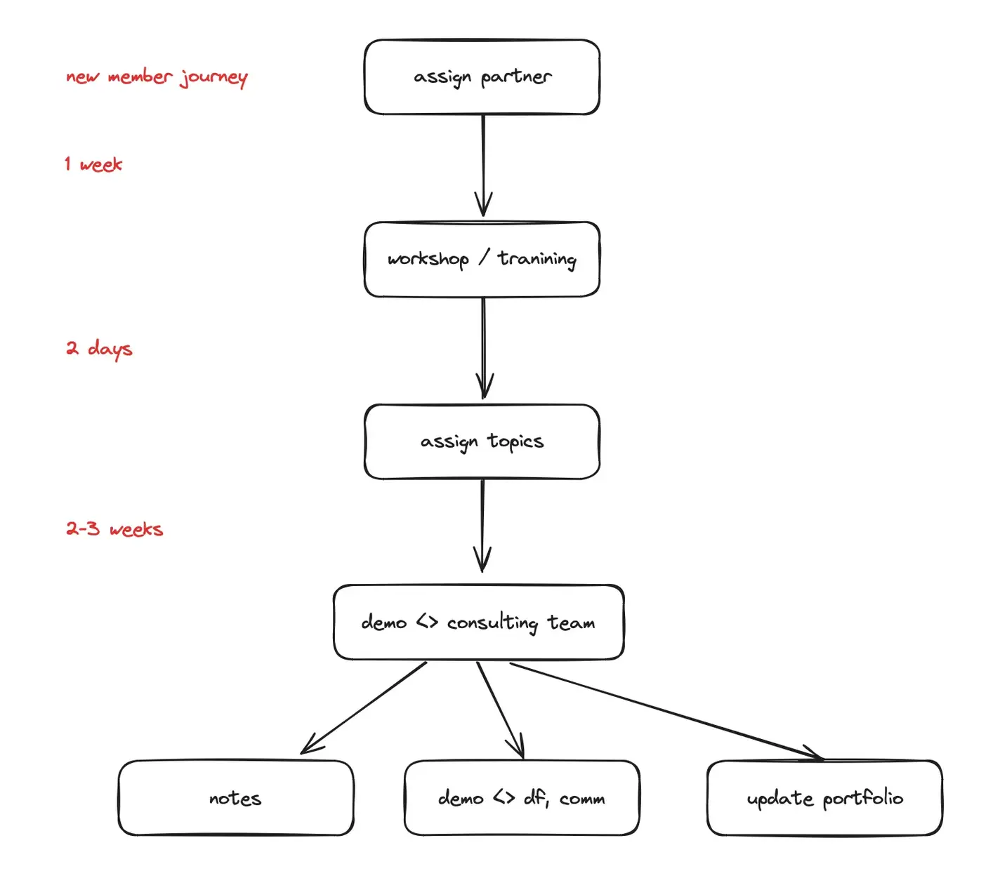
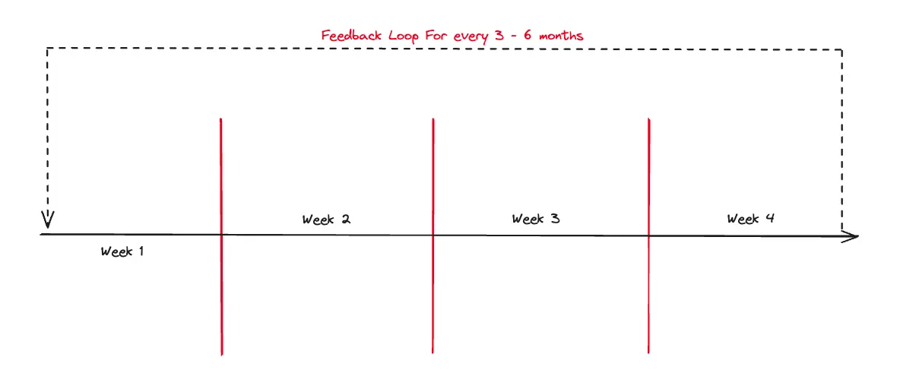

## Our foundation

The Consulting team is a strategic spin-off built on the foundation of our Tech Research team. While Tech Research explores emerging technologies and builds innovative solutions, we take those insights and apply them directly to real business challenges. This unique setup gives us a competitive edge - we're practitioners backed by cutting-edge research, bridging the gap between innovation and practical application.

## Latest from consulting team

```dsql-list
SELECT markdown_link(COALESCE(short_title, title), file_path)
FROM vault
WHERE file_path ILIKE '%consulting%'
  OR ['partners', 'consulting'] && tags
ORDER BY date DESC
LIMIT 10;
```

## Our culture & approach

We stay current with technology trends through continuous learning. This helps us take on interesting challenges and deliver quality work. We believe in understanding problems before coding solutions. We welcome partnerships with anyone sharing our goals and values.

We work collaboratively, bringing specialists together to create innovative solutions. We encourage creative thinking and welcome new approaches. We communicate openly to build trust and alignment with team members and clients.

## Our vision

We aim to deliver outstanding client satisfaction by continuously improving our services. We handle the entire project lifecycle from understanding needs to delivering solutions.

We want team members to be problem-solvers rather than just task-completers. Deep project engagement leads to fair rewards and recognition for everyone.



## How we work

Our work environment is practical and hands-on. We learn through real client projects rather than just theory. We track industry trends and turn insights into practical solutions.

What sets us apart is our direct pipeline from research to application. When facing client challenges, we tap into innovative technologies and cutting-edge knowledge, creating solutions that are both forward-thinking and pragmatic.

We maintain structured communication:

- Weekly notes on project health and opportunities
- Monthly reports tracking wins and lessons
- Regular planning sessions to set direction
- Monthly demonstrations of our work
- Team calibration meetings to review performance



## Main functions

We monitor markets to stay informed about industry trends and new technologies. We gather insights from hiring patterns, industry contacts, venture capital news, and publications. This intelligence provides a comprehensive view of what's possible in the current tech landscape.

Our solution delivery process includes:

1. Understanding client needs
2. Studying what's possible, leveraging our research expertise
3. Designing solutions that merge innovation with practical applications
4. Creating proposals
5. Building the right team with specialized skills as needed
6. Developing and testing
7. Deployment and operations

## Our sales process

The overall process is:

- Someone contacts us.
- We have them fill out our new project form.
- We have a phone call or have them come into the office.
- Qualify/disqualify: are we a good fit for the client?
- Qualify/disqualify: is the client a good fit for us?
- Understand the client's vision.
- Agree to the outcomes we're trying to achieve.
- Estimate iterations.
- Sign the contract.
- Pay us for the first iteration.
- Schedule people for iterations.
- We begin work.

## Rewards system

We reward team members for creating market reports, participating in sales, managing projects, documenting knowledge, and bringing in new business. Rewards range from internal recognition points to tokens and revenue percentages.

## Who should join us

We welcome people who want more than just coding work. We look for:

- Curious minds interested in market trends
- People who can bring in new projects
- Those who care about creating sensible solutions
- Those who take pride in managing projects well



To succeed with us, you need technical skill combined with business understanding. You should be able to analyze situations, break down problems, and present solutions clearly. Building client relationships is important - you'll connect business needs with technical solutions.

Project management is key - you'll oversee projects from idea to delivery, often handling multiple projects at once. We value ongoing learning and knowledge sharing.

## Joining our team

Our team started with members appointed by our Board and referrals from various internal teams. We look for people who show strong project involvement, leadership ability, and business understanding.

If you're interested, join technical discussions on our Discord server. Once invited, you'll receive training through workshops on consulting, marketing, and sales. We assign mentors to support your growth. There's a one-month trial period working on actual projects.

## Growth path



Our growth track includes four levels:

**Associate Consultant**: You'll support senior consultants on client projects. You'll gain exposure to various projects while learning our methods. This role requires technical expertise, ability to gather requirements, and good communication.

**Consultant**: You'll lead projects or specific work areas, communicating directly with clients. You'll analyze problems, develop solutions, create proposals, and mentor junior team members. This requires specialization in specific technologies and client relationship skills.

**Lead Consultant**: You'll oversee multiple projects and serve as a subject matter expert. You'll provide thought leadership, guide strategy, and represent the company at industry events. This requires strategic thinking and advanced problem-solving abilities.

**Partner**: You'll set strategic direction, drive business growth, maintain key client relationships, and participate in company decisions. This requires leadership skills, business development expertise, and operational efficiency.


