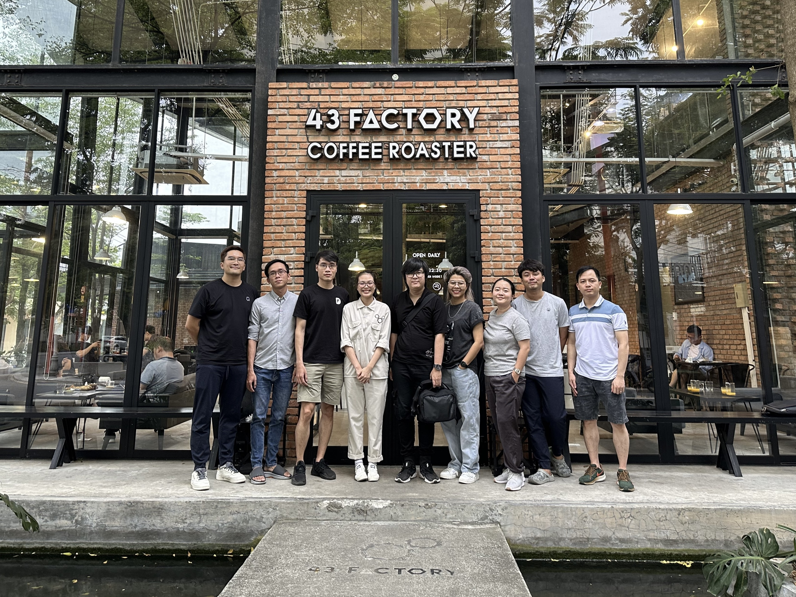

At first thought, visiting a coffee shop for WALA might sound a bit strange. But 43 Factory has all the characteristics we love: The place is run by young, passionate, talented people; coffee craftsmanship is the goal, providing value customers is top priority; lean business model.

Plus, they make crazy unique coffee.

Happened in March, our visit to 43 Factory was a great opportunity for us to learn how a coffee shop operates, from their hiring principles, their logistics, their been sourcing and roasting process. From our member’s takeaways, it’s not much different from how we look at software engineering and software talent management.

- Actively seeking talents. Hire fast, train fast and let people go just as fast. When your culture is well shaped, you can spot, almost immediately, whether someone is a good fit.
- 43 Factory doesn’t shy away from letting people know they import bean from overseas, as long as the beans add up to their high-quality delivery to customers. Going against the current is okay, as long as you believe and are great at what you do.
- Every small detail matters. At 43 Factory, we see intentions behind every little subject, from the way they design the shop, to their choice of cup. Just like every line of code matters.
- Knowledge/experience accumulation is a real thing. Someone who starts out as a waitress might be a store manager tomorrow if they care enough to learn. We don’t get to stop learning.
- The people is the business’ brand. Every staff in the shop is the face of their brand. Customers remember great services through their staff that serve them.

As a we left 43 Factory, we definitely got a boost in energy, and also in our perspective. It was a great reminder of the importance of learning from other people, from other industries who are passionate about their craft.

Later that day, Phuong messaged us sharing that the unscripted session with Techie WALA was a a reminder of why she’s with 43 Factory, as she told her stories and answered our questions in the most natural, honest ways. Making new friends too, of course.

Thank you to the solid Nhu Phuong for hosting us and sharing 43 Factory’s stories with us. You can pay a visit to their cozy coffee shop at 422 Ngo Thi Si, Danang.

And you can definitely look forward to our next WALA.

___

**WALA: to walk around, learn around.**

In our line of work, we hear and talk about domain knowledge all the time. WALA aims for exactly that: we, people in tech, take a break from sitting in front of our computers, to go out, connect with new people, and get to understand other businesses.

Through stories collected from Techie WALAs, we hope our community members get the chance to learn from others’ successes and failures, gain insights into what works and doesn’t, and reflect on their own works and practices.

Besides, breaking away from the stereotype of “tech people are introverts” is always fun.
