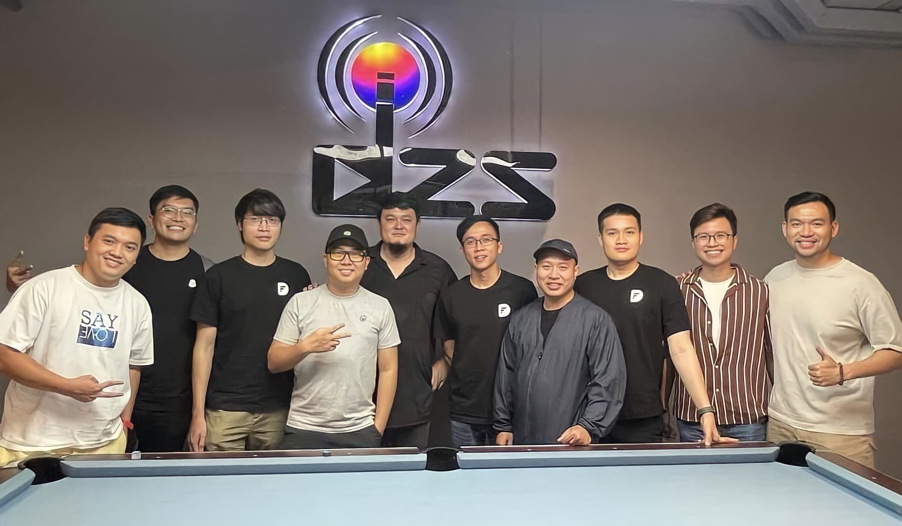

The tech world has much to gain by learning from other industries. Techies always look for unconventional ways to seek insights and learnings. Recently, we had the opportunity to visit DZS Media, a film production company in Ho Chi Minh City, the powerhouse behind hits like “Siêu Lừa Gặp Siêu Lầy” and “Chị Chị Em Em 2”.

During our visit, we witnessed DZS Media's meticulous production process. They've built a facility for every purpose - soundproof recording studios, talent training rooms, reference libraries - leaving no detail overlooked. Their discipline and work ethic were stunning. Every step was engineered to get it right the first time, a requirement in the film industry.

We were stunned to discover DZS Media's process mirrors our own software engineering practices. The high cost of film redos means that they need to understand the importance of getting it right the first time, and be super meticulous in their work, and they understand the importance of getting it right the first time. Their processes are structured to ensure that there is not need for a redo. This was a huge reminder for us as software engineers.

- Be an expert in your craft, then expand to bigger things.
- The film production process is mostly waterfall, so it's crucial to ensure that each step is done correctly to avoid high costs for redos.
- DZS Media's margin is high, but the success rate is not that high. Therefore, it is essential to have an expert eye to know which movies might have a higher chance of success. Same way, we choose which software development projects to be part of.
• The content of a film must be good to be successful, regardless of the marketing, advertising, or famous actors.

Despite their success, DZS Media stayed humble. We were awed by their ability to wrangle celebrities and foster an environment where creativity and hard work thrive. We left with profound respect for the film industry - and the Herculean efforts behind blockbusters like Chị Chị Em Em and Siêu Lừa Gặp Siêu Lầy.

Our visit to DZS Media was an eye-opening experience, and we are grateful to have had the opportunity to learn from such a talented and dedicated team. We believe that we can take some of the lessons we learned during our visit and apply them to our own industry. We hope to have the opportunity to work with DZS Media in the future and see what we can learn from them again.

Til next WALA.

___

**WALA: to walk around, learn around.**

In our line of work, we hear and talk about domain knowledge all the time. WALA aims for exactly that: we, people in tech, take a break from sitting in front of our computers, to go out, connect with new people, and get to understand other businesses.

Through stories collected from Techie WALAs, we hope our community members get the chance to learn from others’ successes and failures, gain insights into what works and doesn’t, and reflect on their own works and practices.

Besides, breaking away from the stereotype of “tech people are introverts” is always fun.
