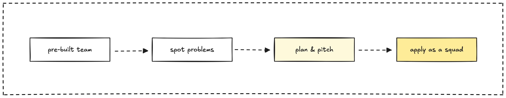

> **tl;dr**
>
> Generate deals as a squad team, spot problems, plan and pitch solutions, deliver fast for small teams, and weigh pros and cons.

When we’re hunting for new deals in tech consulting, applying as a **squad team** is my **favorite approach** because it lets our tight-knit crew stand out. Unlike typical consulting firms that pitch as full companies, our small squad of high-skilled devs and experienced pros brings a unique edge, perfect for **small and medium teams**.

We connect with startups launching ventures or facing challenges, spot inefficiencies through job boards, and pitch tailored solutions that save clients time and money. Here’s how we can make this work to land **win-win partnerships**, especially when working with smaller clients, while keeping in mind the need for a different approach with enterprises.

## Spot opportunities with smart research

We start by hanging out with startup folks tackling big challenges, or we dive into job boards like Indeed to pull data on hiring trends. We look for patterns, like a startup repeatedly posting for backend devs, which might signal app performance issues our squad can fix fast. It’s a 50/50 shot whether they’ll hire contractors, but clear scoping often sways them. This research helps us find **problems that fit our expertise**, ensuring we’re solving issues we’re passionate about while targeting use cases that align with our market thesis.

## Build a strong squad vibe

Our **squad’s synergy** is what sets us apart for small and medium teams. We’re a pre-built crew of skilled devs and pros who work in sync, saving clients the headache of hiring individuals and hoping they gel. We keep our skills diverse, covering frontend, backend, and UX, so we can handle full projects with ease. Our past wins, like speeding up a client’s app by 30%, build trust fast, showing we’re ready to deliver results without the usual ramp-up time.

## Plan and pitch as a squad

Once we spot a problem, we talk to the client to understand their needs. What’s slowing them down? What’s their goal? We craft a **focused plan**, like a scalable backend fix for a struggling app, tied to their motivations, such as hitting the market faster. Then we pitch directly, showing how our **squad saves time and costs**. We share proof, like cutting load times for a similar client, to build trust. We ensure it’s a **win-win deal**, clearly scoped to meet their goals, like launching on time, even if they’re hesitant about contractors.

## Deploy our squad and deliver fast

Once the deal’s set, we deploy our **squad to deliver quickly**, sticking to the scope. We keep clients updated with quick check-ins, ensuring we hit their goals, like a faster workflow or a stable app. For a small startup, delivering a project ahead of schedule often leads to more work as they scale, proving our squad’s value in action. This speed makes them eager to work with us again, especially for smaller teams who need agility.

## Weigh the squad approach

We loves this approach for its **pros**, but it’s tailored for small and medium teams, not enterprises. It saves clients time and money, as they skip hiring and get a crew that’s already in sync. Our agility lets us deliver fast, often outpacing bigger firms, and our tight-knit vibe builds trust quickly.

However, there are **cons** to consider. Some companies, especially larger ones, prefer in-house teams and might not trust contractors, even with clear scoping. For **enterprises**, we need to approach as a **well-established company**, with a broader presence and formal structure, to meet their expectations. Scope creep can also be an issue with startups, requiring us to be firm on boundaries, and finding the right problems takes time if we’re not strategic.
