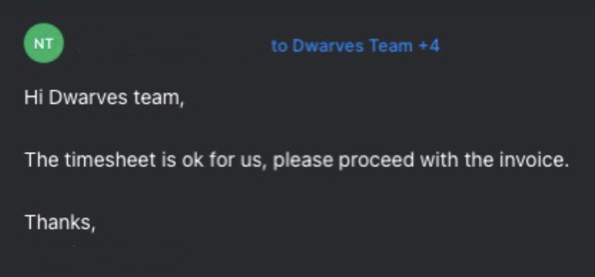

We are all aware of the uncertain economy, as well as the long funding winter in the tech market. These forces have led to companies being extremely cautious with their tech budgeting and resources. We have seen more than enough budget cutdowns and layoff across the tech industry.

There still is an upside to the matter. When there is a need to build, companies now prefer partnering with teams who can deliver comprehensive, end-to-end solutions. This means the role of Dwarves is no longer deploying engineers who can code. We now can also offer research, business analysis, consulting, solution design, and much more.

Given the growing dynamic of our engagement, fixed prices or monthly retainers became much less sufficient. That’s why we are now implementing an **hourly billing model** so we can be:

- **Fair**: we get compensated for the actual hour spent, reflecting the real effort and level of expertise we bring.
- **Flexible**: we can adapt to scope of responsibilities, client requirements and project scopes.
- **In control**: we can make sure we are paid for additional work required to address issues and challenges.
- **Transparent and foolproof**: clients get detailed time logged, no grey area. Numbers create transparency and trust for both sides.

### Implementing the hourly billing model

We are using the following steps to successfully implement this model.

- **Clear announcement**: ensure our clients are fully informed about our timesheet approval process, as well as how we track time.
- **Timesheet setup:** different projects might require different timesheet formats. We need to work with the clients to set the correct format for timesheets.
- **Time tracking**: we use Notion / Excel to record hours spent on each project and task. If a member is on the hourly billing, said member is required to log their time in an accurate and timely manner.

_Example of a timesheet we are using for design work_

- **Project management:** maintain detailed project plans, frequently update clients of progress, changes in scope and how that would effect the hours to be billed.
- **Approval:** timesheets are sent at the end of the month for client’s approval. Only after timesheets are approved that we can send invoices.

_Only after timesheets are approved that we can send invoices._

This hourly billing model is nothing new, but it require us to be consistent and articulate. Build it up like a habit, and we will be able to take greater responsibilities and better client relationships.

In case of any questions or further clarification, our ops team is ready to assist.
