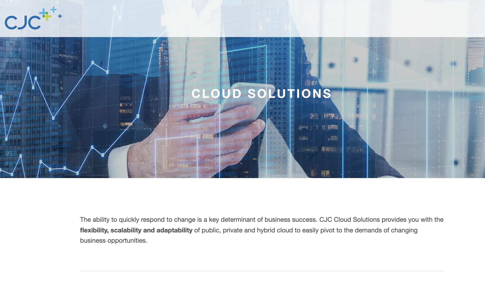
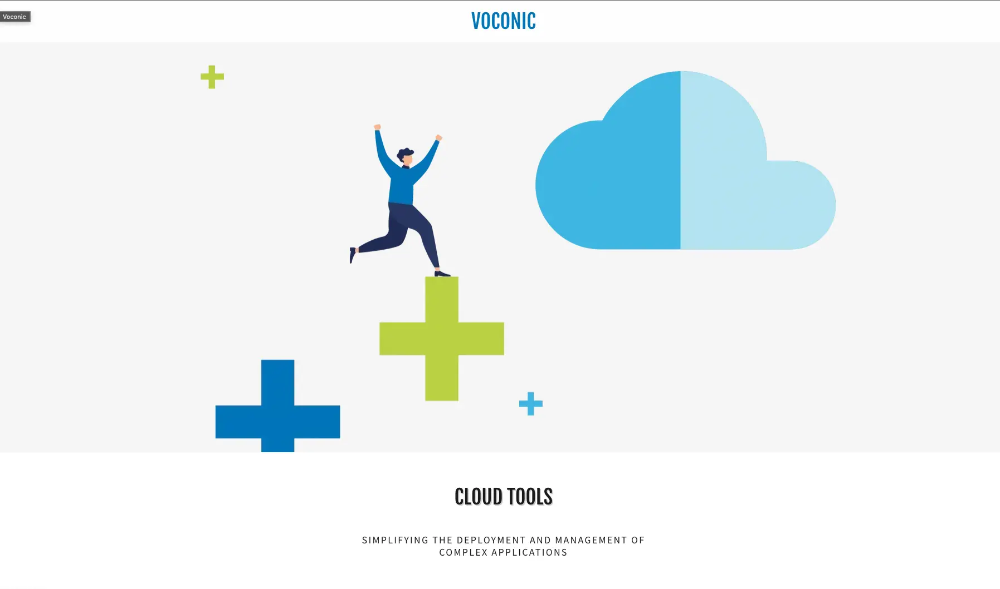
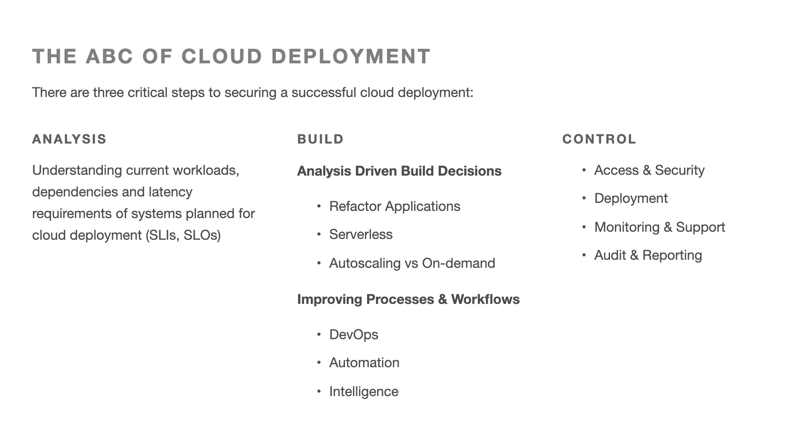
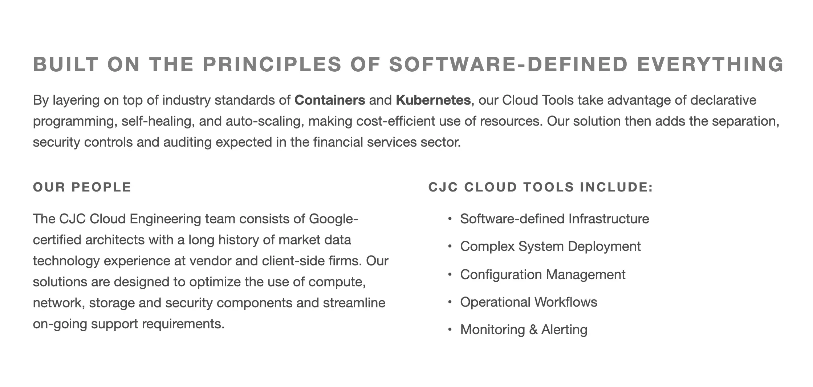
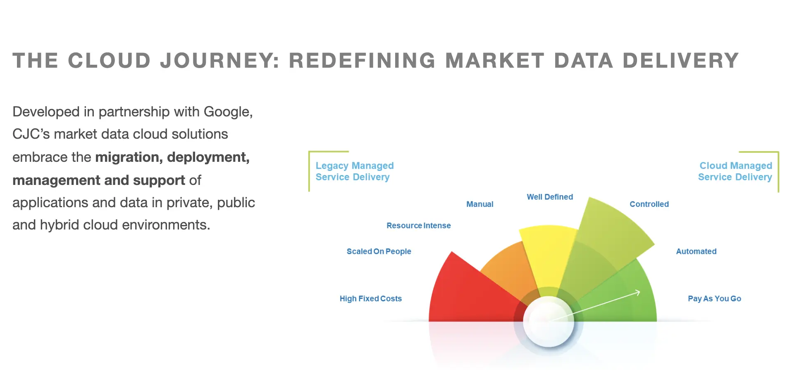

### In brief
* CJC Ptd is a 20-year expert in providing market data consultancy & professional services for global financial sector.
* They want to make a new data ecosystem: Public and private cloud, containerization, software orchestration, AI to support the growth of DevOps
* We team up with them to develop **Voconic** - a cloud PaaS for CJC’s clients, aiming to make cloud deployment seamless across cloud providers and environment.

### Technical Highlight
* Backend, Frontend and CLI tools are built from scratch by engineers specialized in Cloud development
* Golang heavy backend integrated with Google Cloud Platform for 1-click deployment experience
* Deep integration with multiple cloud providers (Google & AWS)
* Complex system auto-deployment and configuration function
* CLI support for repetitive tasks and complex operation
* Separated services for file upload. This divides chunk files into smaller packs with cache data, which optimizes large files uploading process (reduce CPU & RAM)
* Automation test for product deployment on GCP (automated deploy and delete product on GCP)

### The Context
CJC wants to provide cloud solutions with flexibility, scalability and adaptability. It empowers users to pivot the demand of changing business opportunities. 

They believe spending manually effort on deploying and managing products in cloud is cumbersome. 

Provides people with convenience in deploying while maintaining an error-prone process is what derives Voconic's basic concept. 

With Voconic, users have as internal working version before releasing the official  version to cloud providers. Another layer for error-detection. 

☁️ We were looking for a team that we can entrust our new Voconic cloud platform. And we found Dwarves among others which is well known for industry experience in Go development, cloud platform and K8s.

Paul Kossowski, Manager at CJC

### Engagement Model
**Team size**
From 3 engineers in the early stage, we grew the number up to 6 with deeper involvement.

Voconic was built upon the industry standard - Docker containers and k8s. A whole package in partnership with Google.

**Golang Heavy Back-end System**
The robust back-end system in Golang
* Freedom from the high cost data system 
* Ability to switch between data source and technology 
* Ceaseless delivery and support premium real-time data solutions

Voconic auto diagnoses and fixes the current state when a container crashes. Its level of automation, such as monitoring and alerting, enables the system to operate without human intervention.

**Tech stacks**
* Backend: Golang
* Frontend: React
* Infras: Docker & k8s
* Document bundle: Redux

**Collaboration**
* Google Chat: daily discussion
* Google Hangout: team meetings & sync-up
* Asana: task tracking & management

### Outcome
Through months with dedicated work, we're proud to deliver **[a runnable MVP](https://cjcit.com/market-data-cloud-solutions)** with significant impact for Voconic platforms.
* Seamless Integration into Google Cloud and AWS with k8s library
* User-friendly Web UI
* Custom-made yaml format to define how to create a product, using CLI support for product creation
* Automation Test System

