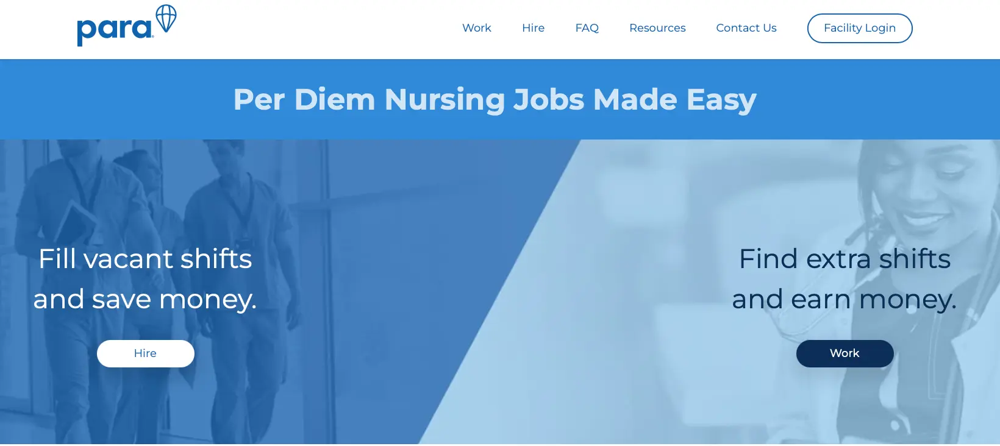
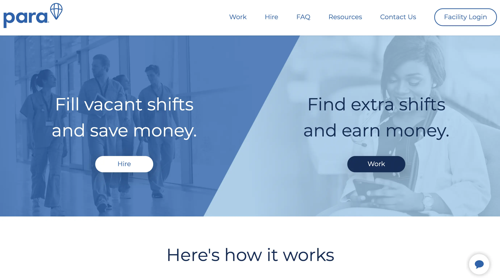
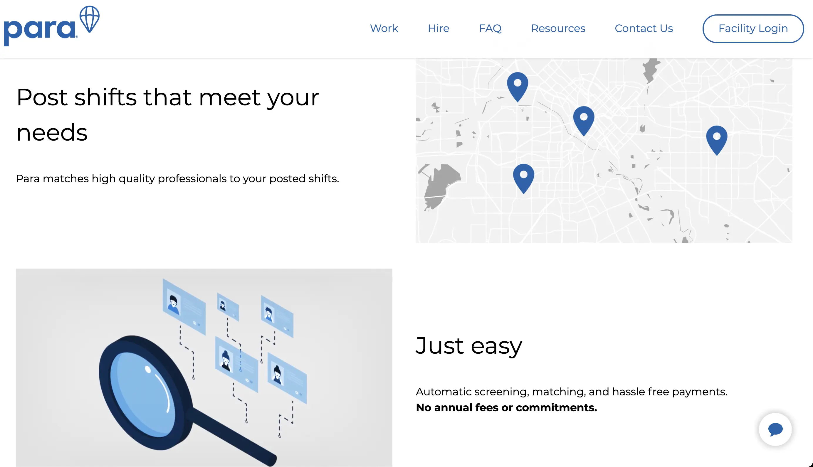
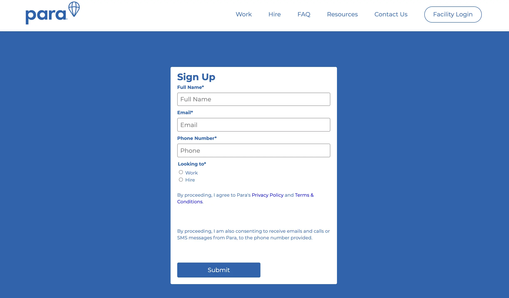

## In brief
- Founded in 2019, Para is a platform connecting hospitals with medical professionals. 
- Continuing with Go microservices, we have shipped numerous features, markedly workshift management and candidate screening. We partnered and helped unburden Para from the financial stress during the early stage of their MVP development.
- Our Covid-19 program was launched in early 2020. We aim to provide software development, technical support for startups and businesses to help them stay stable during and progress forward despite the pandemic. 

## Highlights
- Microservices architecture, written in Go
- Using K8s on Google Cloud (GKE) for deployment
- Apply MOM pattern & RabbitMQ to handle async jobs
- Write SQL raw queries instead of using ORM
- Automation regression testing
- Using [Codecov](https://about.codecov.io/) to ensure code coverage
- Matching service based on multiple criteria

## The Context
Para was in a rushing period. They saw a demand for its product peak when Covid-19 hit severely. Nutriment products and healthcare services are essentials. The roadmap was clear and concise. They seek a team to quickly work and conclude the remaining features. Speed up the development phase is the top priority. 

We offer our top-tier core services. Our quick-to-adapt Dwarves experts give them full support as staff augmentation, where Para focuses on building their business.

Beyond that, our expertise provides them with business & tech consultancy that suits their roadmap, heading for user acquisition & revenue growth. 

## Engagement Model
### Team size
The Dwarves initially joined in with 1 Backend Engineer. Working together with Para team, we helped build a sturdy backend system to sort out different logics. 

Para's app serves multiple purposes and deals with a loaded volume of data. We went for a microservice architecture built from Go.

When the system has been set up, our Designer and her director stepped in. Using Figma & Sketch, we delivered a stunning brush-up for Para's mobile app's interface. The app covered both Android & iOS versions for a wider user segment. Then our Frontend Engineer continued turning those canvas into a digital display. 

Throughout the process, we keep 1 PM in the team to oversee and provide on-time consultancy. With a team of 5, we stayed aligned and respected Para's business goal to maintain flexibility during the development stage.

### Tech stacks
- Backend: Microservices, Go
- Frontend: React, Redux, Material UI
- Database: MySQL
- Infra: GKE, Google Cloud

### Communication
- Slack & Google Meets: Team discussion
- Figma: Design storage
- Git/ Gitflow practice
- Jira, Statushero & Confluence: Task management

## Outcome
Through more than 6 months of working on the remaining features, we got to launch a shape MVP release on time - a fully functioning app for nurse shifting schedules. 

JoinPara app is a finetune product ready to demo for various clients, empowering Para to reach more funding opportunities and expand the market.

>
> *"Dwarves Foundation's communication skills are exceptional as well as their integrity. They stand out with the highest standards of delivery. Dwarves is in a league of their own."* CEO, Para

View more at [clutch.co](https://clutch.co/profile/dwarves-foundation#reviews)

By connecting nursing professionals with vacant shifts, Para contributed its effort to respond to the COVID surge in demand for healthcare services.

This output enabled Para to reduce development time and tackle pivotal features to scale the business with lessened complexity. They now can drive the focus back to revenue growth & user acquisition.

