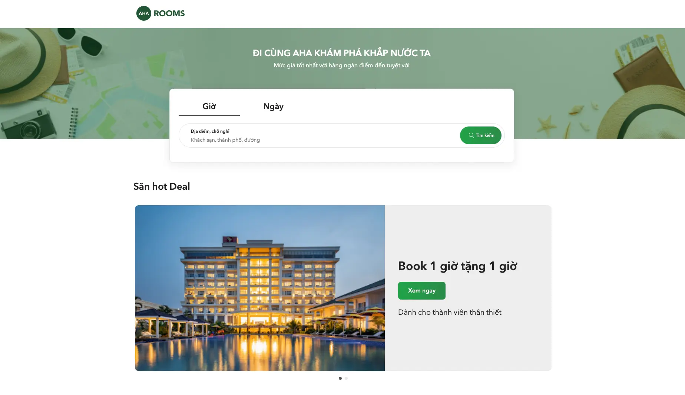
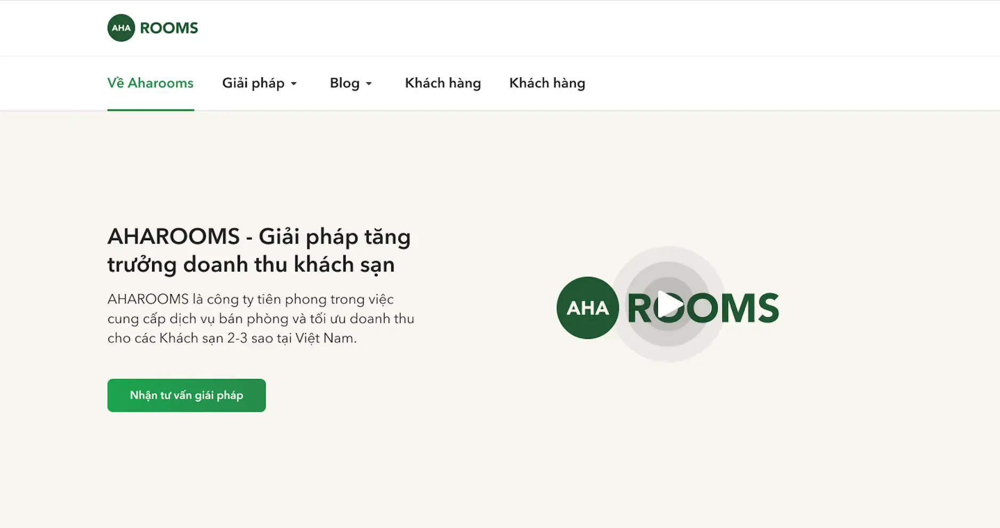
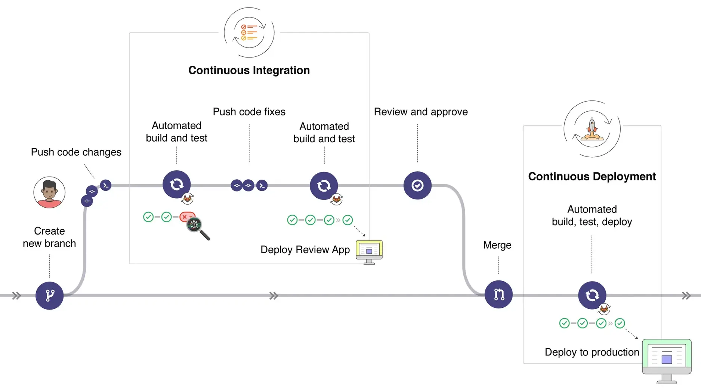
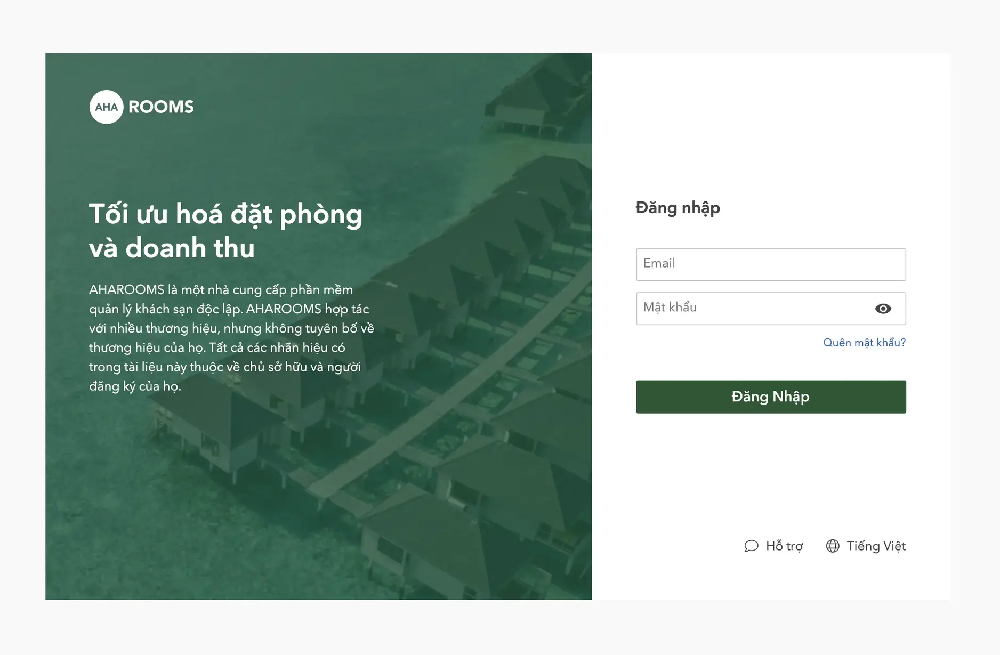
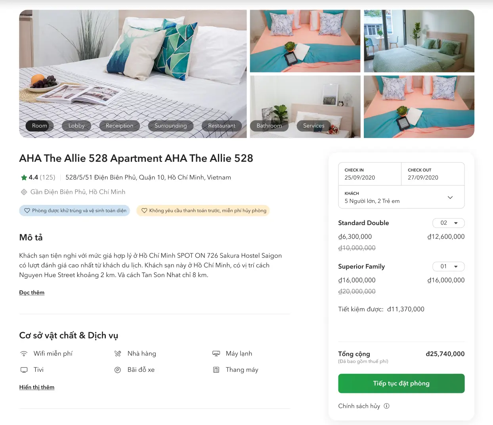
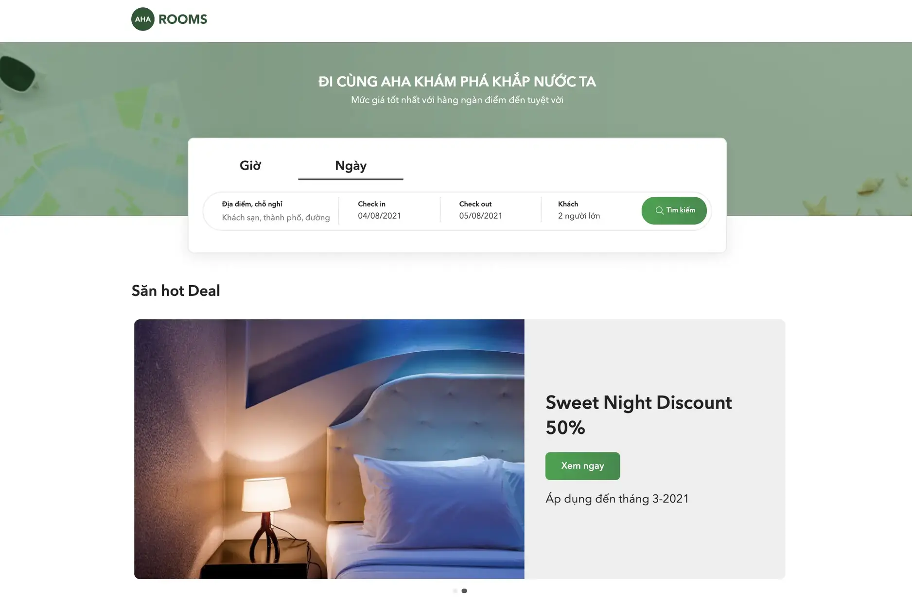

**Industry**\
Hospitality

**Location**\
Vietnam

**Business context**\
Startup needed to build and launch specialized tech tools for small Vietnamese hotels

**Solution**\
Created a complete system with booking platform, management tools, and revenue optimization features

**Outcome**\
Successfully launched a product that helped hotels adapt during COVID-19 and gained market recognition

**Our service**\
Full-stack development / Product development

## Technical highlights

- **Backend**: Golang, Elixir for reliable server-side performance
- **Frontend**: React.js, JavaScript, TypeScript for responsive interfaces
- **Cloud Infrastructure**: Docker, Google Cloud, Kubernetes, Netlify
- **Monitoring**: Prometheus, Grafana, Loki, Sentry
- **Database**: PostgreSQL, Redis for efficient data management
- **Architecture**: Monolithic for easier maintenance and faster development

## What we did with Aharooms

Aharooms came to us with a clear mission: help small Vietnamese hotels compete more effectively in the market. They envisioned a set of digital tools specifically designed for 2-3 star hotels in Vietnam, but needed technical expertise to turn this vision into reality.

When we joined the project, Aharooms had already spent nearly two years developing their system but was struggling with slow progress. They faced the common challenge of balancing new feature development with fixing existing issues in their codebase.

We stepped in as their dedicated product team, dramatically accelerating development and helping them finally deliver their solution to hotel owners who needed it. Our work enabled Aharooms to focus on expanding their market reach while we handled the technical heavy lifting.

## The challenge Aharooms faced

Small hotels in Vietnam (typically 2-3 stars) represent a significant market opportunity but face substantial challenges. Most of these hotels operate with inconsistent service quality and outdated business practices that limit their growth potential. They often lack the resources and know-how to implement modern hotel management systems.

When the COVID-19 pandemic hit, these challenges intensified. Small hotels were particularly vulnerable to the sudden drop in tourism, and many realized they needed to quickly adapt their business models and offer new services to survive.

Aharooms identified this need and wanted to create a comprehensive solution specifically tailored to the Vietnamese market. They aimed to provide everything these small hotels needed: growth tools, management systems, booking channels, customer service features, and revenue optimization capabilities.

The technical challenge was significant: build a system that was powerful enough to handle all these functions but simple enough for small hotel owners to use without extensive training.

## How we built it

We took a practical approach to creating Aharooms' system, focusing on reliability, ease of maintenance, and meeting the specific needs of Vietnamese hotel owners.

### Technical approach

We made several key technical decisions to ensure the system would be stable and scalable:

**Simplified architecture**: We deliberately chose a monolithic architecture instead of microservices to make the codebase easier to manage and iterate on. This was important given Aharooms' need to move quickly and their previous development challenges.

**Cloud-based infrastructure**: We set up the system using Docker containers and Kubernetes on Google Cloud Platform, with servers based in Singapore for optimal performance in Vietnam. This approach kept each client's data separate and secure.

**Performance optimization**: We used Netlify to host the React.js frontend sites, which helped avoid traffic bottlenecks and made updates smoother. This setup ensured that users would have a fast, responsive experience even during traffic spikes.

**Quality assurance**: We implemented a rigorous testing process with automated tests and careful code reviews to catch issues early. With four separate environments (Local, CI, Staging, and Production), we could thoroughly test features before releasing them.

**Data insights**: We set up PostgreSQL databases with Metabase dashboards to help Aharooms understand business performance. This enabled them to make data-driven decisions about their product and market strategy.

**Developer ecosystem**: We created a developer portal with open APIs to encourage third-party integration, allowing other developers to build tools within the Aharooms ecosystem.

### Product features

We helped Aharooms build a complete package of services for hotels, focusing on three main areas:

**Hotel management tools**:

- A direct booking platform that functioned like "Shopify for hotels," making it easy to set up different room types and rates
- A property management system (PMS) that served as a central hub for managing bookings from various channels
- Simple tools for handling daily operations, budgets, and promotional campaigns

**Customer retention features**:

- A loyalty system using "Ahacoin" to provide cashback incentives for repeat customers
- Visual performance reports to help hotel owners understand their business metrics
- Analysis of booking cancellations to help hotels identify and address common issues

**Revenue optimization**:

- Revenue management system (RMS) with tools to help hotels maximize sales while controlling costs
- Integration with other booking platforms to increase visibility
- Support for flexible booking options like hourly rooms and corporate partnerships

### How we collaborated

We worked closely with the Aharooms team, functioning as their in-house product development department. This tight collaboration allowed us to:

- Understand the specific needs of Vietnamese hotel owners through regular workshop sessions
- Quickly adjust features based on market feedback
- Provide technical guidance on product decisions
- Help them prioritize development efforts for maximum impact

Our team handled everything from initial design through implementation and deployment, while maintaining open communication with Aharooms' business team.

## What we achieved

Our partnership with Aharooms produced significant results for both the company and its hotel clients:

**For Aharooms**:

- Successfully launched their product in the Vietnamese market
- Gained recognition as an innovative solution for small hotels
- Built a scalable platform that could grow with their business
- Created multiple potential revenue streams from their hotel clients

**For hotel owners**:

- Provided an all-in-one system that simplified their operations
- Enabled online bookings and digital management during COVID-19
- Offered data-driven insights to improve business performance
- Created new ways to retain customers and maximize revenue

As both a technical partner and venture builder, we helped Aharooms design their product to maximize revenue potential, especially during the critical COVID pandemic period when hotels needed to adapt quickly to survive.

The system we built together allowed Aharooms to establish itself in the market and positioned them for continued growth as the hospitality industry recovered.
