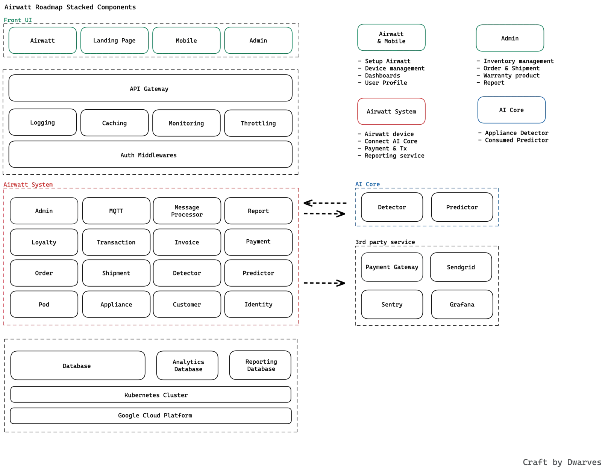

**Industry**\
Energy Management / Internet of Things (IoT)

**Location**\
Vietnam

**Business context**\
Businesses needed a way to monitor electrical equipment in real-time to save money and prevent problems

**Solution**\
Built an AI-powered system that collects data from monitoring devices and provides actionable insights

**Outcome**\
Delivered a complete platform with mobile apps, dashboard, and AI engine that helps businesses optimize energy usage

**Our service**\
Full-stack Development / AI Integration / IoT System Design

## Technical highlights

- **Core system**: Go-powered microservices handling device lifecycle management
- **AI engine**: Custom machine learning for device detection and usage prediction
- **Mobile apps**: Native iOS (Swift) and Android (Kotlin) applications
- **Database architecture**: MongoDB for real-time updates and DynamoDB for AI data
- **Device connectivity**: WiFi connection using ESP2866 protocol 
- **Infrastructure**: Docker, Kubernetes, AWS, GCP for reliable hosting

## What we did with AirWatt

AirWatt is a smart system that uses artificial intelligence to monitor and improve how businesses use electricity. It helps companies track their electrical equipment in real-time, so they can save money on power bills and prevent problems caused by faulty equipment.

We worked with AirWatt to build their system from scratch, teaming up with their business, hardware, and AI specialists. Our goal was to quickly develop a working product that would prove the concept worked, while also creating a strong foundation for future growth.

We needed to create a complete system that could collect data from monitoring devices, process it with AI, and show useful insights through easy-to-understand dashboards on different devices. The solution had to be both technically advanced and simple to use so it would provide real value to AirWatt's customers.

## The challenge AirWatt was facing

AirWatt needed a versatile system that could be installed quickly and improved over time. It had to work on multiple platforms and process large amounts of data in real-time.

The main technical challenge was using AI to accurately figure out which electrical devices were turned on or off based on their power usage patterns. This required not just collecting and processing data, but also creating dashboards with tracking tools to visualize this information.

While AirWatt had expertise in building hardware and developing AI algorithms, they needed a partner to help create the software that would connect everything and provide a user-friendly interface. They needed to establish the data structures and visualization tools that would make the platform valuable to users.

This was a complex challenge requiring expertise in connecting devices, processing data in real-time, integrating AI, and developing apps for different platforms – all areas where we could help.

## How we built it

We approached the project by focusing on four key areas that aligned with AirWatt's business needs:

1. **Device Management**: We created tools to manage monitoring devices across different locations, allowing users to see detailed usage information and control their monitors remotely.
2. **Reporting**: We built features to track how electrical equipment is used, with mobile versions showing weekly or three-month history.
3. **Mobile Apps**: We developed apps for iPhone and Android that let users connect monitors to their network and link them to their accounts.
4. **Business Website**: We built a website for business owners to track data from their AirWatt monitors through weekly and monthly reports.

### Technical approach

The system had to handle huge amounts of data – each device generates about 17,280 records every day. To handle this, we built a system with specialized components:

- **Core System**: The main service managing device lifecycles and data flow
- **Landing Page**: A website showcasing solutions and allowing pre-orders
- **Admin Dashboard**: Tools for system management and monitoring
- **Mobile Apps**: iPhone and Android apps with dashboards, charts, and reports
- **AI Engine**: The system's brain, handling data synchronization, device detection, prediction, and report generation
- **Device Management**: The foundation for tracking device status and electricity consumption

We used different databases for specific purposes:

- **MongoDB** for the main system, updating device status and electricity usage every 5 seconds
- **DynamoDB** for storing AI input data, processed from the main system

For the AI models, we used real data from test users. The system collected device data over two-week periods to create reliable models for real-time detection and prediction.

To connect hardware devices to the system, we implemented a WiFi connection method using the ESP2866 protocol, which requires pressing a button on the device to enable setup mode.

### Technology we used

We selected a variety of technologies to build a reliable, scalable system:

- **Backend**: Go for efficient processing of large data volumes
- **Frontend**: React.js for web interfaces
- **Mobile**: Swift (iOS) and Kotlin (Android) for native experiences
- **Infrastructure**: Docker, Kubernetes, AWS, GCP, and Netlify
- **Databases**: PostgreSQL, Redis, MongoDB, and DynamoDB
- **Monitoring**: Grafana, Loki, Prometheus, and Sentry

### How we collaborated

Throughout the project, we collaborated closely using tools like:

- Figma for design collaboration
- GitHub for code management
- Insomnia for API testing and documentation

We followed agile development methods, regular code reviews, and automation practices to ensure high quality while maintaining development speed.

## What we achieved

After just three months of development, we successfully completed the working product with all necessary components:

- **Apps for All Devices**: We delivered web applications for businesses and mobile apps for both [iPhone](https://apps.apple.com/us/app/airwatt/id1522009415) and [Android](https://play.google.com/store/apps/details?id=com.dwarvesf.airwatt).
- **Complete System**: We created a system that handles data from monitoring devices to the central server, processes it with AI, and shows the results on multiple platforms.
- **Clear Reports**: We built attractive and information-rich data reports that provide actionable insights to users.

This successful implementation helped AirWatt prove their concept and gain recognition in the startup community, including being featured at [Vietnam Zone Startup](https://vietnam.zonestartups.com/zone-startups-portfolio/).

Following this initial success, AirWatt has continued to grow, with their next goal being to customize the web application for restaurants and food businesses. This extension of their energy monitoring solution shows how the foundation we built is helping them expand into specific industries.
