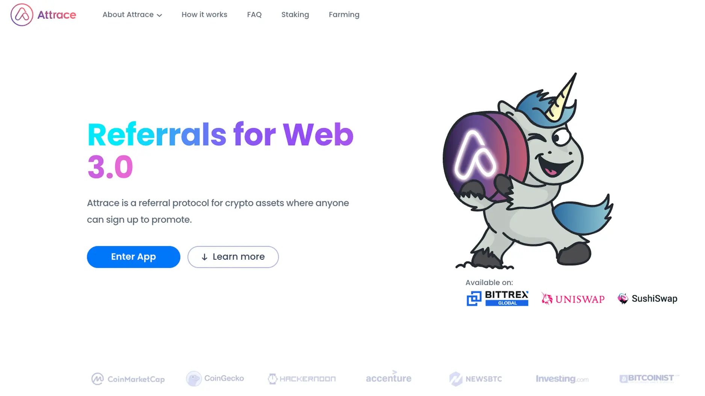
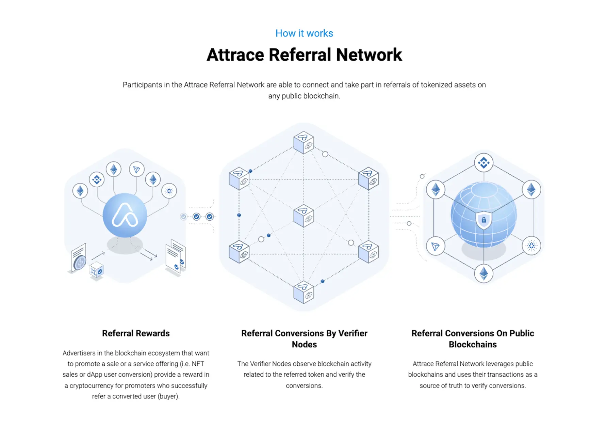
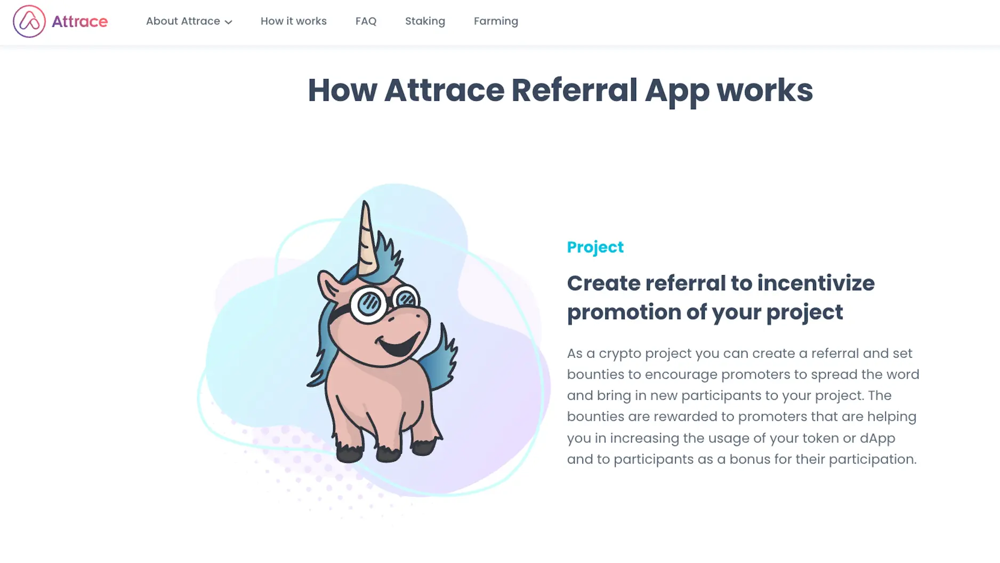
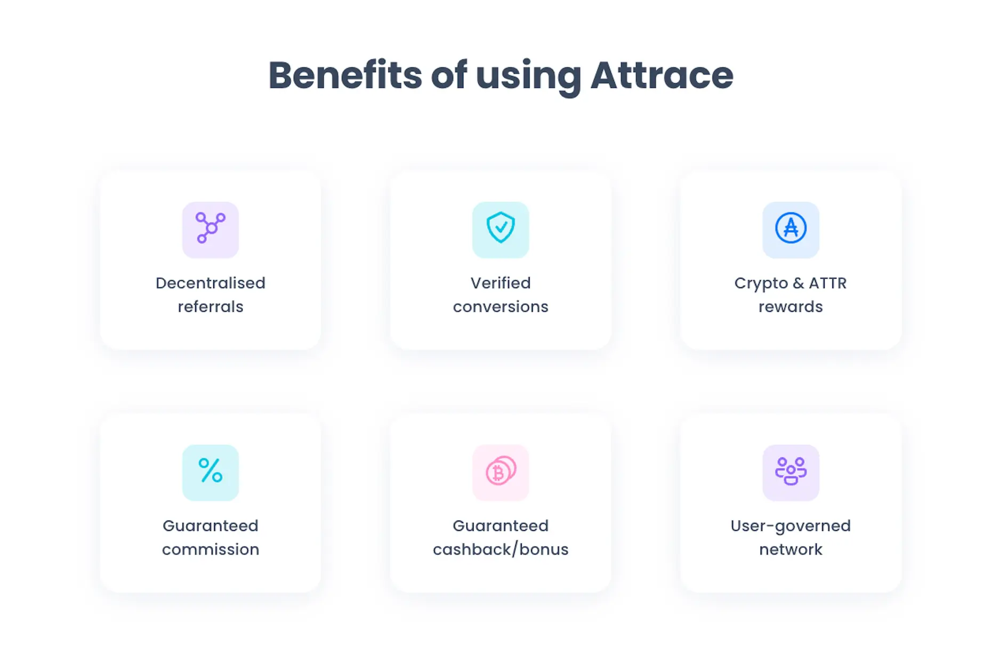
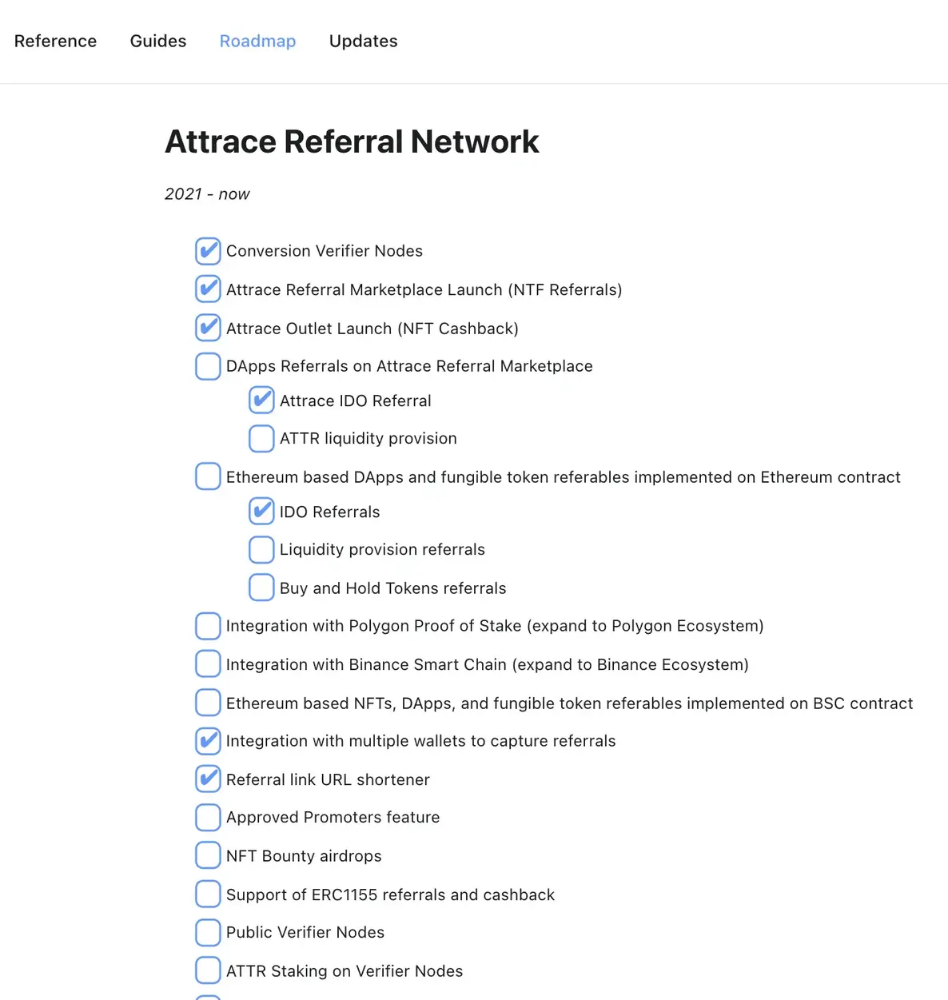
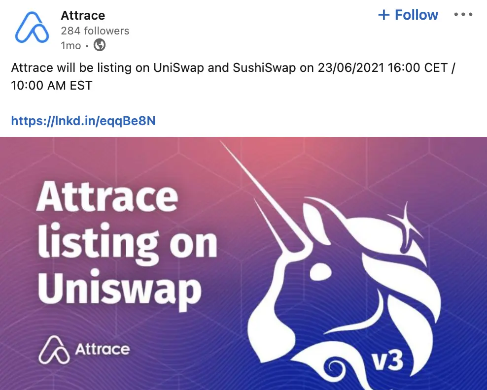

**Industry**\
Marketing Technology / Blockchain

**Location**\
Netherlands

**Business context**\
Traditional affiliate marketing systems lacked transparency and trust between merchants and websites

**Solution**\
Developed a decentralized affiliate network using blockchain to verify referrals and ensure fair commission payments

**Outcome**\
Successfully launched an MVP followed by "The Outlet Launch" (NFT cashback) and integration with major crypto exchanges

**Our service**\
Blockchain Development / Smart Contract Development / Network Architecture

## Technical highlights

- **Smart contracts**: Solidity for transparent transaction agreements
- **Backend**: Golang for blockchain data indexing and verifier network
- **Consensus**: pBFT protocol implementation for blockchain validation
- **Data storage**: IPFS for persistent, secure file sharing with access controls
- **Security**: Multiple authentication systems with rigorous testing
- **Integration**: Support for eight major blockchain networks

## What we did with Attrace

Attrace came to us with an exciting challenge: build a decentralized affiliate marketing network that uses blockchain to verify referrals and connect merchants with websites.

Their core idea was applying referral systems to different blockchain products, from token sales to NFTs.

They needed to launch an MVP quickly to validate their idea and start attracting early users. Our team of three developers joined their project, focusing on creating custom blockchain solutions to power Attrace's core functionality.

## How we built it

We focused on creating a secure, transparent system using blockchain technology:

- **Blockchain solutions** for multiple use cases like IDO launches, liquidity pools, and NFTs
- **Custom backend systems** built with Golang and Solidity to index blockchain data
- **IPFS technology** for secure file sharing with proper access controls
- **Privacy-focused design** meeting GDPR standards
- **Fraud detection network** to verify transactions and prevent misuse

## The problem Attrace was solving

Traditional affiliate marketing has issues with transparency and trust. When a customer clicks a referral link and makes a purchase, it's hard to verify if the commission was correctly tracked and paid.

Unclear money flow creates opportunities for fraud. Attrace's solution was to move all network activity to blockchain, which provides:

- Lower costs for running the network
- Better data privacy management
- Transparent tracking of all transactions

The blockchain system logs agreements between merchants and affiliates through smart contracts, with each click and conversion tracked on the chain.

We built Attrace using **blockchain nodes** that provide transparent transactions, create secure networks, and enable real-time communication between everyone involved.

### Technical approach

We initially built on Ethereum because it offers a proven way to create decentralized applications with smart contracts. This greatly reduces the chance of fraud by eliminating the need for third parties.

But we didn't stop there. The Attrace team was already planning to integrate with more blockchain networks to reach a wider user base.

We developed several key technical components:

- **Consensus protocol**: We implemented a pBFT (Practical Byzantine Fault Tolerance) consensus mechanism for blockchain validation, ensuring reliable agreement between network nodes.
- **Blockchain connector**: We built a network connector that serves as the interface for users to interact with Attrace's blockchain, simplifying the complexity of blockchain integration.
- **Smart contract system**: We created Solidity contracts that define the rules for different types of affiliate relationships and handle commission payments automatically.
- **Indexing engine**: We developed a system in Golang to efficiently index and process blockchain data, making it accessible for reporting and analysis.
- **Dashboard**: We built a management interface for marketing campaigns, allowing users to create, track, and optimize their affiliate programs.

### Data architecture

Blockchain data needs to be available long-term while avoiding bloat. We used IPFS (InterPlanetary File System) to keep data persistently available with proper access controls. This system relies on cryptographic hashes instead of storing everything on the blockchain itself.

This approach provided several benefits:

- Data remains accessible even if the original publisher goes offline
- Content addressing ensures data integrity
- Access controls maintain privacy where needed
- Reduced on-chain storage costs

### How we collaborated

We stayed in sync with the Attrace team using Slack for daily conversations and Trello for task management. Our regular communication rhythm included:

- Daily progress updates through Slack
- Weekly planning sessions to prioritize tasks
- Bi-weekly demos to showcase new features
- Monthly roadmap reviews to align with business goals

This collaborative approach ensured we remained aligned with Attrace's vision while maintaining development momentum.

## What we achieved

After nine months of work, we successfully launched the MVP version of Attrace. This was followed by "The Outlet Launch" (featuring NFT cashback) and deep integration with multiple crypto wallets.

Our team delivered several key components:

- A pBFT consensus protocol for blockchain validation
- A network connector for users to interact with Attrace's blockchain
- A dashboard for managing marketing campaigns

Attrace went on to achieve significant milestones:

- [Launching their $ATTR token](https://medium0.com/attrace/launch-of-attrace-token-attr-8af568436136?source=rss-43b67b0fd75b------2)
- Releasing the complete Attrace Referral Network
- Getting listed on major exchanges like UniSwap and SushiSwap

> *"They left us with great development and improvement, in terms of work result and team synchronization. A worthy evidence for Attrace's investments and we hope nothing more than to keep going with them in long-term, provide opportunities for these devs to grow with Attrace."* - Erwin, Attrace's CEO & Founder
