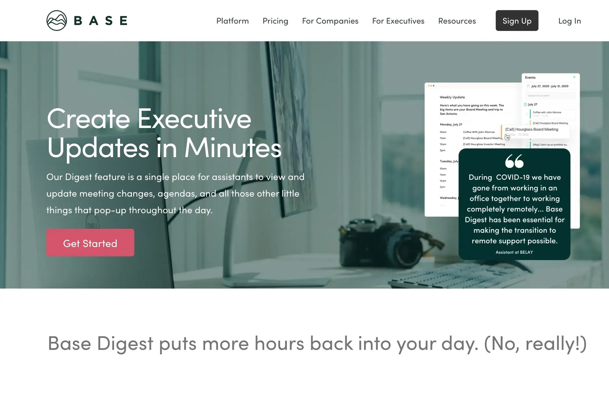

**Industry**\
Productivity / Workplace Software

**Location**\
United States

**Business context**\
Executive assistants lacked specialized software to manage calendars, tasks, and communication across multiple platforms

**Solution**\
Developed and refined a comprehensive platform specifically designed for executive assistants' unique workflow needs

**Outcome**\
Created a successful platform that streamlines assistant workflows while establishing a long-term technical partnership

**Our service**\
Full-stack Development / Technical Consulting / Code Quality Improvement

## Technical highlights

- **Backend**: Go and Node.js for efficient processing and API development
- **Frontend**: React.js and Next.js with TypeScript for type safety
- **Database**: MongoDB for flexible data storage and PostgreSQL for structured data
- **Architecture**: Microservices approach for maintainability and scalability
- **Monitoring**: New Relic, Sentry, and Fullstory for comprehensive visibility
- **Deployment**: Google Cloud Platform with Kubernetes for reliable hosting

## What we did with BaseHQ

Base is a software platform made specifically for executive assistants. It launched in 2019 with $2.6 million in funding from investors like Matchstick Ventures, Rise of the Rest Seed Fund, High Alpha Capital, and Slack Fund. Their goal was to change how executive assistants work.

The platform helps executive assistants manage their daily tasks by putting calendars, to-do lists, communication, and reporting all in one place. To do this, Base needed to build a system that could connect with all the different tools that assistants typically use.

We worked with BaseHQ for two years to help them develop new features and improve existing ones. We focused on helping them meet their deadlines while keeping their product high-quality. We provided both development help and technical advice, helping them improve their code and system design as they grew.

## The challenge BaseHQ was facing

Executive assistants have a unique challenge: they need to work across many different platforms and manage lots of information for the executives they support. Before Base, there wasn't any software specifically designed for their needs.

Base needed to create an all-in-one platform that could bring together important data from different sources, including calendars, task managers, communication tools, and more. This would let assistants create reports, track decisions, build summaries for executives, and manage schedules all from one place.

When we joined the project, Base had a lot of existing code that needed improvement to make the product more stable and ready for future growth. The challenge wasn't just to add new features but also to clean up existing code and create a better system that could support their ambitious plans.

## How we built it

Our work with BaseHQ included both coding and technical advice. We helped improve their existing code while suggesting new approaches for future features and providing design recommendations.

### Technical approach

We tackled their large existing codebase and improved it to make the product more stable. The system was divided into two main parts:

1. **User Application**: The interface that executive assistants use every day
2. **Admin Tools**: Backend systems for managing users, connections, and platform settings

For the technical implementation, we used:

- **Modern backend**: We combined Go and Node.js to create efficient APIs and data processing systems that could handle the complex requirements of calendar synchronization and task management.
- **Type-safe frontend**: We built the user interfaces with React.js and Next.js, adding TypeScript to improve code quality and reduce bugs through static typing.
- **Flexible database architecture**: We used MongoDB for storing unstructured data alongside PostgreSQL for more structured information, creating a hybrid approach that offered the best of both worlds.
- **Reliable cloud infrastructure**: We deployed the system on Google Cloud Platform with Kubernetes, ensuring high availability and easy scaling as the user base grew.
- **Comprehensive monitoring**: We implemented New Relic, Sentry, and Fullstory to track performance, catch errors, and understand user behavior.
- **Event-driven architecture**: We created custom components for tracking events, enabling real-time updates and notifications across the platform.

### How we collaborated

Our collaboration with the Base team included:

- Managing tasks through Jira to keep development organized
- Communicating via Slack for quick questions and updates
- Regular meetings on Zoom to discuss progress and challenges
- Code management with Git for version control
- Continuous deployment through GitHub Actions for reliable releases

Throughout the project, we kept detailed weekly updates to track progress and ensure transparency with the BaseHQ team.

## What we achieved

One of the most important features we helped develop was the Availability Offer system, which combines calendar management with polling to make scheduling easier. This feature shows how Base simplifies complex workflows for executive assistants.

The availability system lets assistants:

- Quickly find open time slots across multiple calendars
- Send scheduling options to executives or external contacts
- Collect preferences through a simple polling interface
- Automatically book confirmed meetings on the right calendars

Our partnership with Base is one of our longest collaborations. We've supported them through several important milestones, from the initial development of their web application to the creation and improvement of their core features.

Base has continued to grow in popularity, recently showcasing their platform through a detailed [Base 101 Demo](https://www.linkedin.com/posts/basehq_base-101-demo-get-back-to-the-base-ics-activity-6800435873860120576-G7ZI) that shows how their system works.

This project illustrates the value of long-term technical partnerships in helping startups refine and expand their products. By providing both development resources and strategic technical guidance, we helped Base create a platform that addresses a significant market need and delivers tangible value to executive assistants worldwide.

Dwarves Foundation is a team of design and development experts working closely with clients to craft software, build tech teams, and invest in people who create world's next favorite things.
