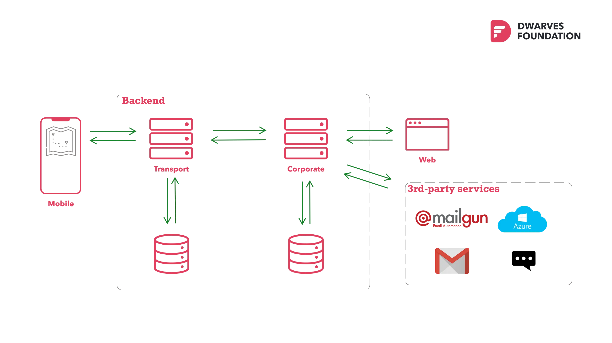
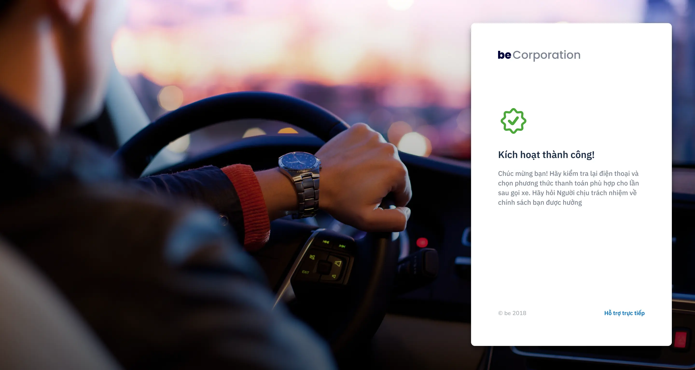

## In brief
- Getting the early funding for over 40M US dollar, **beGroup** focuses to roll out all 4 products by the end of 2018. By that time, there were only 6 months before the debut.
- **beCorporate** is a module to manage and optimize in-house business transports for employee. 
- They look to ship in short timeline. The current engineering team was working on the 1st release of ride-hailing app. Wrap-up beCorporate adds a step in perfecting their service.
- We augmented them with 6 Dwarves, working collaboratively to speed up the product development.

## Technical Highlight
- Golang-backend system for team-scale support
- System design: Microservice architecture
- System integration with new module development
- Business logic adjustment 

## The Context
**beCorporate** is tailored for enterprises. Employees can register, schedule and book vehicle for business transports via **beApp**, either as a group or as an individual. The initial launch gained a lot of traction and traffics. It drives the development team to their busiest stage.

Their release timeline for **beCorporate** couldn't change due to the business roadmap. The market was welcoming **beApp**, and was ready to see more. 

Back in 2018, it was challenge to build an in-house team of experienced Golang developers. With that timeline, **be** needs a team partner to get things done fast. Hiring for more hands wasn't an option. There was no time for recruitment, onboarding, or tech stacks training. 

>
> "We were one of the first teams in Vietnam that picked up Golang as the strategic language. That's how our partnership began."

## Engagement Model
**beCorporate** was sketched up with 2 ideals architectures. We must find where to input the module. Would it better be stand alone, or integrated as a service within be's Cloud ecosystem?
- The stand alone: Modern enterprise solutions without compromising stability and reliable. 
- The ecosystem: Ensures how beCorp fits into the big picture of the current infrastructure. 

We figured integrating **beCorporate** into the ecosystem was more reasonable. Users are capable of experience other services. Hence, microservice was the final option for system architecture.

### Tech stacks
- Backend: Golang
- Frontend: ReactJS, Tailwind
- Logging/Monitoring
- Automated CI pipeline

### Collaboration
- Slack chat & GSuites document storage
- Jira task management
- Scrum Process
- Bi-weekly release iteration & Weekly tech discussion

## Outcome
**beCorporate** first MVP was released after 3 months, expanded the market coverage, enabled **be** to lay its name on Vietnam transportation industry.

The augmentation allows them to reduce recruitment and training cost. 

Instead, their effort was fully invest in product development and maintaining current resources, marketing strategy and branding activities.

See the full version at: [be.com.vn/khach-hang-doanh-nghiep/becorporate/](https://be.com.vn/khach-hang-doanh-nghiep/becorporate/)

