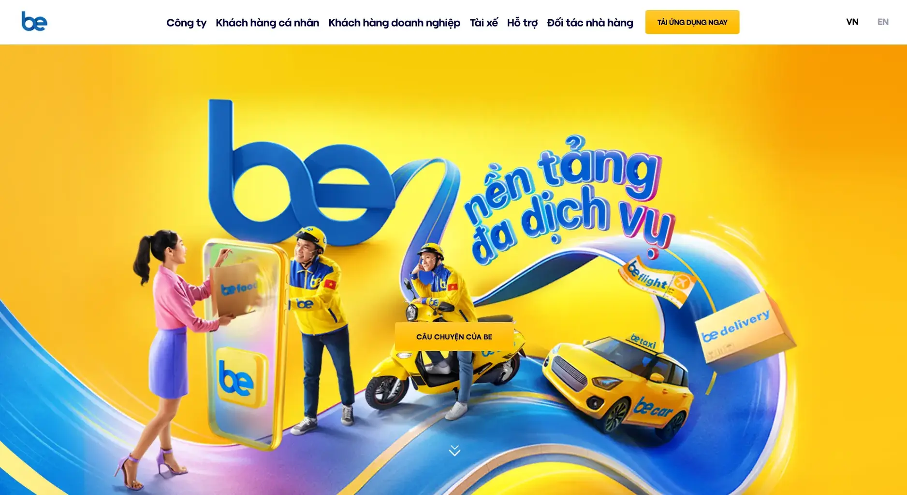
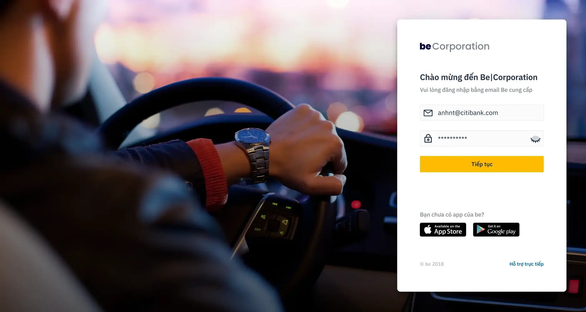
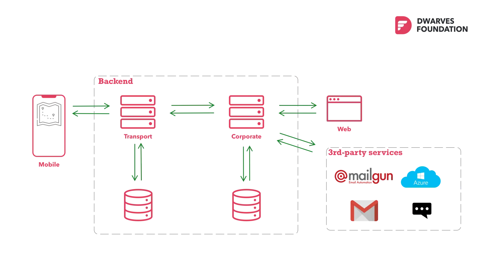
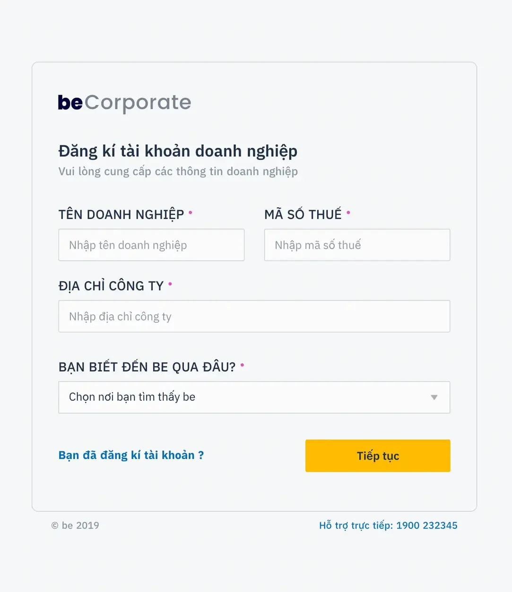
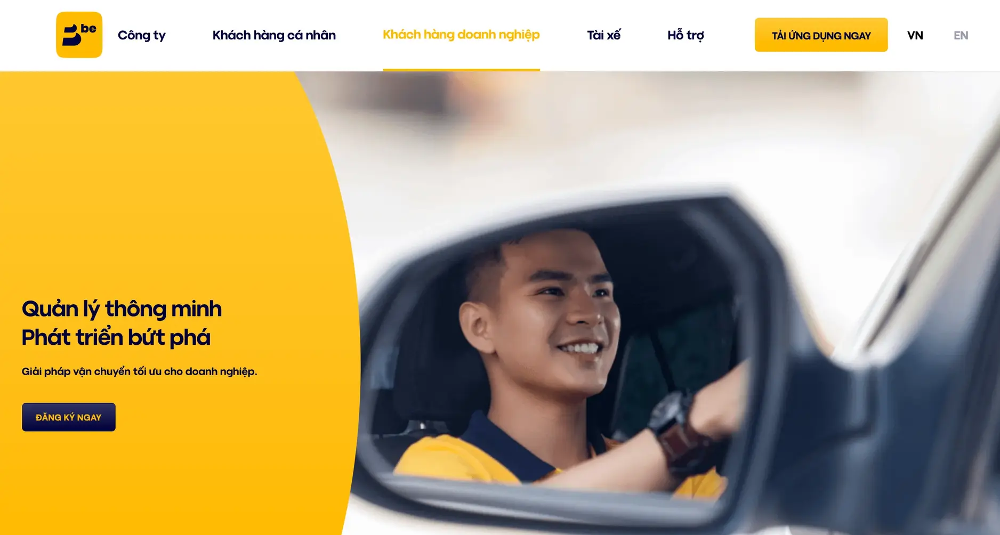

**Industry**\
Transportation / Ride-hailing

**Location**\
Vietnam

**Business context**\
beGroup needed to launch their enterprise ride-hailing service on a tight timeline while their in-house team was focused on their core consumer app

**Solution**\
Provided an augmented team of six developers to accelerate the development of the beCorporate platform

**Outcome**\
Successfully released the beCorporate MVP after just three months, expanding beGroup's market coverage

**Our service**\
Team Augmentation / Backend Development / Frontend Development

## Technical highlights

- **Backend**: Golang development for scalability and performance
- **Frontend**: ReactJS with Tailwind for modern, responsive interfaces
- **Architecture**: Microservices approach for seamless integration
- **DevOps**: Comprehensive logging, monitoring, and CI/CD pipeline
- **Process**: Agile development using Scrum methodology
- **Collaboration**: Close integration with the beGroup in-house team

## What we did with beGroup

beGroup is one of Vietnam's leading ride-hailing platforms, backed by significant early funding of over $40 million. With ambitious plans to launch four distinct products by the end of 2018, they faced a challenging timeline with just six months until their debut.

One of these products was beCorporate, a specialized module designed to help enterprises manage and optimize their business transportation needs for employees. While beGroup's in-house engineering team was fully occupied with developing their core consumer ride-hailing app, they needed additional expertise to deliver beCorporate on schedule.

We provided an augmented team of six developers who worked collaboratively with beGroup to accelerate the development of beCorporate, helping them complete their product lineup and strengthen their market position in Vietnam's competitive transportation industry.

## The challenge beGroup was facing

beCorporate is specifically tailored for enterprise clients, allowing employees to register, schedule, and book vehicles for business travel through the beApp platform, either individually or as groups. The initial launch of beGroup's main service had already gained significant traction and traffic, putting their development team under considerable pressure.

The release timeline for beCorporate was fixed due to the company's business roadmap. The market had responded positively to their main app and was eager to see more offerings from the beGroup platform.

In 2018, building an in-house team of experienced Golang developers on short notice was particularly challenging in Vietnam. With their tight timeline, beGroup needed a partner who could hit the ground running. Traditional hiring wasn't viable – there simply wasn't enough time for recruitment, onboarding, or technical training.

As beGroup noted: "We were one of the first teams in Vietnam that picked up Golang as the strategic language. That's how our partnership began."

## How we built it

The first challenge was determining the best architectural approach for beCorporate. We explored two potential options:

1. A standalone solution: This would provide a modern enterprise service without compromising stability and reliability
2. Integration with beGroup's ecosystem: This would ensure beCorporate fit seamlessly into their existing infrastructure

After careful analysis, we determined that integrating beCorporate into the existing ecosystem made more strategic sense. This approach would allow users to seamlessly experience other beGroup services and create a more cohesive product family. A microservices architecture became our chosen technical approach to accomplish this goal.

### Technical approach

We implemented a solution utilizing:

- **Backend development**: We used Golang to ensure scalability and performance, making sure the system could handle enterprise-level demands.
- **Modern frontend**: We built the user interface with ReactJS and Tailwind, creating a responsive design that worked well on all devices.
- **Comprehensive monitoring**: We implemented logging and monitoring systems to track performance and quickly identify any issues.
- **Efficient deployment**: We set up an automated CI/CD pipeline for reliable testing and deployment, ensuring consistent quality.
- **Seamless integration**: We carefully designed the system to work within beGroup's existing ecosystem while maintaining its own distinct functionality.

### How we collaborated

Throughout the project, we maintained close collaboration with the beGroup team through:

- Regular communication via Slack and GSuite document sharing
- Task management through Jira
- Agile development using Scrum methodology
- Bi-weekly release iterations and weekly technical discussions

This approach ensured alignment with beGroup's vision while maintaining development velocity.

## What we achieved

Our collaboration delivered significant results. The first MVP of beCorporate was successfully released after just three months of development, expanding beGroup's market coverage and strengthening their position in Vietnam's transportation industry.

The team augmentation model provided several important benefits for beGroup:

- Reduced recruitment and training costs during a critical growth period
- Allowed them to focus their internal resources on product development and maintenance
- Enabled them to invest more in marketing strategy and brand-building activities
- Delivered a complete enterprise offering to complement their consumer services

This project demonstrated the effectiveness of strategic team augmentation for companies facing tight deadlines with specialized technical requirements. By providing experienced Golang developers who could integrate quickly with beGroup's existing team, we helped them achieve their business objectives and establish a strong foundation for future growth in the enterprise transportation market.
