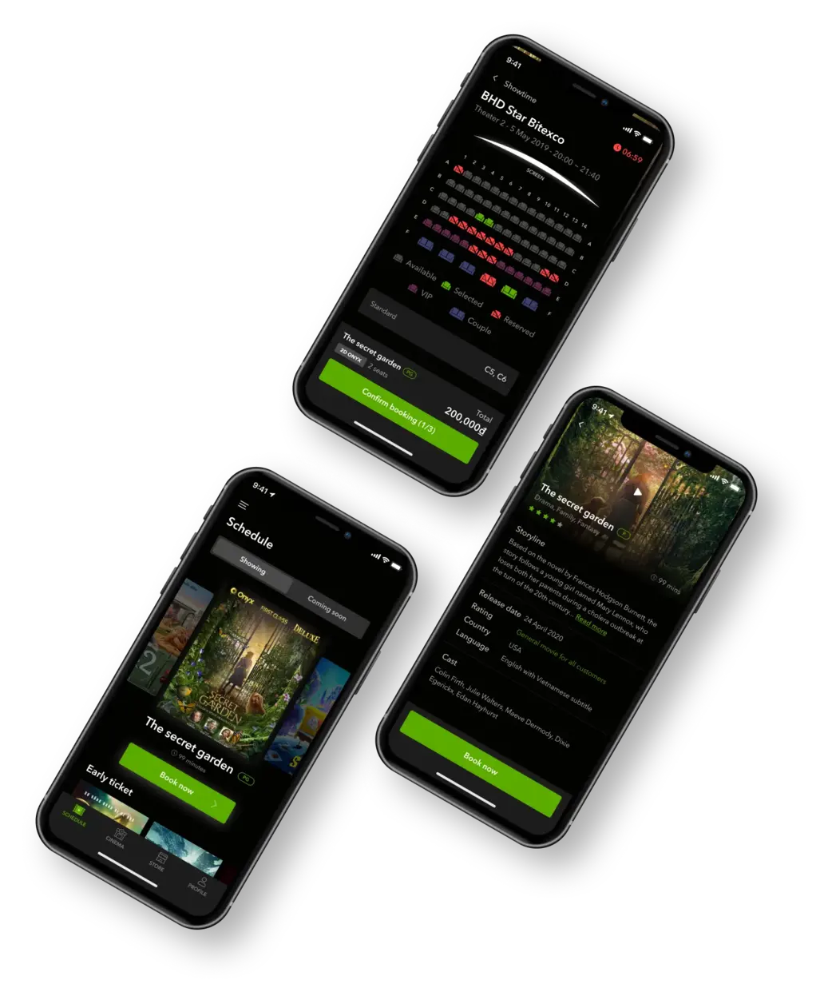
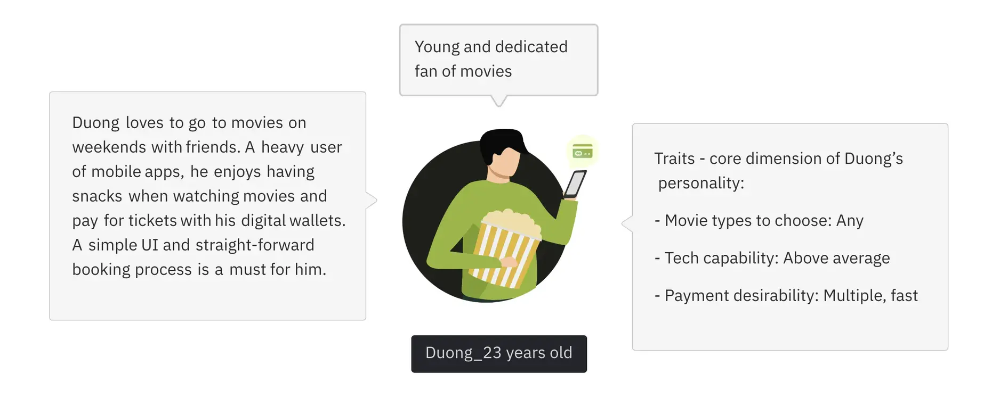
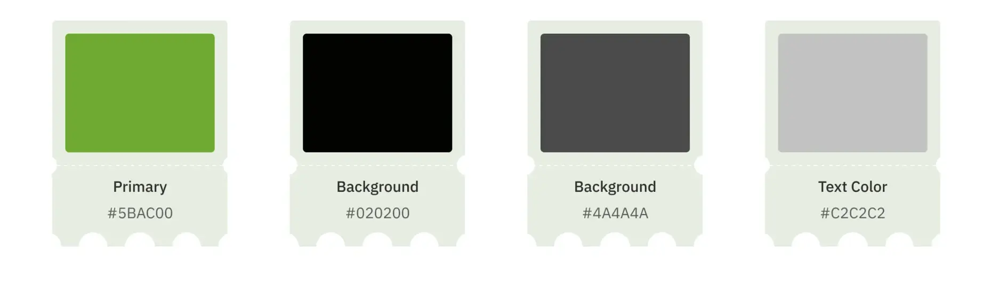
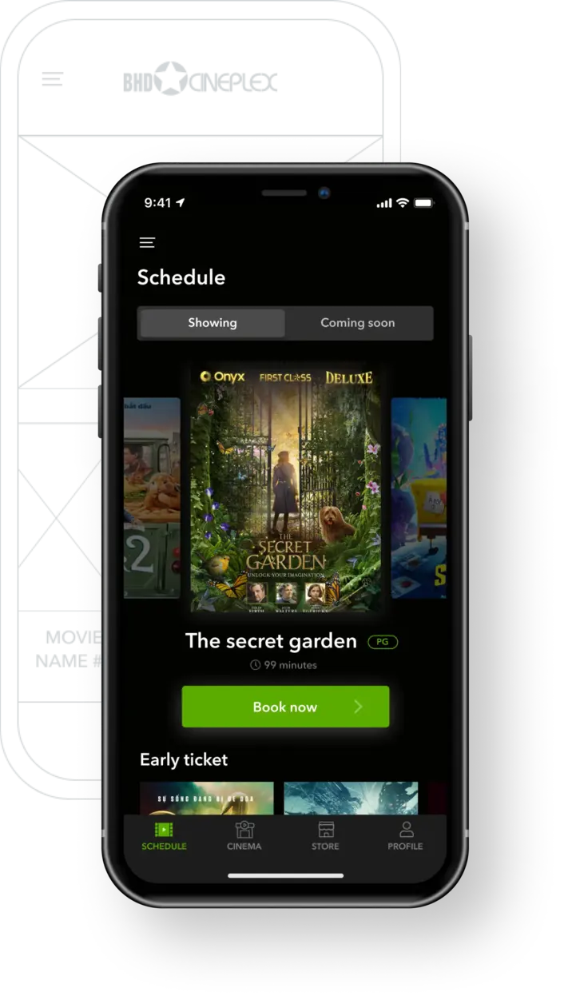
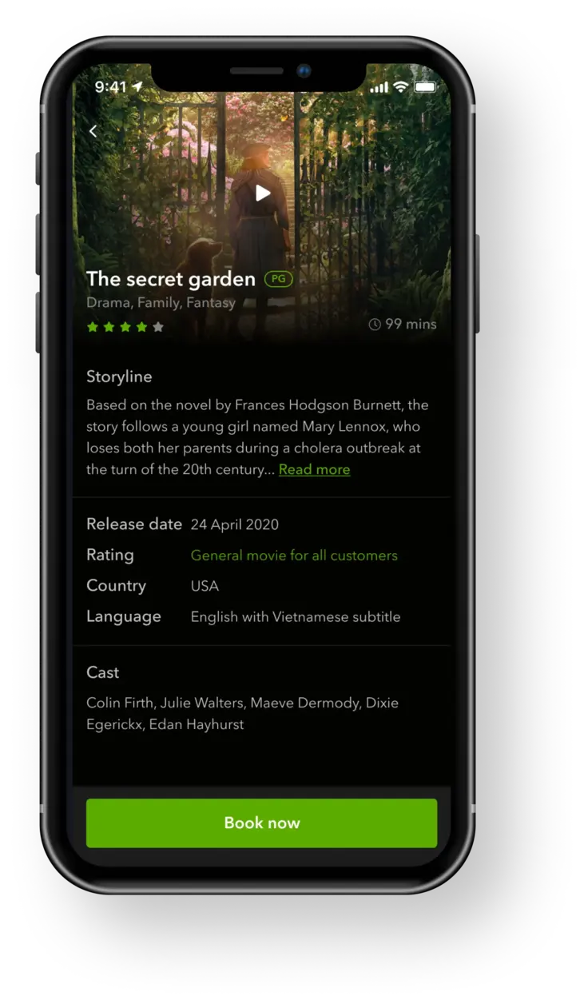
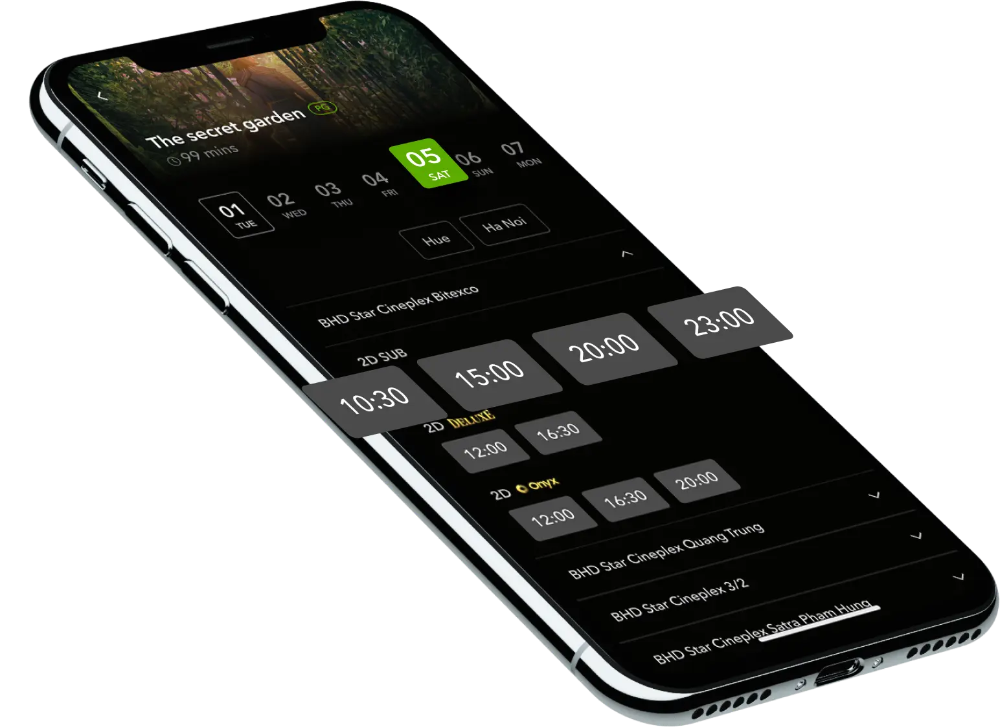
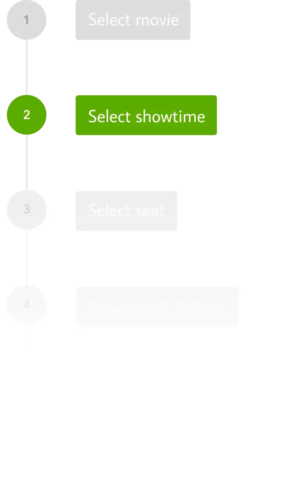
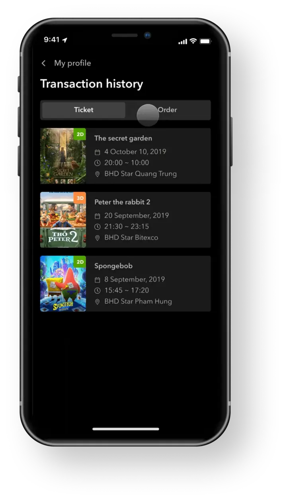
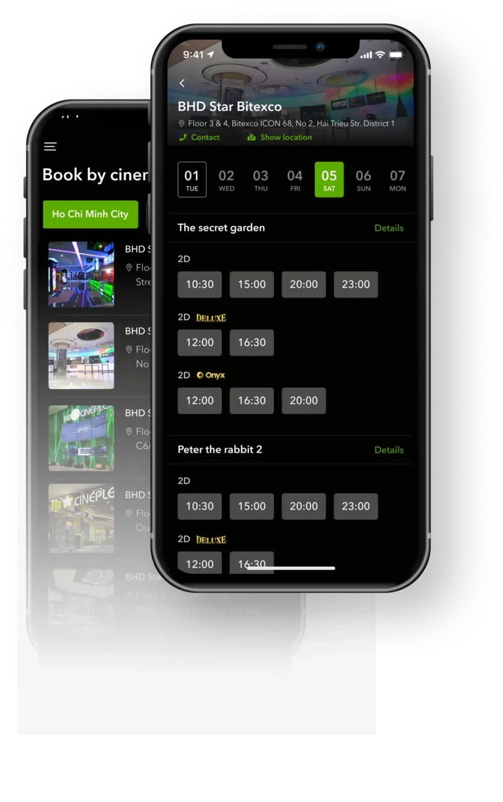
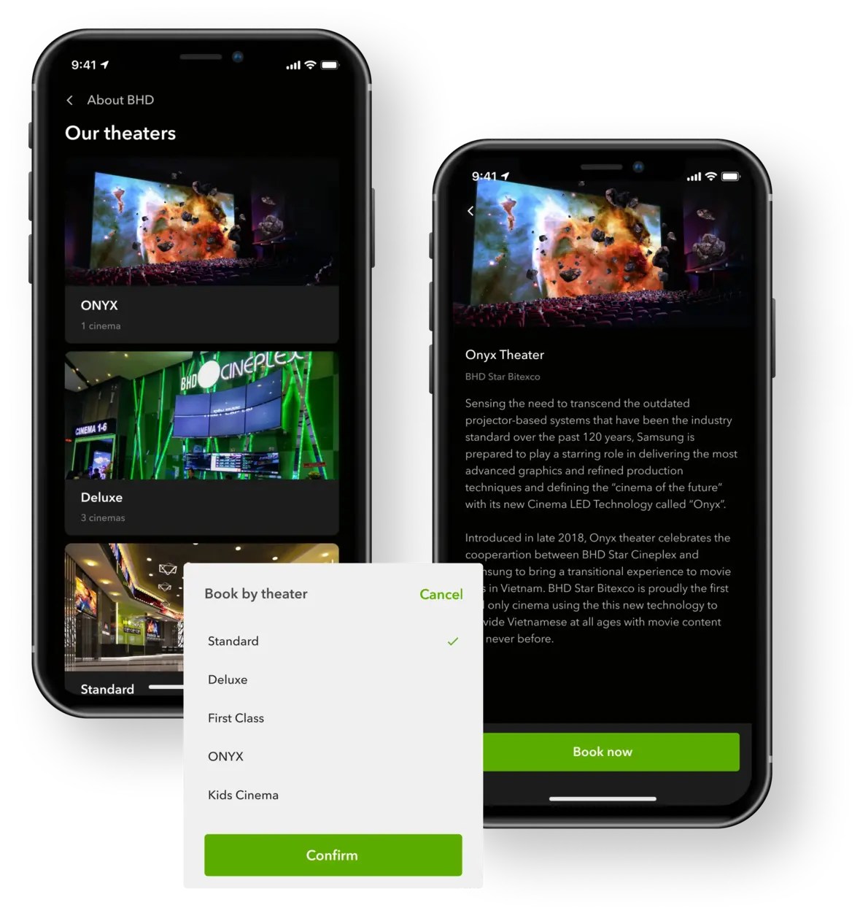

**Industry**\
Entertainment

**Location**\
Vietnam

**Business context**\
Popular cinema chain with an outdated, non-functional mobile app that frustrated users

**Solution**\
Complete app redesign with intuitive user flows for booking tickets and discovering movies

**Outcome**\
A modern, easy-to-use app that lets movie-goers book tickets online and enhances the cinema experience

**Our service**\
Mobile app design / UI/UX improvement

## Technical highlights

- **UI Framework**: Used modern mobile design frameworks
- **Typography**: Avenir Next font family for clean, readable text
- **Design System**: Created consistent components and color palette
- **Interactive Elements**: Carousel navigation, intuitive booking screens

## What we did with BHD Cinema

BHD Cinema is one of Vietnam's largest cinema chains, selling hundreds of thousands of tickets each month. Despite their popularity, their mobile app was a major weak point in their customer experience. The old app looked outdated, had an inconsistent interface, and most importantly, didn't allow customers to book tickets online.

We completely redesigned their app to meet the basic needs of movie-goers in a clean, intuitive way. Our new design makes it easy for customers to check movie schedules, see what's playing, learn about films, and book tickets directly through the app.

## The challenge BHD faced

BHD needed to change how customers perceived their digital experience. Their existing app was:

- Visually outdated and inconsistent
- Unable to process online ticket bookings
- Difficult to navigate with a cluttered interface
- Missing key information that customers needed

They wanted a solution that would not only allow online booking but would also help convert regular movie-goers into loyal BHD customers. The app needed to become their customers' first choice when thinking about watching a movie.

## How we built it

We approached the redesign by focusing on the core needs of movie-goers while creating a visually appealing, easy-to-navigate experience.

### Design approach

We built the app around several key principles:

**Intuitive navigation**: We designed the home screen to immediately show what movies are playing, with a smooth carousel interface that makes browsing enjoyable. We moved promotional content below the movies to keep the focus on the main task—finding and booking movies.

**Simplified information**: Movie details are structured for easy scanning, with all the essential information (runtime, genre, ratings) clearly visible. A persistent "Book now" button stays at the bottom of the screen, making it easy to move to the booking process at any point.

**Streamlined booking**: The booking flow was reduced to the minimum necessary steps, with clear visual cues at each stage. We grouped showtimes logically by date, location, and theater type to help users quickly find convenient options.

**Digital convenience**: We introduced digital tickets with QR codes, allowing for faster entry at theaters and reducing paper waste. The app also keeps track of past bookings and ticket history, sorted from newest to oldest for easy access.

### Design elements

We created a consistent design system for the app:

**Typography**: We used Avenir Next throughout the app for its excellent readability and modern feel.

**Color palette**: We developed a color system based on BHD's brand colors, creating a visually appealing interface that maintained brand recognition.

### Key features

**Home screen and movie schedule**: The redesigned home screen makes it easy to see what's playing with larger movie cards and a smoother carousel effect. We prioritized movie content over promotional banners to focus on the main user need.

**Movie details**: We structured movie information to help users quickly decide if a film matches their interests. Details include synopsis, runtime, genre, cast, and age rating—all the essential information for making a choice.

**Showtime selection**: We organized showtimes in a logical order by date, location, and theater type. Only relevant information is highlighted to prevent information overload:

- Today's date is the default view (you can't book past shows)
- City selection is simplified
- Start times are arranged in a horizontal scroll for quick scanning

**Booking flow**: We simplified the entire booking process to make it quick and intuitive, reducing the steps needed to complete a reservation.

**Transaction history and tickets**: The app keeps track of all tickets and orders, making it easy for users to access their current and past bookings. Digital tickets include QR codes for quick theater entry.

**Cinema browsing**: For users who prefer to choose a theater first, we created a "Book by cinema" feature that shows all movies playing at a specific location. This option provides greater flexibility in how users approach their movie selection.

**Theater information**: The app includes detailed information about each BHD theater, including photos of the different theater types (standard, premium, etc.) to help customers know what to expect from their cinema experience.

## What we achieved

The redesigned BHD Cinema app successfully transformed the customer experience by addressing all the key issues with the previous version:

- Created an intuitive interface that makes finding and booking movies simple
- Implemented online ticket booking functionality that eliminates the need to wait in line
- Designed a system for managing digital tickets and booking history
- Provided comprehensive information about movies, theaters, and showtimes in an easily digestible format
- Built a flexible platform that accommodates different user approaches to movie selection

The new app helps BHD Cinema strengthen their brand and build customer loyalty by providing a seamless digital experience that complements their physical cinema services. By making it easier for customers to engage with their brand through digital channels, BHD can better compete in Vietnam's busy entertainment market.
