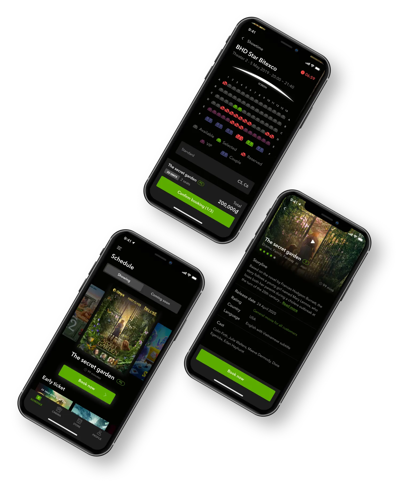
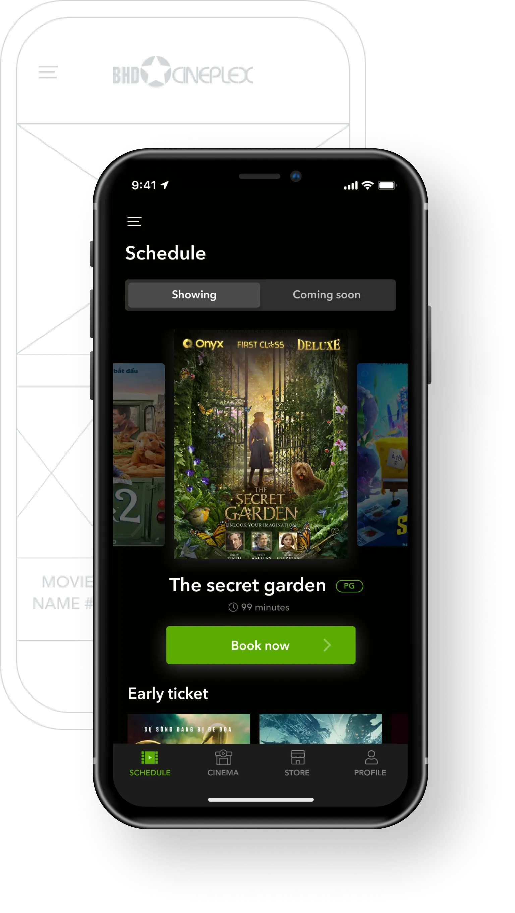
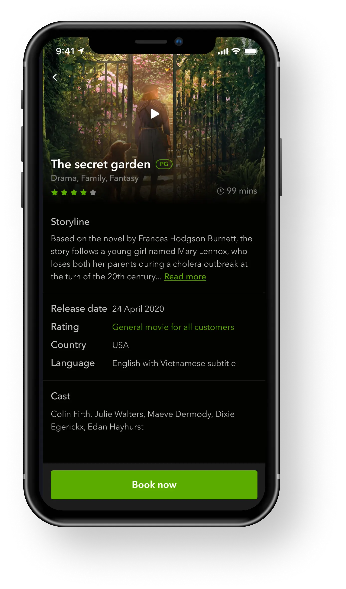
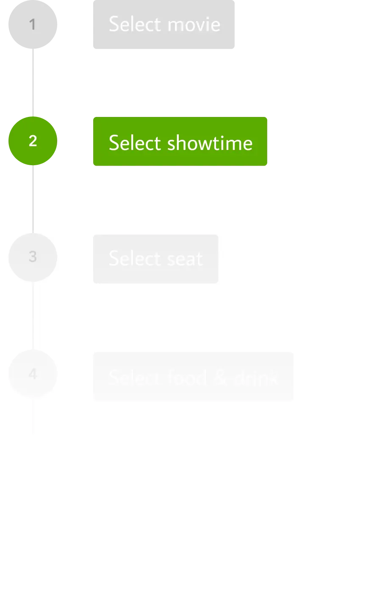
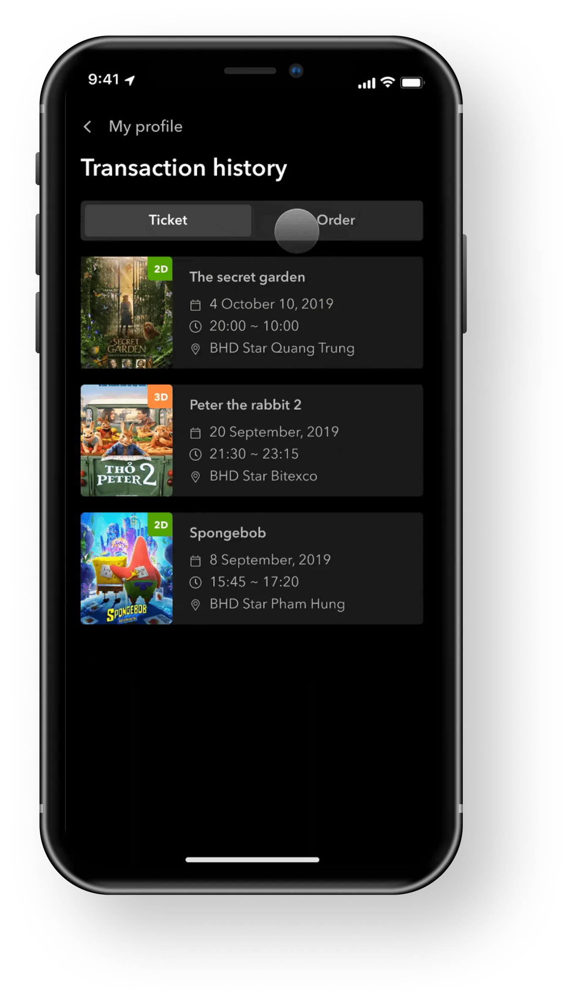
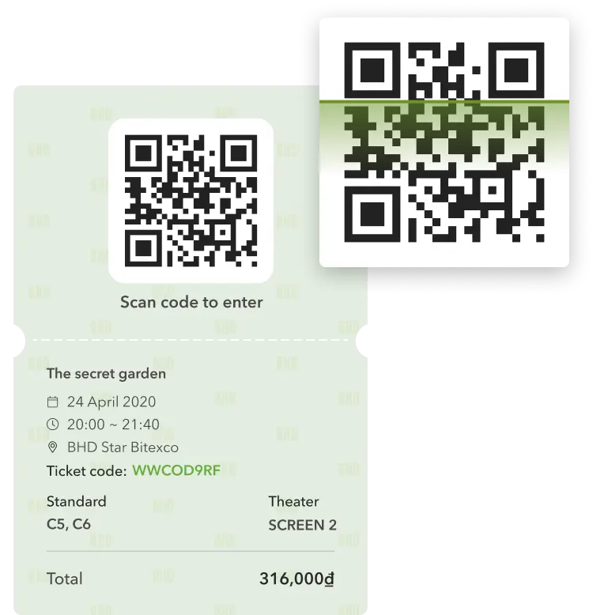
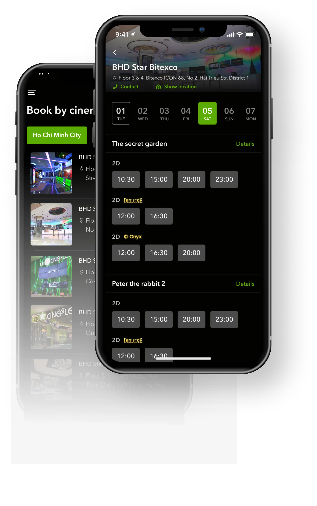
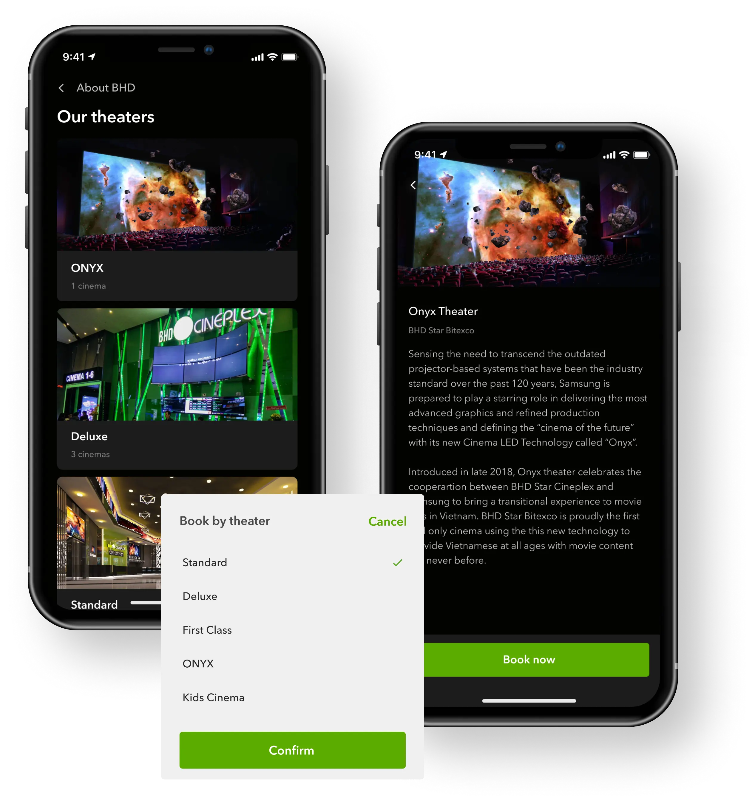

## Introduction
BHD is one of the biggest cinema chains in Vietnam with hundreds of thousands tickets sold monthly. However, its mobile application is a complete drawback; users cannot book tickets online, it feels and looks outdated, inconsistent and cluttered.

## Mission
BHD’s new app covers all the basic needs of movie-goers, in an intuitive and pleasant way. Meaning, users can easily scan screening schedules, view movie details and book tickets online.

## Goal
1. Provide users with information on movies, schedules, locations, promotions all in one space.
2. Allow users to book and pay for their tickets online.
3. Convert movie-goers into BHD fanatics. When it comes to movies, BHD comes to mind first.

## The Challenges
**The new design** needs to change users’ current perception of BHD app, by providing users with **a seamless and straight-forward experience.**

### Personas

### Home screen - Schedule
Home screen providing information of all movies, with a bigger and smoother transition effect for the movie carousel.

Moving the promotion banners beneath the movies to prioritize the main task.

### Movie details
Finding more info helps users decide if a movie fits them. Movie details were structured for easy scanning. A clear Book now button stays at the bottom of the screen allows fast booking without having to scroll.

### Transaction history
Users can keep track of their tickets, as well as their orders, sorted from newest to oldest for quick navigation. Orders are also indicated with different statuses to prevent missing pick-ups.

Digital ticket with QR code. Scan and enter the movie, go green with less paper waste.

## The Solution
### Typography
Avenir Next

### Color palette

### Home screen - Schedule
What movies are playing at the theater? Is that movie too long to watch? Providing answers to these common questions is the top priority of this screen. The old one didn’t offer this info and our proposed solutions are:

1. A bigger and better transition effect for the movie carousel to make the browsing more enjoyable
1. Eye-catching CTA button to encourage booking
1. Moving the promotion banners beneath movies to prioritize the main task

### Movie details
Finding more info helps users decide if a movie fits them. Movie details were structured in a way that users can scan through easily. A clear Book now button always stays at the bottom of the screen allows fast booking without having to scroll.

### Showtime
When picking showtime, it is important to group them by order: time - location - type of theater. Must-have data is also highlighted for best scanning:

* Date of the showtime - today as the default state, going back to the previous days is not permitted to prevent mistakes.
* City in which the cinemas locate - only 3 cities available so showing all should be better than hidden in a combo box.
* Start time - optimized with horizontal scroll to help users perceive info and make their booking decision quickly.

### Booking flow

### Transaction history
Users can keep track of their tickets, as well as their orders arranged by latest to oldest for quick navigation.

Orders are also indicated with different statuses to prevent missing pick-ups.

Digital ticket with QR code. Scan and enter the movie, go green with less paper waste.

### Book by cinema
Some users might want to find the nearest cinema to go to, regardless of which movies are shown. Therefore, showtime of movies are fully shown in one screen.

Now, only two steps needed to select a seat.

### Our theaters
Movie-goers can explore many types of theaters provided by BHD ranging from Standard to Special. List of theaters presented with real photos brings a hint of what they would enjoy. Card component is used to display list of theaters and news to retain consistency in style.

