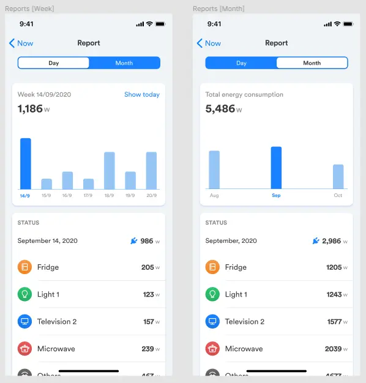

## In brief
* AirWatt is an IoT solution that integrates and monitors electricity usage using AI/ML. 
* AirWatt's vision is to help businesses track electric usage status of electrical equipment. Hence, they can save electricity and money, even avoid disaster.
* They seek for product development support, with insight on business to provide suitable product design
* The MVP must be done fast to prove the product's concept. We built Airwatt system from zero with other teams: Business, Hardware, and AI.

## Technical Highlight
* Microservices architecture
* Data structure and Infrastructure to centralize all data from Airwatt monitors on platforms.
* End-to-end data-flow from Monitor to AI servers for machine learning.
* MVP-centric: Rx-MVVM Inputs/Outputs to balance development's velocity by separating UI from business logic
* ESP Touch protocol for hardware WiFi connection
* A scalable platform with native mobile apps.

## The Context
AirWatt is designed for quick installation and constant improvement. Hence, it should comes in multiple platforms

AI utilizes data to figure out which device is on or off. We must create analytics dashboard with tracking mechanism. 

The problem is hard to solve, yet, it's worthwhile and improved all the time.

They have the capability to handle hardware production and Machine learning. But they face obstacle in building the MVP to visualize and nurture all the data structure. That's where we dive in to help, as technical partner and venture builder. 

## Engagement Model
### Solution Design
**Onboarding**

AirWatt's system is taken with 4 aspects to meet its business demand
* Monitor Management: Supports administration tasks at different places. Users can also switch on/off and view the detailed usage information of each monitor.
* Reporting: Must-have features to track usage status of electrical equipment. On the mobile version, the report shows weekly or in the nearest three months.
* Mobile App: The only way to bring the Monitors online and bind them to the corresponding user accounts. 
* Web App for B2B: For business owners to track data provided by Airwatt monitors through weekly and monthly reports.

**Microservice Architecture**

AirWatt processes a huge data volume at the same time. We build the architecture with two focus points: CRUD data and IoT data. 

All data must be synced to the AI system in real-time. AirWatt faces ~ 17,280 records per device every day. Going microservice is the ideal solution. 

* Airwatt System: The core domain to manage device's life cycle.
* Landing Page: Features solutions and pre-order for AirWatt's services.
* Admin Panel: Administrative dashboard for AirWatt to access and update data. 
* Mobile: iOS and Android version with dashboards, charts and report features.
* AI core: is the most important part with 4 main features: Data synchronization, detect appliance, predict appliance, prepare report data. 
* IoT core: Core data in the AirWatt system for IoT devices. This module helps to oversee and track the device's status.

**Different databases for different purposes**

* MongoDB: AirWatt system for data of IoT devices. Update device's status and electric consumption every 5 secs for real-time features and input to AI core.
* DynamoDB: Stores the data related to the input for the AI core. We use data from the Airwatt system data to pre-process data for AI's main features.

**AI Model**

AI models is built from real data with beta testing users, by the labeling data technique. AirWatt system collects the appliance's data in 2 weeks. These models are the input data to detect, predict appliances in real-time.

**Smart config Integration**

Mobile apps must connect user's hardware to the server using wifi. It registers the hardware to the server and link it with the user account. 
We use smart config integration with ESP2866 as wifi protocol. This requires manual-press button to enable the smart config mode.

**Tech stacks**

* Backend: Golang
* Frontend: React.js, Typescript, Swift, Kotlin
* Infras: Docker, k8s, AWS, GCP, Netlify
* Framework: Gin, TailwindCSS, Gastby
* Database: PostgreSQL, Redis, MongoDB, DynamoDB
* Monitoring: Grafana, Loki, Prometheus, Sentry
* Architecture: MVC, N-Tiers, Reactive, Microservices
* Library: RxJava, RxKotlin, RXSwift
* Reporting: Charts & MPAndroidCharts

**Collaboration**

* Development: Figma, Git/Github, Insomnia, K9s
* Practices: Agile, Gitflow, CI/CD, Code Review, Automation

## Outcome
After three months, we have accomplished the MVP development stage with necessary modules:

* Web App for B2B support
* Native mobile apps on [iOS](https://apps.apple.com/us/app/airwatt/id1522009415) and [Android](https://play.google.com/store/apps/details?id=com.dwarvesf.airwatt) platform
* End-to-end system design that handles data from monitor devices to the central server, processed with AI/ML and visualize the nurtured data on cross-platform apps.
* Eye-catching & detailed data report

>
> **Airwatt** has successfully made its way to the problem-solution fit stage. And event marked itself at [Vietnam Zone Startup](https://vietnam.zonestartups.com/zone-startups-portfolio/). The next milestone customizing the web app for a specific domain: FnB. A spinoff to the energy monitor solution for FnB is Airwatt's nearest goal. 

