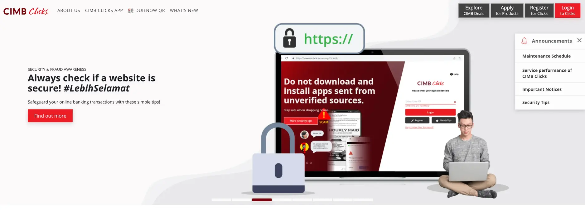

**Industry**\
Banking and finance

**Location**\
Southeast Asia

**Business context**\
Needed to modernize wealth management services as part of digital transformation

**Solution**\
Built a backend system that connects new customer-facing platform with legacy systems

**Outcome**\
Successfully launched a streamlined digital investment platform that improved user experience and operational efficiency

**Our service**\
Tech consulting / Staff augmentation

## What we did with CIMB

We helped CIMB Malaysia, one of Southeast Asia's leading banks, create a modern digital platform for their wealth management services. Our team focused specifically on building the backend foundation that connects their new customer-facing application with their existing banking systems.

The project was part of CIMB's larger digital transformation initiative aimed at improving how customers manage their investments, particularly through their ASNB (Amanah Saham Nasional Berhad) investment products. By making these services more accessible digitally, CIMB could better serve both their preferred and mass-affluent customers.

Working alongside CIMB's team and our partner Netizen, we delivered the technical backbone that powers this new digital experience, helping the bank set new standards in Malaysia's digital banking landscape.

## Technical highlights

Our work centered on creating robust backend systems that could reliably connect CIMB's new platform with their existing infrastructure:

- **Java Spring Boot**: We used this framework for building the core backend services
- **MySQL**: For database management and data storage
- **API Gateway**: We built a custom gateway to manage communication between different systems
- **Legacy Integration**: Developed connectors to work with CIMB's existing databases and APIs

This technical approach ensured the new platform would work reliably while maintaining compatibility with the bank's established systems.

## The challenge CIMB faced

CIMB Malaysia needed to keep pace with rapidly changing customer expectations in banking. Their existing wealth management services weren't meeting the digital-first demands of modern customers.

The main challenges included:

- Their investment processes required too many manual steps and branch visits
- Customers couldn't easily track or manage their investments through digital channels
- Relationship managers lacked efficient digital tools to help their clients
- Legacy banking systems made it difficult to create new digital experiences

The bank needed a solution that would make investment management simpler and more accessible for customers while working seamlessly with their existing backend systems.

## How we built it

Our approach focused on creating solid backend foundations that would support CIMB's customer-facing improvements.

### Technical approach

We concentrated on two key areas:

**API Gateway Construction**: We built a flexible API gateway that serves as the communication hub between different parts of the system. This gateway manages data flow between the customer-facing application and CIMB's core banking systems, ensuring secure and efficient information exchange.

**Legacy System Integration**: We created custom connectors that allow the new platform to work with CIMB's existing databases and APIs. This was crucial for maintaining data consistency and ensuring that customer information remained accurate across all systems.

### How we collaborated

Working on a project with multiple stakeholders required careful coordination. We established a clear communication structure:

1. **Quick team formation**: We rapidly assembled a team of senior engineers from our talent network who had the right skills for this financial project.
2. **Three-party collaboration**: The project involved Dwarves, Netizen (design partner), and CIMB's team working together. We set up:
   - Regular alignment meetings to keep everyone on the same page
   - Clear documentation of responsibilities to avoid overlap
   - Direct communication channels with developers for quick problem-solving
3. **Progress tracking**: We maintained a weekly changelog that documented all new features, fixes, and changes. This kept everyone informed about progress and facilitated feedback.

This structured approach helped us deliver quality work while meeting the project timeline.

## What we achieved

The collaboration between CIMB, our team, and Netizen produced significant results for both customers and the bank:

**For customers:**

- A more intuitive interface that makes managing investments easier
- Self-service options that reduce the need for branch visits
- A consistent experience that works for both younger and older users

**For CIMB:**

- Reduced manual processing, increasing operational efficiency
- Position as an innovator in Malaysia's digital banking space
- A more flexible technical architecture that can adapt to future needs

The new wealth management platform represents an important milestone in CIMB's digital transformation journey. By building strong technical foundations, we helped the bank create a system that not only improves today's customer experience but can also evolve to meet future banking needs.
