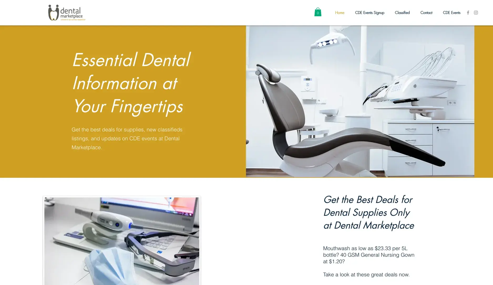

**Industry**\
Healthcare / Dental Services

**Location**\
Singapore

**Business context**\
Dentists needed a centralized platform to manage events, find staff, and order supplies

**Solution**\
Created a comprehensive web and mobile platform specifically for dental professionals

**Outcome**\
Built a successful marketplace that generated $50,000 in revenue and attracted 563 dental professionals

**Our service**\
Full-stack Development / Mobile App Development / UX/UI Design

## Technical highlights

- **Backend**: Golang for reliable, efficient server operations
- **Web frontend**: React.js and Vue.js for responsive interfaces
- **Mobile apps**: Native development with Swift (iOS) and Kotlin (Android)
- **User research**: Extensive interviews with dental professionals to identify needs
- **Payment processing**: Secure system for handling online transactions
- **Iterative design**: Continuous improvement based on real user feedback

## What we did with Dental Marketplace

[Dental Marketplace](https://dentalmarketplace.com.sg/) is a website and app that helps dentists in Singapore run their practices better. It was created by Desmond Goh, a dental surgeon who understood the problems dentists face every day.

We built both a website and mobile app from scratch, working closely with Desmond to understand what dentists really needed. We kept things simple and focused on solving real problems.

The platform helps dentists in several ways:

- Find and sign up for dental events
- Post and find jobs
- Order and track dental supplies
- Connect with other dental professionals

## The challenge Dental Marketplace solved

Dentists in Singapore were facing several everyday problems:

- It was hard to find out about dental events and training
- Hiring staff was done through word of mouth with no central job board
- Ordering supplies was messy with no way to track orders
- Many clinics were still using old-fashioned paper systems

Singapore's dental market is worth about $24 million per year. There are at least 688 dental clinics spending over $2 million monthly on supplies. While the market is growing, most clinics were still doing things the old way.

The biggest challenge was convincing dentists to try something new. For Dental Marketplace to succeed, it needed to be clearly better than the old ways of doing things.

## How we built it

We started by talking to dentists about their needs before writing any code. This helped us focus on building something truly useful.

### Our approach

We focused on building features that would help dentists right away:

- A simple way to find and register for dental training events
- A secure system for handling payments
- A flexible design that could grow as the business grew
- Support for both website and mobile app users

We used a step-by-step approach to build and improve the product, making changes based on feedback. This was exactly what Desmond was looking for.

### Technology we used

We chose reliable, modern tools to build a solid platform:

- **For the backend**: Golang for its performance and reliability
- **For the website**: React.js and Vue.js for responsive interfaces
- **For the iPhone app**: Swift for native iOS experience
- **For the Android app**: Kotlin for native Android functionality

### How we worked together

We used several methods to make sure we built the right product:

- We talked to real dentists to understand their needs
- We built the product in small steps, getting feedback along the way
- We used creative thinking to solve problems
- We regularly tested with real users to make sure everything worked well

## What we achieved

After just 12 weeks of work, we launched a working product that dentists immediately found helpful.

The results were impressive:

- Over **$50,000** in revenue generated
- **563** dental professionals joined the platform
- **302** dental events were listed online

Most importantly, Desmond achieved what he set out to do: create an online space where dentists could connect, learn, and manage their work more easily.

> "It was hard to change how things work in Singapore's dental industry. But working with Dwarves Foundation made me believe Dental Marketplace could make a difference. The product was high-quality and had room to grow. They explained everything clearly and solved problems quickly."
>
> *Desmond Goh, Founder & CEO of Dental Marketplace*
