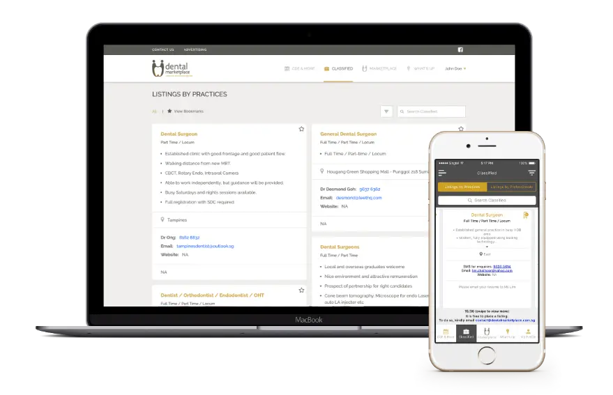

### In brief
* Founded by Desmond Goh - a Singaporean dental surgeon, **Dental Marketplace** is an online platform for dental professionals to stay active in dentistry and simplify operation process.
* Web and App development as MVP release for marketing testing and user feedback.
* We support them with tech solution and market-fit product design. We work according with Desmond to extract business problem and propose suitable solution.

### Technical Highlight
* Product-fit Design: Design Thinking Method & Design UX research for 
* Golang-backend: Steady and microservices-extendable system
* Startup-centric: Scalable system & cost-efficient solution
* Microservice architecture 
* Agile process and Scrum framework for product iteration

### The Context
Singapore dentists faces bottlenecks to practice dentistry and operates dental clinic with SDC rules licensed regulated by MOH. 

* Dentistry events are hard to followup and register.
* Job posts and recruitment process are manually operated.
* Dental supplies are hard to control due to no order tracking and loyalty system. 

Singapore dentistry market is USD $24M/ year generating by at least 688 clinics. These clinics are spending USD$2,064,000 a month on dental supplies. The growth is robust. But the operation is outdated. Disrupt the long-term habits and optimize them is challenging.

Dental Marketplace must be built to simplify the dentistry operation process.

### Engagement Model
We started everything from a fresh idea. The process started out as market research, to define business problem and structure core features. 

**Module's strong focus**

* Data-pulling to update CDE events
* Data process for transaction payment
* Microservices extendable system
* Support multiple platforms

📍 With Agile practices and Scrum framework to iterate the product release and adapt to changes, we came across as exactly what Desmond is seeking for. 

**Tech stacks**

* Backend: Golang
* Frontend: React.js, Vue.js
* iOS: Swift 
* Android: Kotlin

**Collaboration**

* UX/UI research & classification
* Agile practices
* Scrum framework
* Design Thinking Method

### Outcome
MVP launched after 12 weeks of hard work, retrieved great feedback with specific metrics. A success that brings motivation to keep the good work going.

Dental Marketplace generated more than **$50,000** in revenue, connected **563** dental professionals and **302** events were brought online.

Desmond had solved his issue from day one: Build a playground for dental professionals, connect them by a mutual understanding and address them with different needs.

>
> 💬 "It was hard to disrupt Singapore dentistry market. But the work  with Dwarves Foundation made me believe Dental Marketplace would make a difference. The MVP was high-quality and expected to grow. Every of our question and feedback was explained and resolved well. 
*Desmond Goh, Founder & CEO of Dental Marketplace*