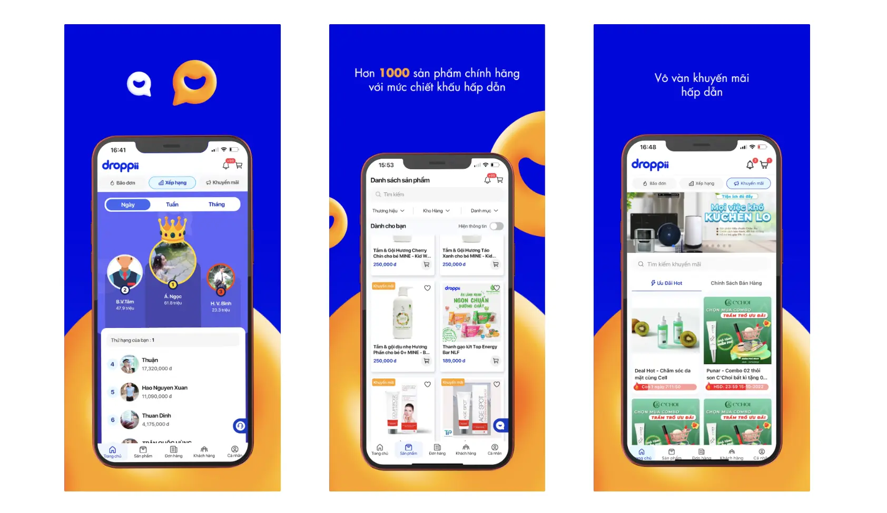

---
tags:
  - dropshipping
  - case-study
  - e-commerce
title: "Droppii: Transforming e-commerce with innovative dropshipping solutions"
date: 2024-01-03
description: Droppii, in collaboration with Dwarves Foundation, revamps its e-commerce platform, enhancing dropshipping operations with the launch of Droppii for Business v3.0. This strategic partnership focuses on improving user experience and operational efficiency through a new dashboard, CMS, and ERP system. The initiative marks a significant step in Droppii's growth in the competitive e-commerce sector, showcasing the impact of technical and strategic collaboration.
authors:
  - huytq
  - han
---

**Industry**\
E-Commerce

**Location**\
Vietnam and SEA

**Business Context**\
Need for an advanced e-commerce platform to streamline drop shipping operations

**Solution**\
Revamped and technologically advanced online system development by Dwarves Foundation

**Outcome**\
Launch of Droppii for Business v3.0, providing a scalable, user-friendly platform for business clients and enhancing customer interaction

**Our Service**\
Full-Stack Development / Agile Project Management

## In brief
> **Droppii**, in collaboration with **Dwarves Foundation**, revamps its e-commerce platform, enhancing dropshipping operations with the launch of [Droppii for Business v3.0](https://play.google.com/store/apps/details?id=com.droppii.business&hl=vi). This strategic partnership focuses on improving user experience and operational efficiency through a new dashboard, CMS, and ERP system. The initiative marks a significant step in **Droppii**'s growth in the competitive e-commerce sector, showcasing the impact of technical and strategic collaboration.

## Challenge
**Droppii** faced the challenge of upgrading their platform to align with the evolving demands of the **e-commerce** industry and their expanding business model. The existing system, developed during their early "90 Days Rushing" campaign, was no longer adequate.

The **Droppii** team, owning their backend and business data handling, recognized the need for expertise in frontend development and expand in man power. They decided to collaborate with a partner adept in both technical development and agile project management.

This collaboration started with a thorough assessment of **Droppii's** existing frontend infrastructure, product management and workflow, leading to the creation of a roadmap for developing a sophisticated, user-friendly, and scalable online platform.

## Solution
**Droppii** and **Dwarves Foundation** joined forces, structuring two collaborative phases to overhaul **Droppii’s** platforms.

**Phase One**: A dedicated team from Dwarves Foundation, in close collaboration with Droppii's in-house team, rapidly developed and deployed **[Droppii for Business v3](https://play.google.com/store/apps/details?id=com.droppii.business&hl=vi&pli=1)**. This version featured a seamless cross-platform web presence as well as iOS and Android apps with an intuitive user interface.

**Phase Two**: The focus shifted to integrating advanced features and system enhancements. Key developments included a **new dashboard** and content management system (CMS), an upgraded Enterprise Resource Planning (ERP) system, and ongoing improvements in UI/UX design. An automated testing framework was established to ensure smooth integration with **Droppii**’s existing systems, aiming to enhance functionality and enrich user experience.

## Outcome
The partnership yielded significant outcomes. The launch of [Droppii for Business v3](https://play.google.com/store/apps/details?id=com.droppii.business&hl=vi&pli=1) was a success with good feedbacks from business users. The enhanced ERP system and improved data management tools provided businesses with greater operational control and insight.

This collaboration not only advanced **Droppii’s** technological front but also solidified their position in the **e-commerce** market. The technical excellence and agile approach of **Dwarves Foundation** played a pivotal role in this transformation, enabling **Droppii** to adapt and thrive in the dynamic **e-commerce** landscape.

## Impact
The partnership between **Dwarves Foundation** and **Droppii** demonstrates the impact of technical expertise and strategic collaboration in enhancing a business's online presence. By focusing on frontend excellence and operational efficiency, this alliance not only improved **Droppii’s** operations but also set a foundation for continual growth and innovation.

Dwarves Foundation is a team of design and development experts working closely with clients to craft software, build tech teams, and invest in people who create world's next favorite things.
