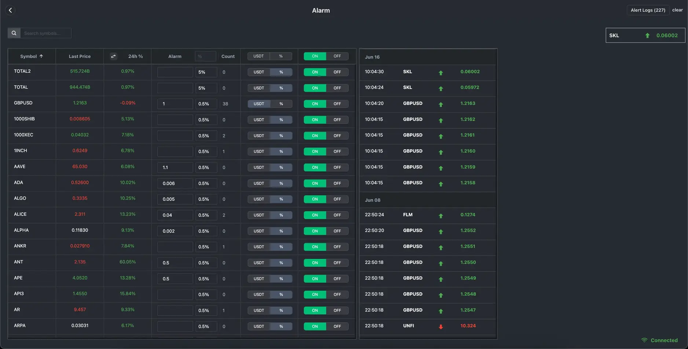

**Industry**\
Financial Technology / Cryptocurrency

**Location**\
Global

**Business context**\
Professional crypto traders needed a unified system to manage multiple exchange accounts and execute strategies efficiently

**Solution**\
Developed an all-in-one dashboard that synchronizes data across exchanges and automates trading functions

**Outcome**\
Delivered a comprehensive platform that significantly reduces the time required to manage multiple trading accounts

**Our service**\
Full-stack Development / Financial Systems / Data Visualization

## Technical highlights

- **Performance**: AG Grid for managing large tables with real-time data updates
- **Concurrency**: Web workers for background processing to prevent UI lag
- **Backend**: Elixir with Phoenix Framework for high-efficiency API creation
- **Data collection**: Crawling systems using Elixir's Supervisor and GenServer
- **Visualization**: TradingView integration with custom indicators
- **Architecture**: Microservices with custom Balancer and Forwarder services

## What we did with Hedge Foundation

[Hedge Foundation](http://hedge.foundation/) is a powerful dashboard we developed to help professional crypto traders manage multiple exchange accounts, track positions, monitor balances, calculate PnL (profit and loss), and execute bulk orders—all from a single interface.

As the cryptocurrency market evolved, traders needed more sophisticated tools to stay competitive. We partnered with an experienced quantitative trader to create a platform that automates many tedious tasks, synchronizes data across exchanges, and provides actionable insights through real-time market data visualization.

The platform serves as an all-in-one management system for crypto accounts, helping traders make faster, more informed decisions while minimizing the time spent switching between different tools and interfaces.

## The challenge Hedge Foundation faced

The founder of Hedge Foundation had developed a unique trading strategy that required tracking multiple accounts simultaneously, executing a high volume of daily trades, and analyzing various data points to identify opportunities.

This approach presented several significant challenges:

- **Data fragmentation**: Essential information was scattered across different exchanges and platforms
- **Manual monitoring**: Watching market conditions 24/7 was impossible without automation
- **Execution speed**: Profitable opportunities required immediate action across multiple accounts
- **Data visualization**: Standard charting tools lacked the specific indicators needed for the strategy
- **Historical analysis**: Past market data was needed to refine trading strategies

The founder envisioned a comprehensive system that would solve these problems through:

- An alarm/alert system providing timely notifications about market conditions
- Automated trading functions to execute strategies without delay
- Storage for all historical market data, including cryptocurrency and forex
- Custom charting with proprietary indicators
- The ability to annotate charts with custom data points

## How we built it

We approached this complex challenge by focusing on data performance, reliability, and a flexible architecture that could integrate with multiple exchanges.

### Technical approach

Our core focus was optimizing for real-time data handling and visualization:

- **Performance optimization**: We implemented AG Grid to manage large tables with fast-updating real-time data, ensuring traders could see accurate information instantly.
- **Background processing**: We used web workers to offload heavy data processing from the main thread, preventing interface lag and enabling complex calculations without affecting the user experience.
- **Backend efficiency**: We chose Elixir with Phoenix Framework to increase the speed and efficiency of API creation, taking advantage of its concurrency model for handling multiple data streams.
- **Data collection**: We built sophisticated crawling and scheduling systems using Elixir's Supervisor and GenServer, providing concurrency, scalability, and fault tolerance when gathering data from third-party sources.
- **Scalable architecture**: We implemented microservices to work with third-party APIs, ensuring stability, scalability, and reusability across the platform.
- **Rate limit management**: Custom Balancer and Forwarder services were created to handle rate limits when crawling data from external platforms.
- **Advanced visualization**: We integrated TradingView with custom indicators and drawing tools, allowing traders to visualize their strategies directly on charts.

### Technology we used

We carefully selected technologies that could handle the demanding requirements of real-time financial data:

- **Backend**: Elixir & Phoenix framework for concurrency and reliability
- **Frontend**: Next.js with server-side rendering for performance
- **Database**: PostgreSQL with optimized queries, views, and indexes
- **Data collection**: Elixir Supervisor and GenServer for resilient data crawling
- **API**: RESTful design for integration with multiple exchanges

### How we collaborated

We established a communication rhythm that kept development aligned with the founder's trading expertise:

- Weekly Saturday discussions for product progress review and planning
- Daily stand-ups to synchronize efforts and quickly resolve any issues
- Regular collaboration through Discord for ongoing communication
- Task management through Basecamp and GitHub

## What we achieved

We successfully delivered a comprehensive trading platform that met all the criteria established at the project's start. Hedge Foundation now provides traders with:

- Real-time monitoring of multiple crypto accounts across exchanges
- Automated alerts based on custom market conditions
- Streamlined trade execution for capturing opportunities quickly
- Custom visualization tools for specialized trading strategies
- Comprehensive historical data for strategy development and backtesting

The platform has significantly reduced the time and effort required to manage multiple trading accounts, providing a single source of truth for position management and market analysis. We're continuing to expand the integration with additional trading platforms, aligning with the business goal of creating more tactical and effective trading strategies.

Hedge Foundation demonstrates our ability to build complex financial systems that combine real-time data processing, custom visualizations, and automated workflows to solve challenging problems in the cryptocurrency trading space.
