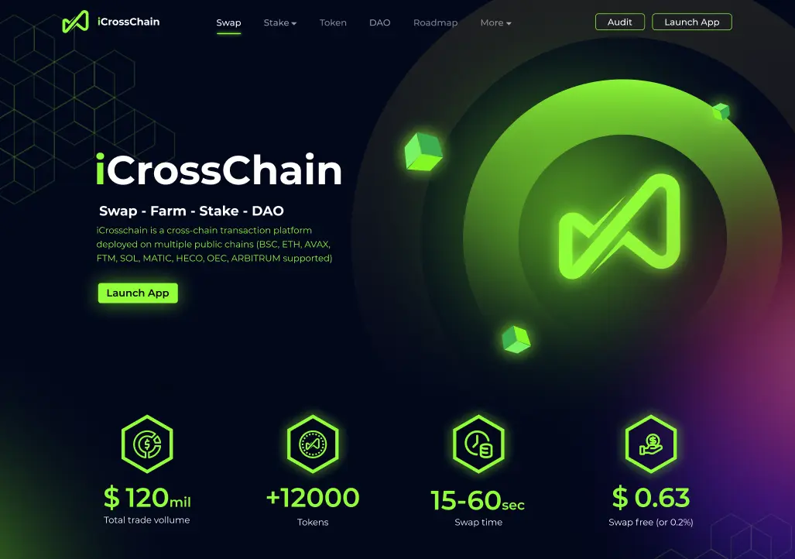
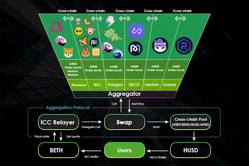
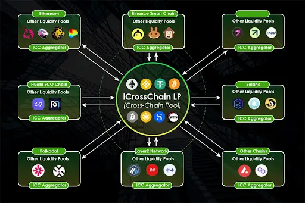
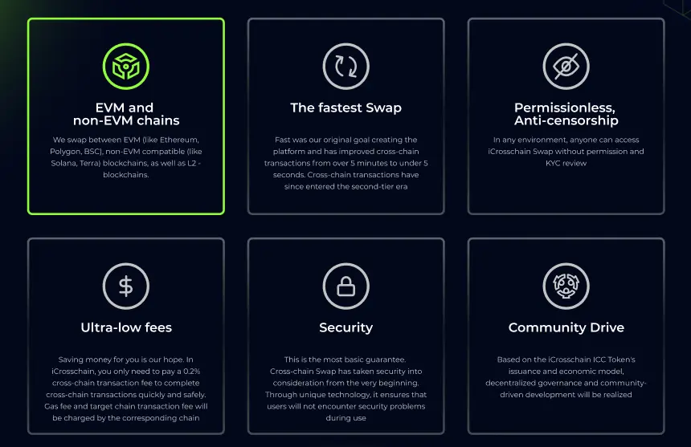

**Industry**\
Blockchain Technology / Cryptocurrency

**Location**\
Global

**Business context**\
Crypto users needed a faster way to move assets between different blockchain networks

**Solution**\
Developed a cross-chain exchange platform with an optimized consensus mechanism

**Outcome**\
Created the fastest cross-chain transfer solution in the industry (15-second completion)

**Our service**\
Blockchain Development / Smart Contract Development / Frontend Development

## Technical highlights

- **Smart contracts**: Solidity for secure, efficient token exchanges
- **Backend**: Golang for high-performance transaction processing
- **Frontend**: React.js and Next.js for intuitive user interface
- **Blockchain integration**: Web3 technology for multi-chain connectivity
- **Security**: Multi-authentication systems and rigorous contract auditing
- **Networks**: Connected 8 major blockchains including Ethereum, Binance Smart Chain, and Polygon

## What we did with iCrosschain

[iCrosschain](https://icrosschain.io/) is a platform that helps people move their cryptocurrency between different blockchain networks. Think of it like a currency exchange for digital money, except it works across multiple crypto systems.

As different blockchain networks like Ethereum, Polygon, and Binance grew in popularity, users needed a way to move their digital assets between these systems. Moving crypto between networks was slow, complicated, and often expensive.

We built a solution that makes these transfers simple, fast, and cost-effective. Our platform lets users:

- Move tokens between different blockchain networks
- Find the best rates for their exchanges
- Complete transfers in just 15 seconds (much faster than the industry standard)
- Earn rewards by providing liquidity to the system

What makes our solution special is that we created a system that connects these different networks securely while keeping transactions fast and affordable.

## The challenge iCrosschain solved

Moving cryptocurrency between different blockchain networks has long been a significant pain point for users. Each blockchain operates as its own isolated ecosystem with unique rules, assets, and security models.

### Technical limitations of cross-chain transfers

Traditional methods for moving assets between blockchains faced several critical challenges:

- **Time delays**: Transfers typically took minutes or even hours to complete
- **High costs**: Users paid excessive fees, especially during periods of network congestion
- **Complex processes**: Moving assets required multiple steps across different platforms
- **Security concerns**: Cross-chain bridges were frequent targets for hacks and exploits
- **Limited options**: Many smaller blockchains had few or no reliable bridging solutions

These challenges created significant friction in the crypto ecosystem. As decentralized finance (DeFi) applications grew across multiple blockchains, users increasingly needed to move assets efficiently between networks to take advantage of different opportunities.

The biggest technical challenge was creating a system that could maintain security while dramatically improving speed. Most existing solutions prioritized one at the expense of the other, forcing users to choose between waiting hours for a secure transfer or using faster but riskier alternatives.

## How we built it

We approached this challenge by rethinking the fundamental architecture of cross-chain transfers. Our goal was to create a solution that offered both security and speed without compromise.

### Technical approach

**Optimized consensus mechanism**: We developed a specialized consensus system that validates transactions across different blockchains much faster than conventional methods. This mechanism:

- Verifies transaction authenticity using a network of validators
- Processes transfers in parallel rather than sequentially
- Implements optimistic confirmation for common transaction patterns
- Uses specialized cryptographic proofs to maintain security

**Smart contract architecture**: We built a system of interconnected smart contracts across multiple blockchains using Solidity. These contracts:

- Lock tokens on the source chain
- Mint or release equivalent tokens on the destination chain
- Maintain a synchronized state across all connected networks
- Implement security measures to prevent double-spending

**Liquidity optimization**: We created a network of liquidity pools that:

- Reduce reliance on direct token bridges
- Find the most efficient path for asset transfers
- Minimize transaction fees (gas costs)
- Incentivize liquidity providers through reward tokens

**User-centered design**: We developed an intuitive interface using React.js and Next.js that:

- Simplifies the complex process of cross-chain transfers
- Automatically suggests the best routing options
- Provides clear status updates during transfers
- Works seamlessly across desktop and mobile devices

**Security prioritization**: We implemented multiple layers of security:

- Multi-signature authentication for critical operations
- Rigorous smart contract auditing and testing
- Rate limiting to prevent abuse
- Continuous monitoring for suspicious activities

### How we collaborated

We approached this project with the mindset of building our own startup:

- **Deep domain expertise**: Our team immersed ourselves in blockchain technology, becoming specialists in cross-chain protocols and token standards
- **Ownership mentality**: We treated the project as our own business, making decisions with long-term success in mind
- **Collaborative innovation**: We worked closely with the client, exchanging ideas and collectively solving complex technical challenges
- **Iterative development**: We used a phased approach, starting with core functionality and expanding to additional features and blockchain networks

Our development process leveraged:

- GitHub for version control and code review
- Basecamp for project management and communication
- Jira for tracking development tasks and bugs
- Regular security audits to identify and address potential vulnerabilities

This approach enabled us to build a sophisticated platform while maintaining the agility needed to adapt to the rapidly evolving blockchain ecosystem.

## What we achieved

We're proud of what we accomplished with iCrosschain. The platform we built achieved several significant milestones:

**Industry-leading speed**: We created the fastest cross-chain exchange in the cryptocurrency market, completing transfers in just 15 seconds compared to the minutes or hours required by competitors.

**Multi-chain compatibility**: We successfully connected 8 major blockchain networks:

- Ethereum
- Binance Smart Chain
- Polygon
- Fantom
- Avalanche
- Arbitrum
- Heco chain
- Okex chain
- (with Solana integration in development)

**Token ecosystem**: We launched two native tokens that power the platform:

- ICC token: Used for governance and staking
- iPlus token: Provides additional features and rewards

**Decentralized exchange expansion**: We deployed a specialized DEX on the Avalanche network, with plans to expand to additional chains.

**Market presence**: We successfully listed our tokens on major exchanges including Pancake Swap, making them widely accessible to users.

### Real-world impact

The iCrosschain platform has transformed how cryptocurrency users move their assets between networks:

- **For traders**: Enabled quick response to market opportunities across different blockchains
- **For developers**: Provided reliable infrastructure to build cross-chain applications
- **For investors**: Simplified portfolio management across multiple networks
- **For the ecosystem**: Increased liquidity and connectivity between previously isolated blockchains

The platform currently operates with centralized validators to ensure security, with plans to deploy validators to partners for greater decentralization. We're also continuing to develop and enhance the decentralized exchange on Avalanche, with completion expected soon.

By creating a solution that bridges the gaps between different blockchain networks, iCrosschain has helped advance the vision of a more interconnected and user-friendly cryptocurrency ecosystem where assets can flow freely regardless of their native blockchain.
