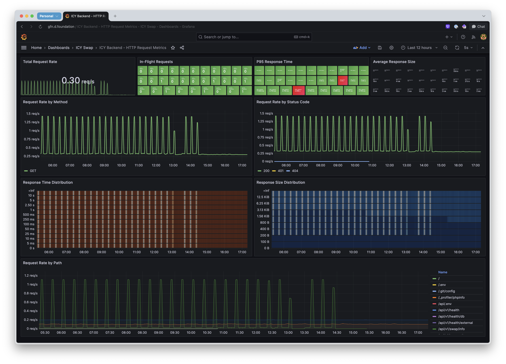
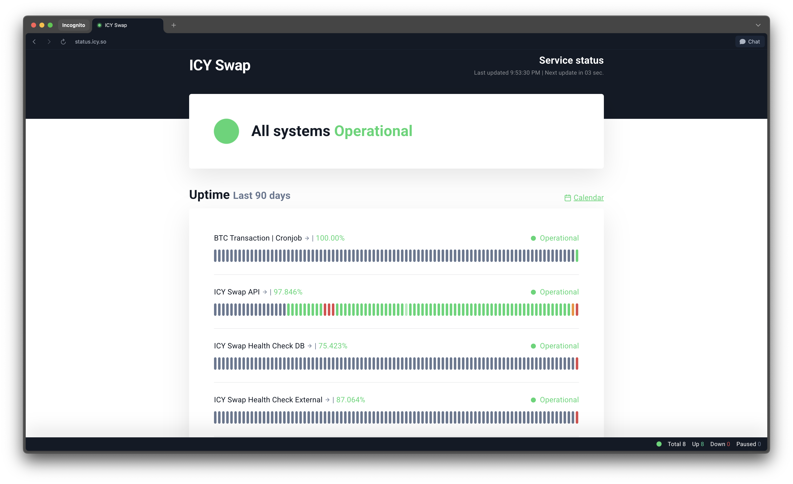
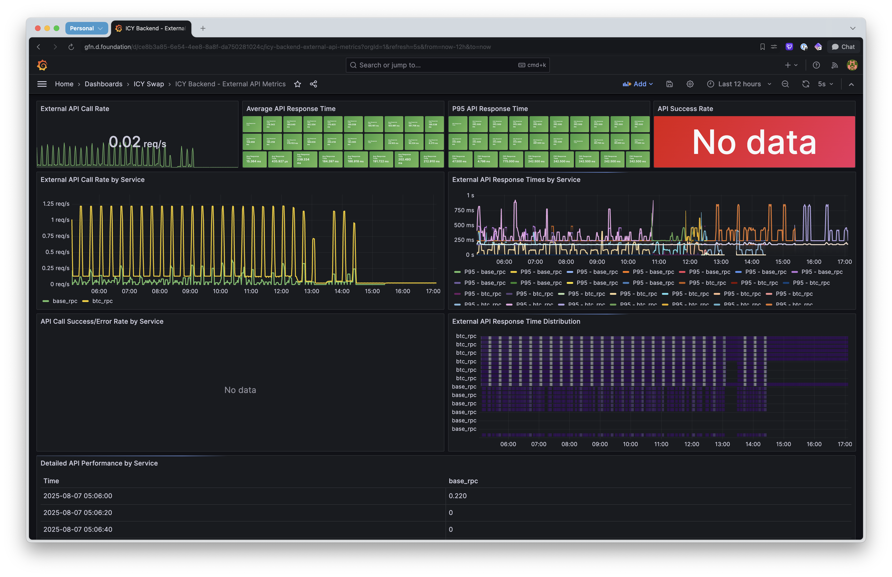
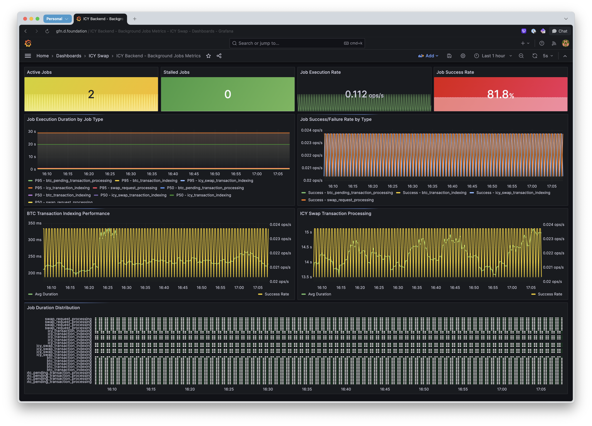

In most software, monitoring is an accessory. For a system that moves money, like a crypto swap service, it's a core part of the engine. If your gauges are wrong, the engine is broken. When building the observability for the ICY Backend, our problem wasn't just to see if the server was 'up.' It was to build a nervous system for it, one that could feel its own state without revealing secrets that would be financially fatal.

## What not to measure

This led us to the central tension: we needed total observability but also near-total secrecy. Most monitoring thrives on detailed labels like user IDs. In crypto, a wallet address isn't just a label; it's a key. Exposing it in a dashboard would be like engraving your bank password on the outside of your house.

So our first principle was ruthless selectivity. Metric cardinality became a security feature, not just a technical one. The rule was absolute: no transaction hashes, no addresses, no amounts. Our metrics could show what operation failed, but never for whom or for how much.

## The shape of a request

So if we can’t use the most revealing labels, what is left to measure at the system’s front door, its HTTP API? The question becomes finding the most expressive yet safe dimensions of a request.

We found the answer in the three primary colors of web service observability: rate, errors, and duration. These tell you almost everything you need to know about the load on the system and its ability to cope. We captured them with a few fundamental metrics. A counter for total requests, a histogram for request duration, and a gauge for active requests.

The power, as always, was in the labels. We settled on three: the HTTP method, the endpoint template, and the resulting status code. This combination is powerful. It lets you ask questions like, "What is the 95th percentile latency for POST requests to /swaps that result in a 200 status?" without ever touching sensitive data.

The key insight here was in the endpoint label. We couldn't use the raw request path, like `/api/v1/user/123/transactions`, because that would create a new metric series for every user, defeating our security goal. Instead, we instrumented the router to provide the normalized path template: `/api/v1/user/:id/transactions`. This small distinction is what makes high-utility HTTP metrics possible in a secure environment.

And the gauge for active requests turned out to be surprisingly insightful. While rate and duration tell you what has already happened, the number of active requests tells you about pressure in the system right now. If it starts climbing while the request rate stays flat, you know something is slowing down. It’s an early warning sign of saturation, a leading indicator of trouble.

## What is health?

The next question was, how do you know if the system is truly healthy? A simple /healthz endpoint is trivial; it's like checking for a pulse. It confirms the system is alive, but not that it can do any real work.

So we built a richer set of probes, a form of synthetic monitoring designed for an external service like Uptime Robot to watch. Instead of one status, our dashboard shows several vital signs. The first is the simple pulse check (/healthz). We then added another, `/api/v1/health/db`, to ask a more meaningful question: "Can you talk to your database?"

The trickiest part is handling unreliable external APIs. Treating a failure from the Bitcoin network like a local one would cause unnecessary downtime.

This is where the circuit breaker pattern is critical. It gracefully isolates external failures, preventing them from taking down our whole system. Our health check for these services, `/api/v1/health/external`, uses this logic. If a circuit is open, it reports a "degraded" status, not "unhealthy."

This gives our Uptime Robot dashboard a richer vocabulary. It’s no longer just green or red, but also has a yellow light for when the system is "wounded, but alive", giving a much more accurate picture of its state.

## Gauges on the outside world

But these health checks, these green and yellow lights, are just a summary. They tell you if something is wrong, but not how wrong. A service being "degraded" is useful information, but is it slow? Is it erroring out? Is the circuit breaker about to trip again?

To answer these questions, you need quantitative data. This is where we go beyond the simple status check and measure the performance of every single call to an external service. We created a standard set of Prometheus metrics for this purpose. A histogram, `icy_backend_external_api_duration_seconds`, to track latency. A counter, `icy_backend_external_api_calls_total`, to track the rate of calls and their success or failure status. And most importantly, a gauge, `icy_backend_circuit_breaker_state`, that explicitly reports whether each circuit is closed (1), open (0), or half-open (0.5).

This is what we plot in Grafana. It gives us a high-fidelity view of our dependencies. We can see the latency to the Bitcoin API begin to creep up minutes before our circuit breaker trips. We can overlay our application's error rate with the external API's error rate and see a direct correlation. These graphs tell a story. They don't just tell us that a service is degraded; they show us the precise shape of its degradation. This is the difference between knowing a storm is coming and having a weather radar to track its every move.

## The silent workers

The most subtle layer of health, however, was in the background. A great deal of the work in a crypto system, such as indexing new transactions and processing swaps, happens in cron jobs. These are silent workers. They can fail, or worse, become stuck in an infinite loop, consuming resources without anyone noticing until it’s too late. How do you monitor something that has no user-facing request?

Our solution was a thread-safe manager that every job had to check in with. When a job started, it registered itself. When it finished, it reported its status as either success or failure. We built a watchdog to detect jobs running for an unusually long time, for example more than 15 minutes for a swap process, and flag them as “stalled.” This brought our background processes, the most hidden part of the machine, into the light.

## The cost of watching

Of course, all this watching comes at a cost. Every check, every metric, every log adds a tiny bit of overhead. In a high-frequency financial system, nanoseconds matter. We set ourselves an almost absurdly low budget for the overhead of our main HTTP monitoring middleware: less than 1 millisecond per request.

Achieving this felt like tuning a race car engine. We pre-computed metric labels at startup so we weren't doing string manipulation on every request. We were careful about memory allocations. The final result was an overhead of around 493 nanoseconds per request. This number wasn't just a performance metric; it was proof that observability didn't have to come at the expense of speed. We could have our microscope without slowing down the patient.

## What we learned

What we built feels less like a collection of tools and more like a coherent system. We learned that security must be designed in from the start, not sanitized later. That "health" is not one question, but a series of layered ones. And that you must assume the world will fail, and build mechanisms like circuit breakers to survive.

The work isn't finished. The next frontier is moving from passive observation to active response, like distributed tracing or automated recovery. But what we've built is a solid foundation: an engine where the gauges are part of the design, not just bolted on.
