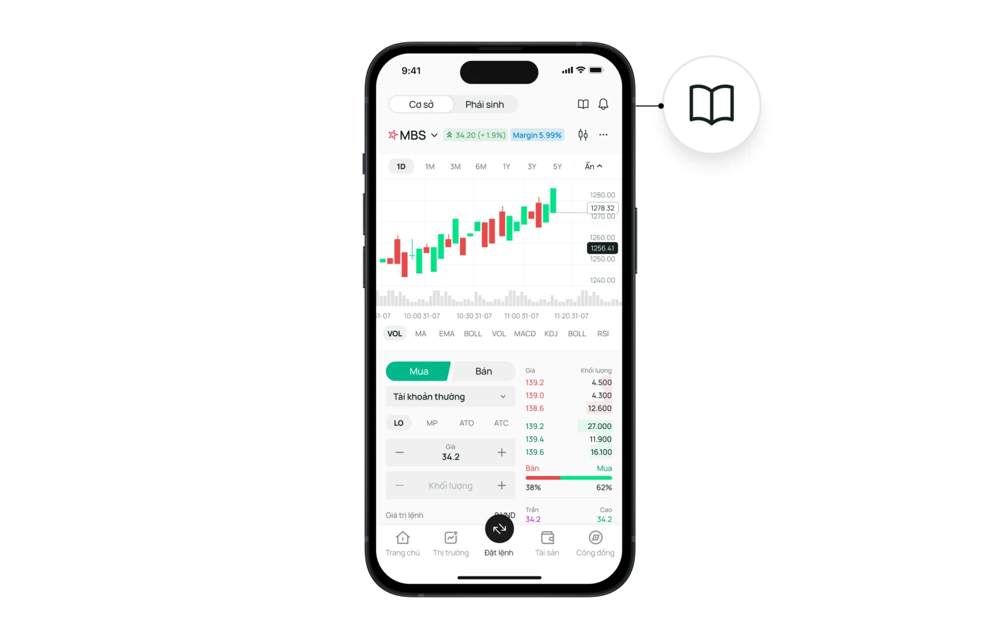
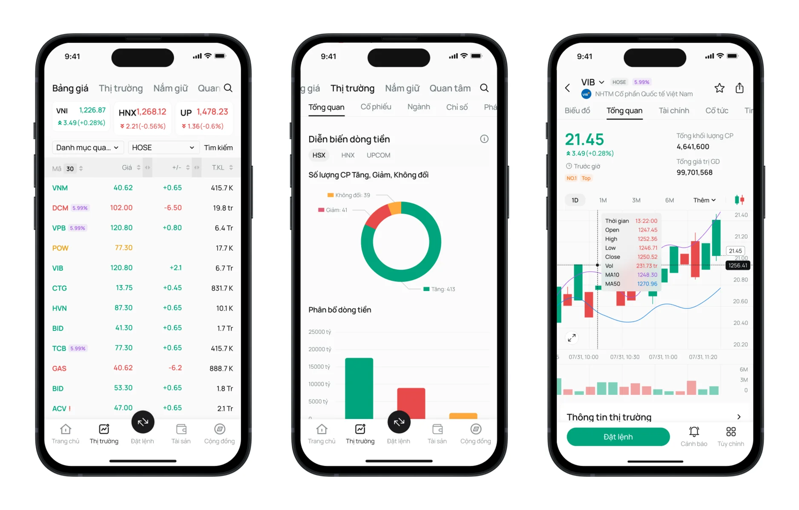
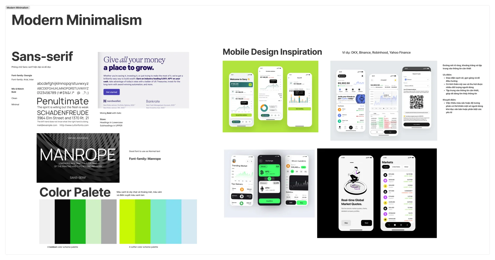

**Industry**\
Financial Services / Investment

**Location**\
Vietnam

**Business context**\
Securities firm needed to modernize their trading app to attract new users while retaining professionals

**Solution**\
Redesigned the mobile trading platform with personalized experiences for different user skill levels

**Outcome**\
Delivered an app that improved user retention and provided appropriate tools for all trader types

**Our service**\
UX/UI Design / User Research / Mobile App Redesign

## Technical highlights

- **User research**: Comprehensive analysis of user behavior and pain points
- **Personalization**: Adaptive interfaces based on user experience level
- **Onboarding**: Streamlined registration process with progressive disclosure
- **Education**: Integrated learning tools for new investors
- **UI design**: Clean, modern interface with contextual help features
- **Responsive design**: Optimized for various screen sizes and orientations

## What we did with Kafi

Kafi Securities asked us to rebuild their mobile trading app. After a strong financial year in early 2024, they wanted to invest in better technology to grow their business and stay competitive.

We worked directly with Mr. Diep The Anh , Deputy Director of Kafi , and their leadership team to find the biggest problems and create smart solutions. Together, we built a new app that matched Kafi's goal of "Building financial dreams" and helping everyone access investment opportunities.

Our main task was designing an app that works for two very different groups: beginners who are just starting to invest, and professionals who trade stocks daily. The app needed to teach new Vietnamese investors about finance while giving experienced traders the advanced tools they need.

Instead of making small improvements to their old app, we built something completely new from scratch. This fresh start let us make the app faster, more secure, and easier to use.

## The challenge Kafi faced

Kafi's biggest problem was that their old app didn't work well for different types of users. This caused several key challenges:

### User experience problems

- **High dropout rates during onboarding**: The complicated identity verification process turned potential users away, with many abandoning the app before completing registration
- **Confusion for new investors**: Financial terminology and complex charts overwhelmed beginners, preventing them from taking their first steps
- **Limited tools for professionals**: Experienced traders couldn't access the detailed market analysis they needed on mobile devices
- **One-size-fits-all approach**: The app treated everyone the same way, regardless of experience level

### Business impact

These user experience issues directly affected Kafi's business by:

- Limiting new user acquisition despite marketing efforts
- Reducing mobile engagement - users only checked basic information instead of actively trading
- Pushing professional traders to use desktop platforms or competitor apps
- Creating frustration that damaged the company's reputation

With investment interest growing in Vietnam, Kafi recognized the opportunity to capture market share by creating a more accessible platform. However, they needed to better understand their users' needs before they could build an effective solution.

## How we built it

We used a three-step approach: learn, plan, and design. This methodical process helped us understand what users truly needed before we started creating solutions.

### Technical approach

#### Comprehensive user research

We spent an intensive week gathering insights to answer three critical questions: What frustrates customers now? What do they want? What do they actually need?

Our research methodology included:

- **Contextual observation**: We watched real users interact with the app to identify moments of frustration and confusion
- **Social listening**: We analyzed investment forums and social media groups to uncover common problems discussed by traders
- **Competitive analysis**: We evaluated competing trading apps to identify best practices and opportunities for differentiation

This research revealed that most mobile trading app users primarily want to:

- Monitor stock prices and market news quickly
- Check their account balances and positions
- Receive alerts about important market changes or opportunities
- Execute basic trades when away from their computers

#### Experience-based personalization

Based on our research findings, we created user personas and journey maps to guide our design decisions. This led us to develop a core innovation: experience-based personalization.

The app now identifies whether a user is a beginner, intermediate, or expert investor and adjusts the interface accordingly:

- **Beginners** see simplified views with educational components
- **Intermediate users** access more detailed charts and analysis tools
- **Advanced traders** get professional-grade features and customization options

#### Streamlined onboarding process

We completely redesigned the registration process by:

- Breaking it into smaller, more manageable steps
- Adding a clear progress indicator to show completion status
- Allowing users to explore the app before completing full verification
- Implementing a "try before you buy" approach with demo accounts

#### Education integration

For new investors, we created contextual learning tools:

- Hover tooltips that explain financial terms in plain language
- A persistent help panel that can be accessed from any screen
- Interactive tutorials that guide users through their first trades
- Simplified market explanations with visual aids

#### Modern, minimalist design system

We developed a clean, distraction-free interface that puts important information first:

- Eliminated unnecessary elements to reduce cognitive load
- Used consistent design patterns across all sections
- Implemented a contemporary color scheme with clear hierarchy
- Created flexible components that work across different screens

### How we collaborated

Our partnership with Kafi involved close collaboration throughout the project:

- Regular workshops with stakeholders to align on direction
- Weekly progress reviews with their leadership team
- User testing sessions with actual Kafi customers
- Direct collaboration with their development team
- Knowledge transfer sessions to ensure smooth implementation

This collaborative approach ensured the final product would meet both business objectives and user needs while being technically feasible to implement.

## What we achieved

Our redesign of Kafi's trading app delivered several measurable improvements:

**Increased registration completions**: The streamlined onboarding process helped more people successfully join the platform, with completion rates rising significantly.

**Higher mobile engagement**: Both beginners and professionals now spend more time using the app, with more trades being executed on mobile.

**Accelerated learning curve**: New investors reported feeling more confident and began trading earlier in their journey thanks to the integrated educational tools.

**Advanced functionality**: Professional traders gained access to the detailed analysis tools they needed, reducing their reliance on desktop platforms.

**Unified platform experience**: A single app now effectively serves users at all experience levels, simplifying maintenance while improving the user experience.

**Enhanced brand perception**: The modern, thoughtful design strengthened Kafi's position as an innovative investment platform in Vietnam.

The new app successfully supports Kafi's mission to make investing accessible to everyone while providing experienced traders with the tools they need. By creating personalized experiences based on user knowledge, we've helped Kafi build a platform where investors can grow their skills over time without needing to switch apps as they advance.

This project demonstrates the importance of understanding diverse user needs when designing financial applications. By combining careful research with thoughtful, adaptive design, we created an experience that works for both beginners and experts, helping Kafi grow their business while making investing more accessible to the Vietnamese market.
