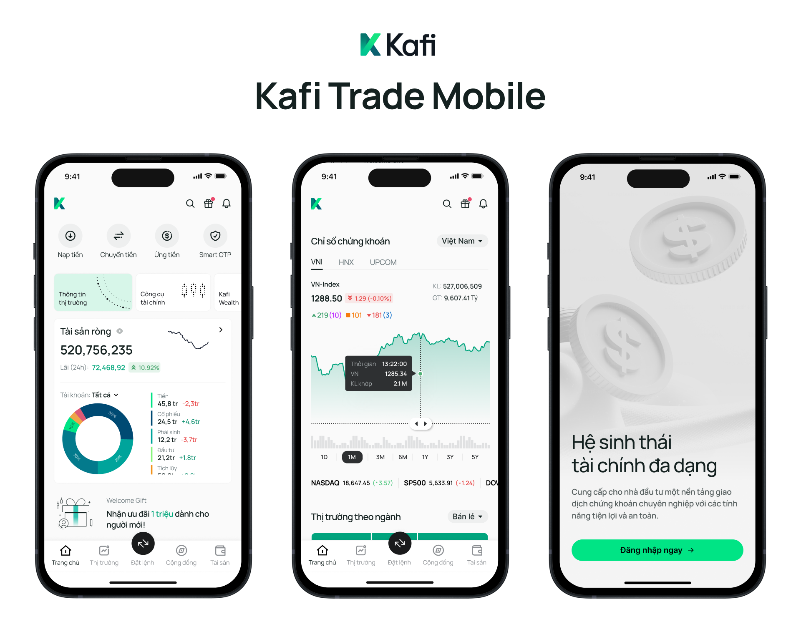

When Kafi began a comprehensive overhaul of their mobile application for individual investors, they faced a common challenge: **the stock trading app's user experience fails to meet the needs of diverse target user groups**. Kafi's product team needed to prioritize user research to satisfy customers, while ensuring that the new application would meet user expectations and create real value. This required a thorough research process, including usage data analysis, direct surveys, and user testing to accurately identify areas for improvement.

In the strategic meeting, Dwarves Foundation met with Mr. Diep The Anh — Deputy General Director of Kafi — along with the senior management team. The lively discussion focused on identifying urgent challenges and proposing creative solutions that need to be prioritized.

## Context of Kafi Securities

In early 2024, Kafi Securities recorded impressive business results thanks to the implementation of new loan packages, bringing significant profits to the company. As a result, Kafi decided to invest these resources in technology, focusing on researching and developing the Kafi Trade and Kafi Wealth applications. The goal is to expand the network scale, enhance competitiveness, and achieve the set strategic objectives.

Kafi, with its philosophy of "Building financial dreams", aims to develop financial thinking for young Vietnamese investors. Kafi's goal is to help everyone understand their personal financial situation and achieve financial freedom. Kafi aspires to become **a convenient investment gateway for everyone**, opening up investment opportunities for all.

## Kafi's Application Caters to Both New Investors and Professional Traders

Kafi's mobile application targets two potential customer groups: new traders (newbie traders) and professional traders (day traders). Kafi recognizes significant growth potential in these two segments.

## Kafi's Digital Transformation Journey: From Challenges to Breakthroughs

Previously, Kafi Securities was relatively obscure in the market and frequently incurred losses. The year 2022 marked a turning point when the company began a restructuring phase, leading to impressive revenue. This success helped Kafi's leadership recognize the importance of user experience in their application and decide to invest in technology. This wise decision created an opportunity for DF and Kafi to collaborate on developing new features.

Kafi decided to "transform" by launching a technological upgrade for their mobile application, aiming to create a smoother, more user-friendly, and secure experience. With comprehensive support from the leadership to the company team, we achieved a high level of refinement in user experience (UX).

However, with this large-scale change, Kafi couldn't just implement small and gradual improvements. Instead, they needed to transition to a completely new application. Rebuilding from scratch created an opportunity to optimize performance and security, while providing a more consistent and seamless user experience, overcoming the limitations of the old system.

## Understanding User Needs

The team divided the project into three main phases: **empathize, plan, and design**. In the empathize phase, Kafi recognized their lack of insight into customers' desires, needs, and expectations. The team needed to answer three key questions: What are customers' current pain points? What do they truly want? And what do they actually need?

Next, the team dove into a one-week deep dive to really get to the bottom of things:

- Usability testing: Directly using the app to capture subtle details that other methods may miss, such as users' emotions and thoughts when interacting with the application.
- Social media analysis: Investigate forums, Facebook groups, and Reddit to understand common issues and needs of individual investors in the stock market. Utilize ChatGPT to assist in analyzing the collected information.
- Competitor analysis: Thoroughly researching competitors and SWOT to identify unique features and opportunities for improvement.

During the research process, the team utilized artificial intelligence (AI) to support market research and competitive analysis. AI helped uncover potential issues in the stock market, providing a starting point and foundation for the team's research. However, the results needed to be carefully examined.

### Action Planning

In the second phase of the project, after gathering all primary data, the team encountered an abundance of information. The team needed to **prioritize and strategize** for the user experience design. The team then conducted **secondary research** to shape Kafi's product and experience strategy. This stage comprised three main activities:

1. Creating personas and customer journey maps
2. Identifying and prioritizing customer pain points, desires, and needs to inform their roadmap and feature set for the product's second version
3. Presenting findings to stakeholders and gathering their input

Kafi's first task was **building personas**: creating representations of specific customer segments based on factors such as age, investment experience, financial goals, and risk tolerance. After identifying the personas, the team conducted a deeper analysis of each group's behavior by **mapping customer journeys**. This included key points such as:

- Researching how users interact with the application
- Determining when and how frequently they use different features
- Analyzing factors influencing their investment decisions

Next, the team focused on **determining the key needs for each target group**. For instance, new investors might require more educational content and learning tools, while professional traders might value advanced analytics and rapid trade execution capabilities.

However, Kafi couldn't tackle everything at once, so prioritization and detailed planning for each part were necessary. Therefore, the management and design team organized a strategic meeting to select, prioritize, and create specific plans for each issue.

As a result, the team identified the **10 most important tasks** in the priority assessment table of the Problem & Solution section.

Based on the data analysis and Kafi's philosophy, they decided to concentrate on two primary user segments: newbie traders and professional day traders. Kafi’s research led to crucial insights that reshaped their approach to stock trading, including knowledge gaps for new investors, speed and accuracy requirements for professionals, and universal concerns about security and risk management.

Their study also revealed that traders primarily use mobile applications as supplementary tools, focusing on:

- Monitoring market fluctuations and news quickly, helping them seize investment opportunities in a timely manner
- Checking investment asset balances periodically, ensuring they always have a clear understanding of their financial situation
- Receiving notifications about important fluctuations or new investment opportunities

Understanding this behavior helps Kafi optimize the user experience on mobile applications, focusing on providing quick, accurate, and easily accessible information, while ensuring high security for important transactions.

With the team comprehensive research complete, Kafi was ready to move forward...

### Helping New Investors

Investing is a complex field that requires a solid foundation of knowledge, posing significant challenges for new investors. They face risks when investing large amounts of capital without fully understanding the potential consequences. This can lead to unwise investment decisions and substantial financial losses.

Recognizing this challenge, the design team set out to transform the application into a reliable guide for new investors. They decided to integrate a comprehensive support system, including contextual help such as smart tooltips, pop-up windows providing detailed information, and an elegantly designed interactive help panel. These features allow users to easily access important knowledge without feeling overwhelmed. 

For example, when a new investor is viewing a stock price chart, the interactive help panel can:

- Appear as a small icon in the corner of the screen, allowing users to expand it when needed.
- When opened, provide brief explanations of important terms such as "trading volume," "opening price," "closing price."
- Feature interactive buttons allowing users to delve deeper into common technical indicators without leaving the main screen.
- Offer quick tips on how to read candlestick charts or common patterns in technical analysis.

The core objective of the new design is not just to provide information, but to create an interactive learning environment where users can confidently explore the world of investing. In this way, Kafi becomes more than just a trading tool; it transforms into a financial education platform, helping users develop the skills and knowledge necessary to make informed investment decisions.

The design team also improved Kafi's user interface, simplifying it so that new investors don't feel overwhelmed by information, while still maintaining the ability to present complex financial data. They created a Moodboard and compared the pros and cons of each style, ultimately arriving at the optimal choice: a minimalist, modern, and scientific interface suitable for both professional investors and beginners. The team focused on core design elements:

- **Less is more:** Eliminating unnecessary elements helps make the interface cleaner and easier to use.
- **Focus on functionality:** Every element on the interface must serve a specific purpose, which is to help users execute transactions quickly and efficiently.

### Step-by-Step Guide for Easy Onboarding

Before implementing improvements, the Kafi application faced a common challenge in the financial industry: a high user dropout rate right from the registration step. After thorough analysis, the design team recognized that the complex registration and identity verification (eKYC) process was one of the main causes. Users often felt discouraged when they had to provide too much information and complete multiple verification steps.

To improve the onboarding experience, we optimized the registration and identity verification process. Instead of using a long and complex registration form, we broke down the process into concise steps. Each step only requires a sufficient amount of information, helping users not feel overwhelmed. Kafi also allows users to explore the application and experience features without immediate registration.

When users decide to create an account, they are guided through the user verification process, portfolio tracking, and order placement step by step. The design team integrated a visual progress bar, allowing users to easily track the onboarding process and flexibly skip any step if desired. This approach not only simplifies the registration process but also creates a personalized experience tailored to the needs of each customer segment.

### Designing Tools for Different User Groups

Investors, especially professional ones, need advanced support tools to make informed investment decisions. While web platforms allow for flexible arrangement of features and tools, the limited space on mobile phones poses a significant challenge for interface design. We must find a way to provide comprehensive analytical tools for professional investors without overwhelming new investors.

After registration, the application **applies a user classification system to divide users into different groups** (such as beginners, intermediate investors, and professionals). Each group receives a personalized experience with guidance content and tools tailored to their specific level of understanding and investment goals. For example, beginners may receive basic investment lessons, while professional investors are provided with advanced analytical tools.

This approach not only enhances the user experience but also promotes continuous development of investors on the Kafi platform. By providing content and tools appropriate for each stage of development, Kafi creates a dynamic learning and investment ecosystem, encouraging users to constantly improve their knowledge and skills. This method meets the specific needs of each customer segment while maintaining a simple and accessible application. As a result, Kafi becomes a flexible platform, effectively serving both beginners and experienced investors, creating a diverse and vibrant investment community.

## Lessons Learned

There are many ways to address the challenges faced by Kafi and other stock trading applications. However, the most important thing is to understand customer needs clearly. If your company serves multiple user groups, pay attention to collecting and analyzing their diverse needs. Then, prioritize addressing these needs appropriately for each group, as Kafi did through their research.

Here are some common and effective methods to explore and understand customer needs:

- Online Surveys: Use closed and open-ended questions to gather information from people who have used the application.
- User data analysis: Leverage AI to analyze vast amounts of user data from apps, websites, and other sources. This reveals patterns in user behavior, preferences, and needs.
- Building personas: Create user representatives, identifying their goals, behaviors, and challenges.
- Competitive analysis: Use Excel or analytical tools to collect and evaluate competitors' products or services, learning about their strengths and weaknesses.

Additionally, you can incorporate AI into the UX research process as a tool to support data collection and analysis. AI will help you process large amounts of information from competitors. Moreover, it assists the design team in clustering users based on characteristics and behaviors, thereby building more accurate and effective personas and user stories.
