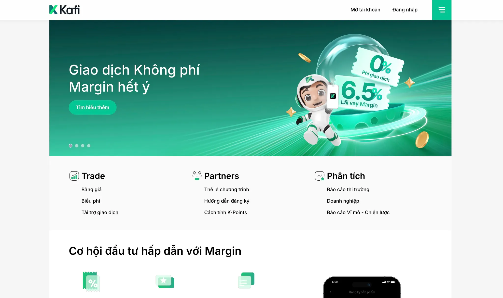
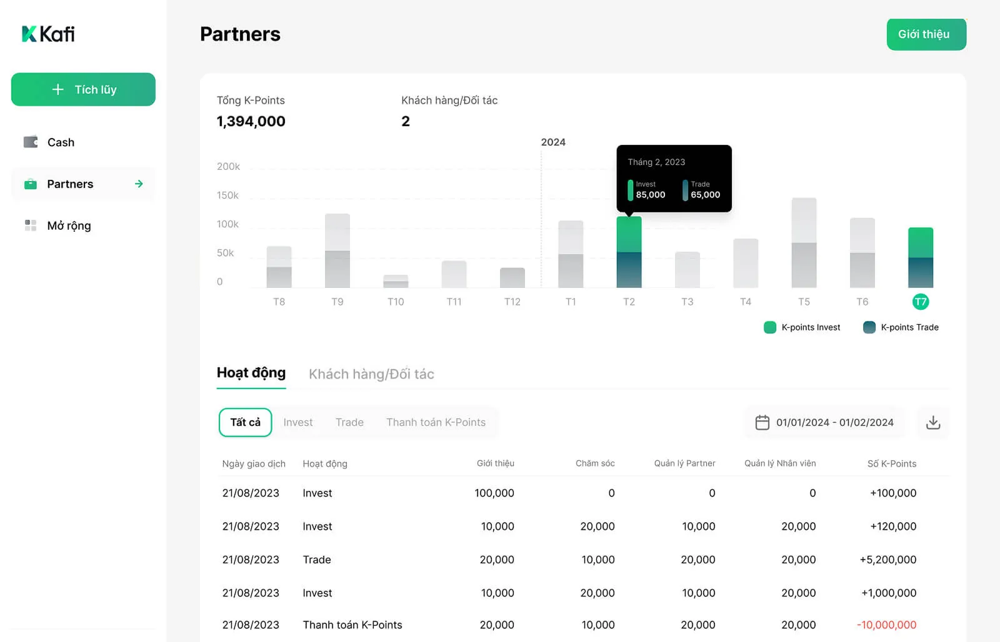

**Industry**

Financial Services, Securities Trading

**Location**

Southeast Asia

**Business context**

A tech-driven financial services firm serving retail and institutional clients across Southeast Asia.

**Solution**

We deployed developers to work alongside their core team on system documentation and workflow optimization.

**Outcome**

Successfully integrated with their team, delivering improved documentation and streamlined development processes.

**Our services**

System Audit, Development Operations, Technical Architecture, Documentation Engineering

## Technical highlights

- **System reverse engineering**: Comprehensive documentation of legacy architecture and workflows to enable smooth team transitions
- **Zero-downtime transition**: Carefully orchestrated handover process maintaining critical trading operations
- **Architecture mapping**: Detailed analysis of system components, dependencies, and infrastructure
- **Workflow optimization**: Introduction of structured development processes improving team efficiency
- **Platform integration**: High-speed integration with new platforms based on evolving business requirements
- **Technical partnership**: Active involvement in architectural decisions and long-term technology strategy

## What we did

The client approached us with a critical challenge: their trading platform had evolved into a highly complex system that was becoming increasingly difficult to maintain and extend. As a technology-driven financial services firm, they recognized that their competitive advantage depended on their ability to rapidly adapt their platform to market needs and regulatory requirements.

The platform's complexity stemmed from years of organic growth, integrating various trading systems, risk management tools, and third-party services. While this approach had served them well, it created significant technical debt and made it challenging to onboard new development teams or implement new features quickly.

> **Core Challenge**: The client needed a partner who could not only understand their complex legacy system but also modernize it without disrupting the critical daily operations that thousands of traders depended on.

We worked directly with their leadership, product, and operations teams to develop a systematic approach to supporting their development efforts. Our goal was to establish ourselves as an extension of their team while bringing modern development practices and architectural improvements to their platform.

## The challenges faced

The trading platform presented several interconnected challenges that required careful navigation:

### Technical complexity without documentation

- **Undocumented architecture**: Years of development had created a system where knowledge existed primarily in the minds of long-term developers
- **Hidden dependencies**: Critical system interactions weren't mapped, making changes risky
- **Technical debt accumulation**: Quick fixes and workarounds had compounded over time
- **Knowledge silos**: Different teams held pieces of the system understanding with no unified view

### Operational criticality

- **Zero tolerance for downtime**: The platform processed millions in daily transactions
- **Real-time requirements**: Trading systems demand microsecond-level performance
- **Regulatory compliance**: Financial regulations required careful handling of any system changes
- **24/7 operations**: Market hours and global trading meant limited maintenance windows

### Growth constraints

- **Scaling difficulties**: Adding new features or integrations took increasingly longer
- **Resource limitations**: Difficulty onboarding new developers due to system complexity
- **Business agility**: Rapid market changes required faster platform evolution
- **Future-proofing needs**: Plans for expansion required a more flexible architecture

These challenges created a situation where their technical capabilities were becoming a bottleneck to business growth, despite their strong market position and tech-driven approach.

## How we built it

Our approach to supporting the platform modernization centered on **systematic transition and knowledge transfer** while maintaining operational stability. We developed a three-phase strategy that allowed us to gradually assume development responsibilities without disrupting critical trading operations.

### Phase 1: Comprehensive system audit

We began with an intensive audit to understand the full scope of their technology landscape:

- **Architecture mapping**: Created detailed diagrams of system components and their interactions
- **Code analysis**: Reviewed millions of lines of code to identify patterns, dependencies, and risk areas
- **Infrastructure assessment**: Documented deployment processes, server configurations, and scaling mechanisms
- **Workflow documentation**: Mapped existing development and operational procedures

### Phase 2: Gradual transition and knowledge transfer

With a clear understanding of the system, we implemented a carefully orchestrated transition:

- **Parallel operations**: Our team worked alongside their developers for seamless knowledge transfer
- **Incremental responsibility**: Started with non-critical components before moving to core systems
- **Documentation creation**: Built comprehensive technical documentation as we learned each subsystem
- **Process establishment**: Introduced structured development workflows without disrupting existing operations

> **Key Innovation**: We developed a **"shadow development" approach** where our team would first observe, then assist, and finally support development efforts for each system component. This ensured zero disruption while building confidence on both sides.

### Phase 3: Modernization and extension

Once established as supporting the development team, we began systematic improvements:

- **Technical debt reduction**: Refactored critical components while maintaining functionality
- **Integration acceleration**: Built frameworks for rapid integration with new platforms
- **Performance optimization**: Improved system response times for critical trading operations
- **Monitoring enhancement**: Implemented comprehensive observability for proactive issue detection

## What we achieved

Our partnership delivered transformative results across technical, operational, and strategic dimensions:

### Technical transformation

- **Comprehensive system documentation**: Created detailed technical documentation covering architecture, workflows, and business logic that previously existed only as tribal knowledge
- **Reduced onboarding time**: New developers can now become productive in weeks rather than months
- **Improved system stability**: Proactive monitoring and structured processes reduced critical incidents
- **Accelerated delivery**: Integration with new platforms now measured in days rather than weeks

### Operational excellence

- **50–60% development support**: Dwarves Foundation successfully supports majority of platform development activities
- **Zero-downtime transition**: Completed the entire transition without a single trading disruption
- **Structured workflows**: Introduced development practices that improved team efficiency and code quality
- **Knowledge continuity**: Eliminated single points of failure through comprehensive documentation

### Strategic partnership

- **Technical decision-making**: Became actively involved in architectural and technology strategy decisions
- **Future-ready platform**: Positioned their system for planned expansions and new business initiatives
- **Risk mitigation**: Detailed system health reports identified and addressed potential issues proactively

> **Client Impact**: "The team didn't just support our development – they transformed how we think about and manage our technology platform. They've become an integral part of our technical strategy."

Our work demonstrates how systematic approaches to legacy system modernization can unlock business potential while maintaining operational stability. By combining deep technical expertise with careful transition planning, we helped transform their complex platform from a constraint into a competitive advantage.

The partnership continues to evolve, with our team now supporting their technology operations and actively shaping their platform's future. This case study exemplifies how thoughtful technical partnerships can enable financial services firms to maintain their edge in rapidly evolving markets.
