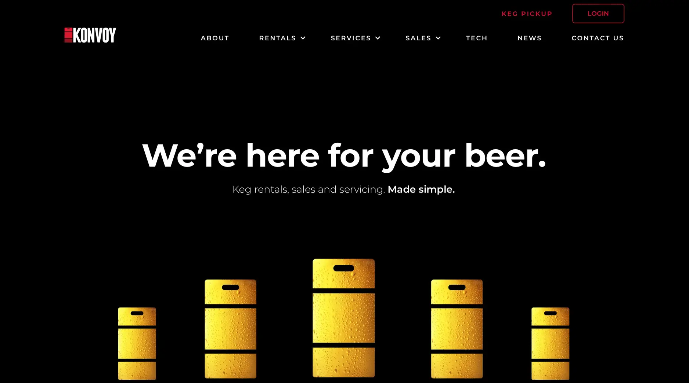

**Industry**\
Beverage Technology

**Location**\
Australia / New Zealand

**Business context**\
Keg rental company needed advanced tracking technology to reduce asset loss

**Solution**\
Built a cloud-native platform with real-time tracking and comprehensive analytics

**Outcome**\
Delivered a reliable system that helps breweries maintain visibility of their kegs throughout the supply chain

**Our service**\
Backend development / Cloud architecture / DevOps

## Technical highlights

- **Cloud architecture**: Kubernetes with GitOps for scalable infrastructure
- **Backend**: Custom geolocation API in Go for cost-effective tracking
- **Performance**: Redis caching with third-party services for improved response times
- **Monitoring**: Sentry, Prometheus, Grafana, and Loki for comprehensive system visibility
- **Deployment**: Continuous delivery with ArgoCD for zero-downtime updates
- **Infrastructure**: AWS EKS for reliable, scalable cloud hosting

## What we did with Konvoy

Konvoy came to us with a vision to revolutionize how breweries track and manage their kegs. Beer kegs are valuable assets that frequently go missing, costing breweries significant money each year. Konvoy wanted to create a tech-driven rental system that would solve this problem.

We partnered with them to build a platform that provides real-time keg tracking and analytics. This system helps breweries maintain visibility of their assets throughout the supply chain, reducing losses and improving their bottom line.

By combining modern tracking technology with flexible rental options, Konvoy offers breweries a compelling alternative to purchasing and managing their own kegs. Their solution helps customers save money while gaining better insights into their keg utilization and movement patterns.

## The challenge Konvoy was solving

Breweries face a common challenge: kegs frequently disappear in their supply chain. Traditional tracking methods are manual and inefficient, leading to lost assets and wasted money.

For breweries, these losses represent a significant expense:

- Each keg costs hundreds of dollars to replace
- Manual tracking systems are labor-intensive and error-prone
- Limited visibility makes it difficult to identify where losses occur
- Inventory management becomes increasingly complex as a brewery grows

Konvoy launched in Australia and New Zealand in October 2019 to address this issue. By October 2020, they had integrated comprehensive keg services into their business, combining innovative technology with industry expertise.

Their solution offers breweries flexible options:

- Short-term keg rentals for one-way trips with transparent pricing
- Long-term leasing that frees up capital businesses would otherwise spend on buying kegs

With a focused mission to track every keg's location, Konvoy helps breweries reduce losses and increase profits. Their team of 30 professionals provides exceptional service and maintenance, minimizing keg downtime.

To make this business model work effectively, Konvoy needed a robust technical platform that could reliably track thousands of kegs across multiple locations while providing easy-to-understand data for both their team and their customers.

## How we built it

We created a robust technology platform that could handle the complex requirements of real-time keg tracking and management. Our approach focused on building a reliable, scalable system that would grow with Konvoy's business.

### Technical approach

**Cloud-native architecture**: We built the entire system using Kubernetes on AWS EKS, creating a platform that could scale seamlessly as Konvoy added more kegs and customers. This approach provided:

- Automatic scaling during peak usage periods
- Improved system reliability with self-healing capabilities
- Easier deployment of new features and updates
- Better resource utilization and cost efficiency

**Custom geolocation services**: We developed a specialized geolocation API in Go that significantly reduced costs compared to commercial mapping services. This custom solution:

- Processed location data more efficiently
- Reduced external API costs by handling common queries internally
- Maintained accuracy while improving performance
- Scaled automatically based on demand

**Performance optimization**: We implemented Redis caching with third-party services to reduce costs and improve response times. This was particularly important for:

- Handling high-volume tracking data
- Generating real-time location updates
- Creating history views of keg movements
- Supporting analytical queries without performance degradation

**Continuous deployment**: Using GitOps with ArgoCD, we established a deployment pipeline that allowed Konvoy to release new features and fix bugs with zero downtime. This approach ensured:

- Reliable, consistent deployments
- Automatic rollbacks if issues were detected
- Full visibility into deployment history
- Improved development velocity

**Comprehensive monitoring**: We implemented a complete observability stack with Sentry, Prometheus, Grafana, and Loki to quickly identify and resolve any system issues. This monitoring system provided:

- Real-time alerts for potential problems
- Detailed performance metrics
- Comprehensive logging for troubleshooting
- Visual dashboards for system health

### How we collaborated

Our partnership with Konvoy spanned two years and involved close collaboration with their team. We established clear communication channels and regular check-ins to ensure the project stayed on track and aligned with their business objectives.

Key aspects of our collaboration included:

- Regular planning sessions to prioritize features and improvements
- Knowledge transfer to help their team understand the technology
- Clear documentation of system architecture and components
- Responsive support for addressing operational issues
- Iterative development based on user feedback and business needs

This collaborative approach ensured that the technical implementation supported Konvoy's unique business model and helped them deliver maximum value to their brewery customers.

## What we achieved

Our partnership with Konvoy over two years delivered significant improvements to their platform:

**Smooth cloud migration**: We carefully moved their system from EC2 to Kubernetes EKS, improving scalability and management. This migration:

- Reduced infrastructure management overhead
- Improved system reliability
- Enabled more efficient resource utilization
- Provided better support for future growth

**Containerization**: We modernized their applications for better efficiency and easier deployment. This transformation:

- Standardized the deployment process
- Reduced environment-specific issues
- Improved development velocity
- Made it easier to roll out updates

**Enhanced monitoring**: We implemented the PLG stack (Prometheus, Loki, Grafana) for comprehensive system health tracking. This monitoring system:

- Provided early warning of potential issues
- Gave insights into system performance
- Helped identify opportunities for optimization
- Improved overall reliability

**Better user experience**: We completely redesigned the admin dashboard to be more intuitive and visually appealing. The new interface:

- Made it easier to track keg locations
- Provided clearer data visualizations
- Simplified common management tasks
- Improved overall usability

**Major performance gains**: We dramatically improved the speed of fetching keg location history and routes, reducing response times from tens of seconds to just seconds. These optimizations:

- Enhanced the user experience
- Allowed for more complex analytics
- Supported larger data volumes
- Improved system responsiveness

These improvements have helped Konvoy provide a more reliable, efficient service to breweries across Australia and New Zealand, supporting their mission to transform keg management with technology. By creating a robust, scalable platform, we've helped Konvoy establish themselves as an innovative leader in their industry, providing a solution that delivers real business value to their customers.
