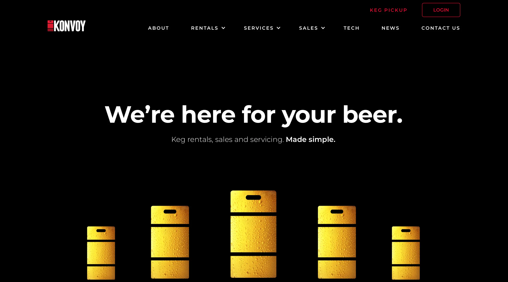
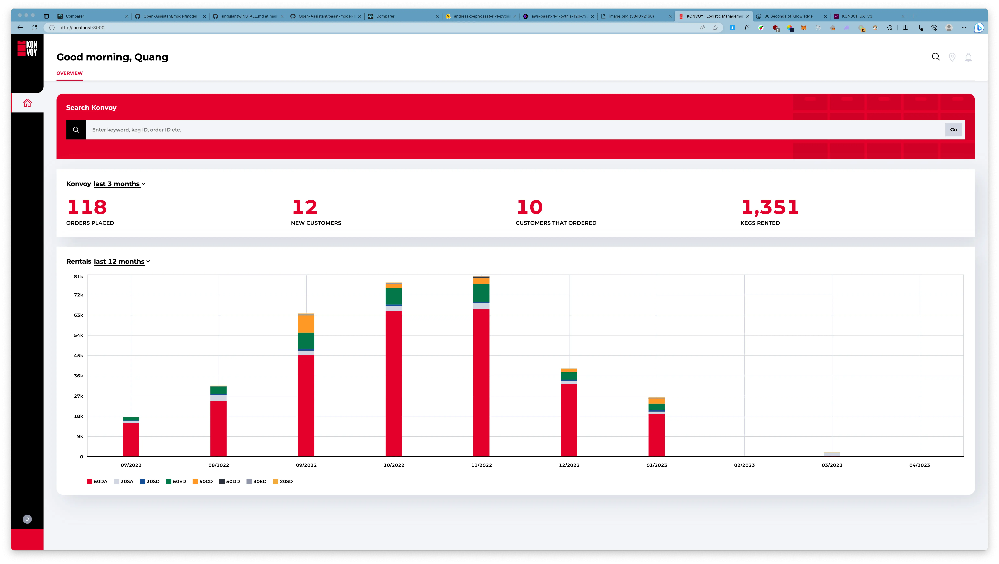

---
tags:
  - case-study
  - consulting
  - partnership
title: "Konvoy: Revolutionizing keg management with innovative technology"
short_title: Konvoy
date: 2023-09-14
description: By October 2020, the company had integrated Keg Services into its framework, enhancing its cutting-edge, tech-based keg solutions with stellar service and deep industry expertise. Konvoy caters to the unique needs of breweries by offering both short-term rentals and long-term leasing options.
authors: 
- huytq
---
**Industry:**\
Logistics, Supply Chain Management

**Location:**\
Australia

**Business Context:**\
An innovative company providing beverage industry with a unique keg rental solution, emphasizing sustainability and ease of use.

**Solution:**\
A tech-driven rental system with real-time keg tracking and analytics ensuring security and transparency.

**Outcome:**\
Increase the operational efficiency and profitability of breweries with a flexible, secure, and eco-friendly keg supply chain.

**Our Service:**\
Product Consulting, Staff Augmentation

### In brief
**[Konvoy](http://konvoykegs.com/)**, a pioneering force in the keg management industry, first surfaced in Australia and New Zealand in October 2019. By October 2020, the company had integrated Keg Services into its framework, enhancing its cutting-edge, tech-based keg solutions with stellar service and deep industry expertise. Konvoy caters to the unique needs of breweries by offering both short-term rentals and long-term leasing options.

The short-term rental solution, an ideal fit for one-way trips, guarantees transparent costs and promotes sustainability. On the other hand, the leasing model lets you have your own kegs for a low monthly fee, freeing up your capital for business investment.

Driven by its mission to track every keg's location, Konvoy reduces losses and bolsters profit margins. Its top-tier service and maintenance ensure minimal downtime for your kegs. Currently a dominant entity in the ANZ market, Konvoy is powered by a dedicated team of 30 professionals.

### Technology Stack
The deployed technology stack includes the following major components:
- **Kubernetes**: This was used to establish a PHP Symfony backend API for managing organizations, users, orders, kegs, and their related information like current location, historical routes, and more.
- **Symfony Commands**: Several Symfony commands were developed and deployed as cron jobs within Kubernetes. These commands processed keg location data, offering near-realtime keg location updates, ensuring a consistently updated system.
- A **Go-based Geolocation API**: This was deployed via Kubernetes, providing cost-effective geolocation based on a set of SSIDs, a more economical alternative to HERE maps or Google Maps.
- **Redis Caching**: This feature was employed with third-party services like HERE maps to cut costs and enhance latency response times.
- **GitOps Approach**: This strategy, in conjunction with ArgoCD, facilitated continuous deployment, enabling Konvoy to roll out new features and rectify bugs with zero downtime, maintaining system stability and security.
- **Error Monitoring and System Health**: Monitoring tools such as Sentry, Prometheus, Grafana, and Loki's logging features were used to promptly detect and address system errors, ensuring consistent system health.

In a nutshell, this technology stack bestowed Konvoy with a resilient, cost-effective solution that optimized operational efficiency while providing users with dependable and prompt services.

### Achievements
The strategic collaboration between **Dwarves Foundation** and **Konvoy** has resulted in remarkable achievements over two years:
- Smooth migration from a system based on EC2 to Kubernetes EKS, facilitated by a thorough system analysis, a strategic migration plan, a Kubernetes cluster build-out, containerization of the existing applications, resource management with Kubernetes, and the implementation of service discovery, load balancing, automated scaling, security, and monitoring/logging.
- Containerization and deployment of the existing applications on Kubernetes, leading to improved system efficiency and scalability.
- Implementation of robust monitoring and logging using the PLG stack, ensuring optimal application health and performance.
- A major revamp of the Admin Dashboard, leading to a more user-friendly, visually appealing, and intuitive interface.
- Dramatic speed enhancements in fetching keg history location and routes, reducing latency response time from tens of seconds to mere seconds – an improvement largely credited to Brad, the leader of the engineering team.

