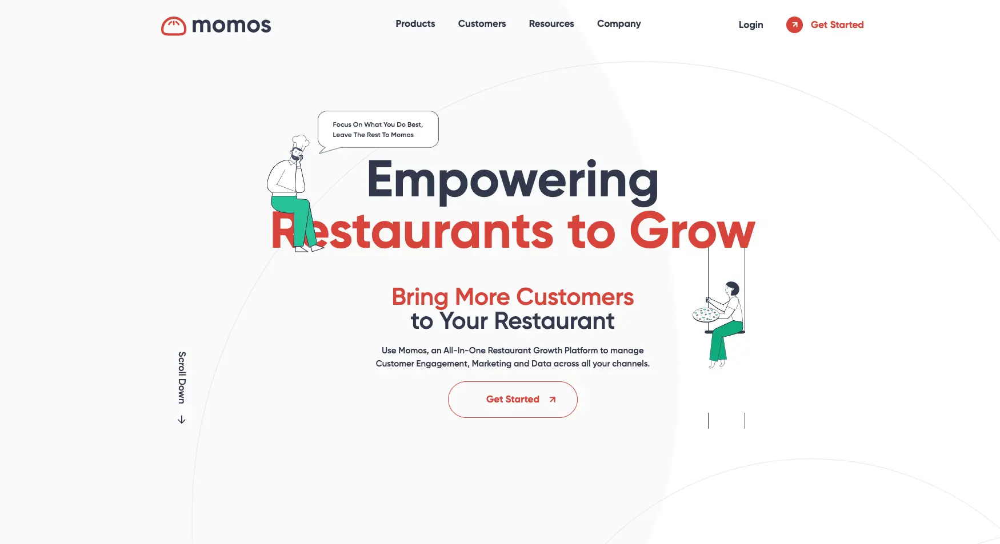
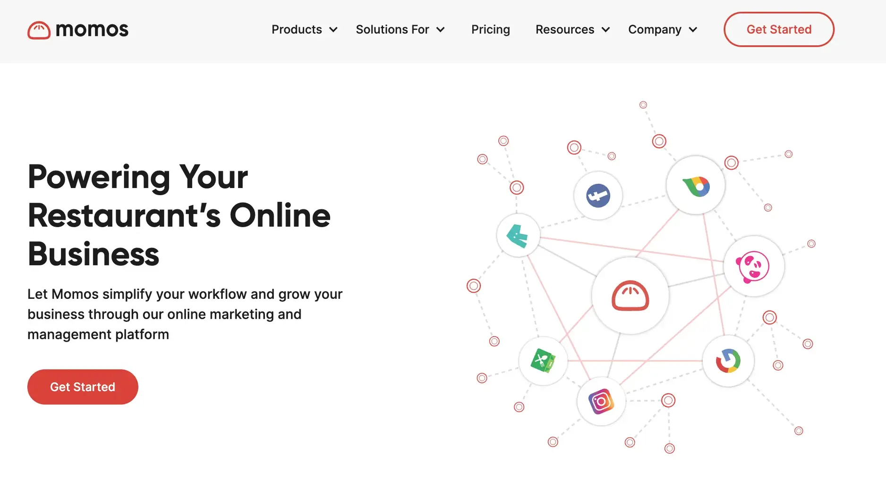
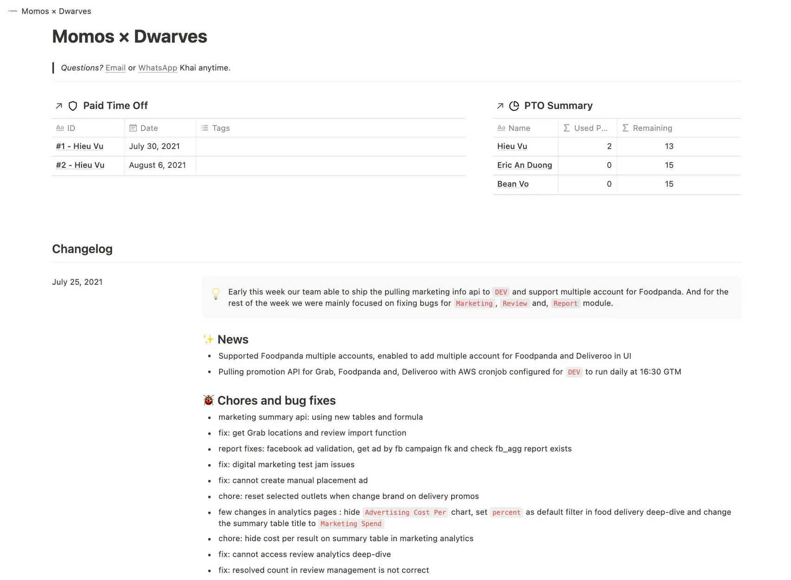
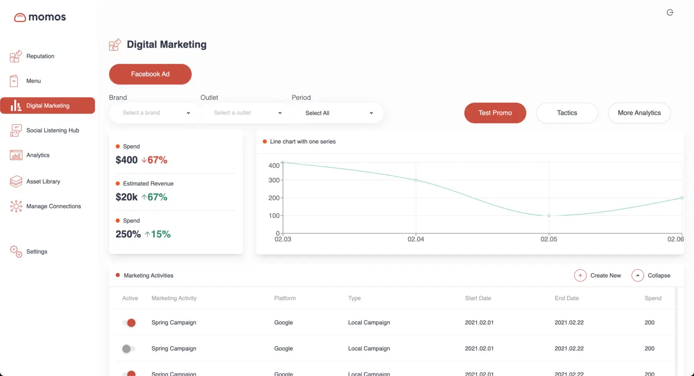
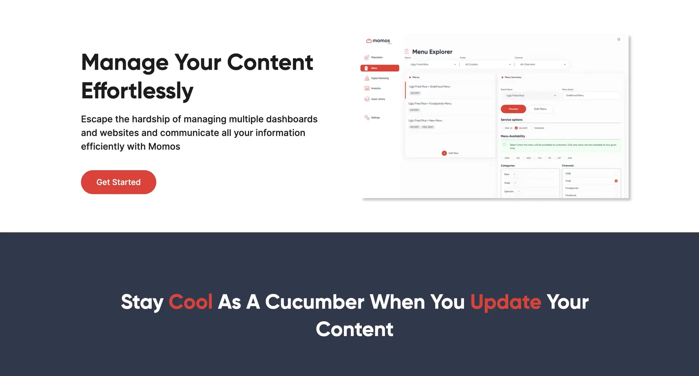
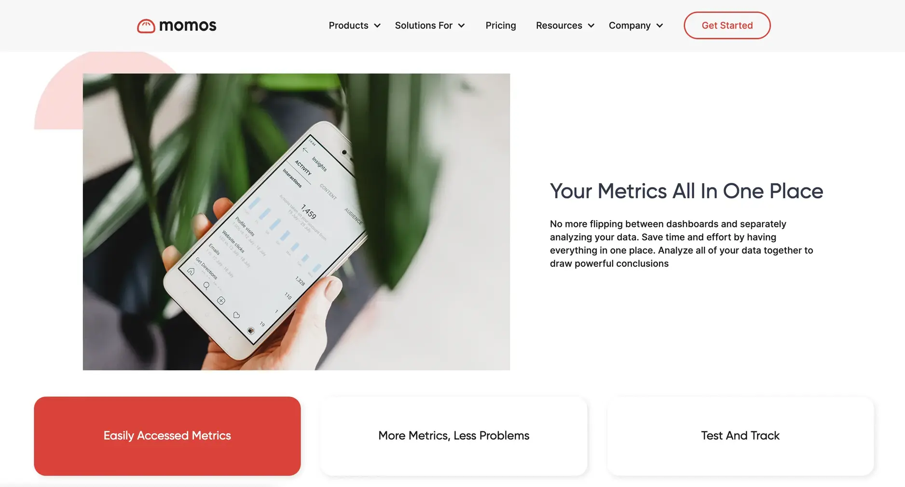

**Industry**\
Food & Beverage Technology

**Location**\
Singapore

**Business context**\
Pre-seed startup needed to quickly build their first MVP to test market fit

**Solution**\
Created a centralized data platform that integrates with delivery services and provides analytics

**Outcome**\
Successfully launched the platform and began onboarding their first users

**Our service**\
Full-stack development / Integration development / DevOps

## Technical highlights

- **Backend**: Node.js for flexible and rapid development
- **Frontend**: React and Next.js for responsive user interfaces
- **Database**: PostgreSQL with materialized views for reporting
- **Cloud**: AWS Lambda, EventBridge, CloudWatch for serverless architecture
- **Authentication**: Auth0 with OAuth 2.0 for secure third-party access
- **Analytics**: Google Studio for data visualization and reporting

## What we did with Momos

Momos is a pre-seed startup operating in Singapore, founded by an ex-Grab employee with a vision to simplify online operations for food and beverage businesses. They needed to quickly develop and launch their first MVP—a web platform that would serve as a centralized hub for F&B merchants to manage their online presence across multiple services.

With a tight timeline to test their market fit and onboard early users, Momos needed additional development expertise. We provided a team of three developers who worked remotely with Momos starting in March 2021. Our goal was not only to accelerate their development timeline but also to establish a solid technical foundation that would support future growth and scalability.

Together, we built a platform that integrates with third-party delivery services, manages online reputation, runs targeted social ads, and generates content-based reports—all from a single dashboard.

## The challenge Momos was facing

As more F&B businesses moved their operations online during the pandemic, many faced a common challenge: they needed to work with multiple service providers to establish their digital presence. This fragmentation created inefficiencies and complications for businesses that just wanted to focus on their core product—food.

The typical restaurant or café had to manage:

- Multiple food delivery platforms (Grab, Foodpanda, Deliveroo)
- Various social media accounts
- Online reviews across different platforms
- Digital advertising campaigns
- Sales data from multiple sources

This fragmentation meant restaurant owners spent more time juggling different platforms than focusing on their actual business. They lacked a unified view of their online operations and struggled to make data-driven decisions.

Momos aimed to solve this problem by creating a centralized data hub that would handle these integrations, allowing businesses to manage everything from a single platform. The founders had a clear vision for expanding their integration capabilities but needed technical expertise to make it happen quickly.

Working with an early-stage startup meant embracing a rapidly changing environment. As the technical partner, we needed to deeply understand their business model and contribute meaningfully to building a future-proof foundation during these critical early stages.

## How we built it

In the fast-paced startup environment, we knew that speed and flexibility would be essential. We deployed resources who could take ownership of their work, understand the product vision, and communicate effectively with the Momos team.

### Technical approach

The platform we built functions as a centralized data hub with several key features:

**Third-party integrations**: We developed connections to major food delivery platforms (Grab, Foodpanda, and Deliveroo) and mapped their APIs to the Facebook platform. This allowed Momos to pull data from these services and present it in a unified dashboard.

**Serverless architecture**: We built the platform on AWS using serverless technologies like Lambda, EventBridge, and CloudWatch. This approach provided:

- Cost efficiency for the early-stage startup
- Automatic scaling as user numbers grew
- High availability without complex infrastructure management
- Flexibility to add new integrations quickly

**Report generation**: We implemented content-based report generation using:

- GPT-3 for natural language generation
- AWS Lambda for processing
- Materialized views in PostgreSQL for efficient data access
- Custom templates for consistent reporting formats

**Authentication system**: We implemented Auth0 for the database synchronization process, leveraging OAuth 2.0 protocols to protect user data and limit access from third parties. This ensured a secure connection between Momos and the various third-party platforms.

### How we collaborated

The team structure spanned multiple locations, with engineers in Singapore, India, and Vietnam. We established clear communication channels to ensure effective remote collaboration:

- Daily sync-ups via Slack and Google Meet to address immediate issues
- Task management through Notion to track progress and priorities
- Weekly change logs to summarize achievements and maintain transparency
- Regular review sessions to align on product direction and technical decisions

Our development process emphasized:

- Rapid prototyping to test ideas quickly
- Iterative development based on feedback
- Regular deployments to get features to users faster
- Documentation of APIs and integration points for future expansion

This collaborative approach allowed us to work effectively despite geographical distribution and time zone differences.

## What we achieved

After several months of collaboration, Momos successfully launched their platform and began onboarding their first users. The MVP provided a solid foundation for their business, demonstrating the value of a centralized management solution for F&B merchants.

The platform we built enabled F&B businesses to:

- **Manage multiple delivery platforms**: Control offerings across Grab, Foodpanda, and Deliveroo from a single dashboard
- **Track online reputation**: Monitor and respond to customer reviews across various platforms
- **Deploy targeted advertising**: Create and manage social media ads without specialized marketing knowledge
- **Generate data-driven insights**: Access comprehensive reports about business performance and customer behavior
- **Make informed decisions**: Use centralized data to optimize menu offerings, pricing, and marketing efforts

Key technical achievements included:

- A scalable integration framework that could easily accommodate new service providers
- Reliable data synchronization across multiple platforms
- Secure handling of sensitive merchant account information
- An intuitive user interface that required minimal training
- Automated reporting that saved merchants hours of manual work

Our partnership with Momos continues as they grow and evolve. We're currently working toward the next milestone, focusing on enhancing their analytics dashboard and review management capabilities to provide even more value to their users.

This project demonstrates how effective technical partnership can help early-stage startups accelerate their time to market while building a solid foundation for future growth. By combining Momos' industry expertise with our technical capabilities, we created a solution that addresses real needs in the F&B marketplace.
