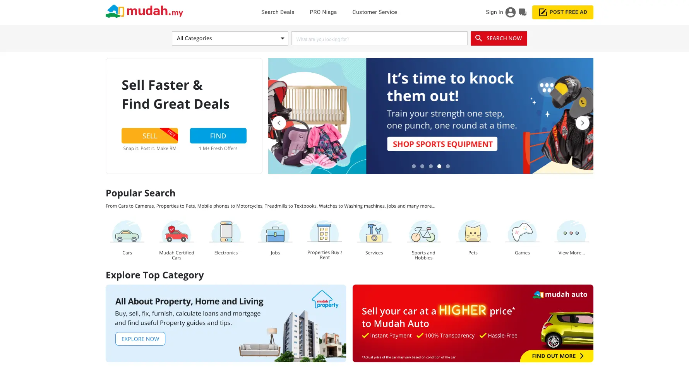
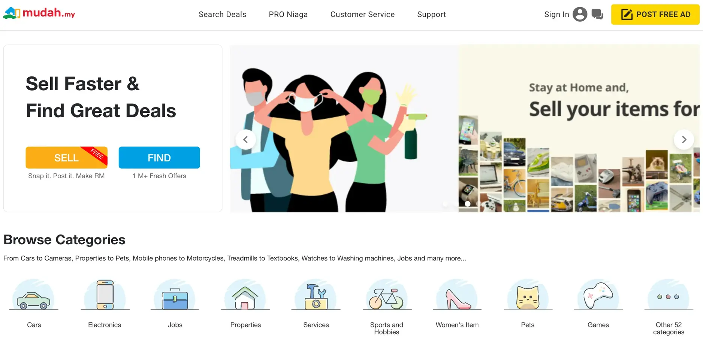

**Industry**\
E-commerce / Online Marketplace

**Location**\
Malaysia

**Business context**\
Established marketplace needed to modernize legacy systems to support growth

**Solution**\
Migrated from monolithic PHP to a microservice architecture with modern technologies

**Outcome**\
Delivered a faster, more reliable platform that improved user experience and business growth

**Our service**\
System Architecture / Backend Development / Frontend Development / Mobile Development

## Technical highlights

- **Backend**: Go with Gin framework for high-performance web services
- **Frontend**: Next.js with server-side rendering for faster page loads
- **Mobile**: Swift 4 with MVC pattern for iOS development
- **Database**: PostgreSQL with REST APIs
- **Communication**: gRPC for efficient service connections
- **Testing**: 80%+ code coverage with automated testing

## What we did with Mudah

Mudah.my is Malaysia's biggest online marketplace. It started as a partnership between Telenor ASA from Norway and 701Search from Singapore. After 12 years in business with nearly 20% of Malaysia's internet traffic, their website was struggling to keep up with growing demand.

We helped Mudah change their old, slow system into a modern, scalable one. Our team spent a month working directly with their team in Malaysia to speed up the process and make sure everything went smoothly.

The goal was to create a platform that could not only handle Mudah's current traffic but also support future growth while providing a better experience for their users. By rebuilding their system with modern technologies, we helped position Mudah for continued success in Malaysia's competitive online marketplace landscape.

## The challenge Mudah was facing

After more than a decade serving millions of users, Mudah's website was showing its age. Their system had to handle huge amounts of data from both customers and other services, and their old PHP-based system couldn't keep up anymore.

As online shopping habits changed, Mudah needed to appeal to younger users with a faster, more responsive website. Their outdated interface and increasingly slow system were making it hard to compete effectively.

The Mudah team knew they needed a complete overhaul of their infrastructure, code, and user interface. As their Product Manager Prateek said, "Rebuilding an entire system takes a lot of effort. We didn't have time to hire and train new team members. We needed people who could jump in and get the job done right away."

The challenges they faced were complex:

- Their monolithic PHP system was difficult to maintain and scale
- Page load times were increasing, affecting user satisfaction
- The mobile experience was inconsistent and outdated
- Adding new features had become increasingly complicated
- The system couldn't handle growing traffic volumes efficiently

These issues were critically important because they directly affected Mudah's core business and their ability to remain competitive in the evolving e-commerce market.

## How we built it

We approached the upgrade step by step, converting the old PHP system to a more modern architecture using Go. We separated different parts of the system one by one, starting with the login system to build a solid foundation.

### Technical approach

**Frontend Modernization**: For the website itself, we used Next.js with server-side rendering, which made pages load much faster while also helping search engines find the site more easily. This improved both search rankings and the overall user experience. The component-based architecture allowed for:

- Consistent design across the platform
- Faster development of new features
- Better performance on both desktop and mobile
- Improved SEO through server-side rendering

**Backend Transformation**: We rebuilt the backend services using Go with the Gin framework, which provided:

- Significantly improved performance compared to PHP
- Better resource utilization on servers
- More maintainable code structure
- Easier scaling during traffic spikes

**Mobile Enhancement**: For the mobile version, we improved features, cleaned up the code, and enhanced deep linking using Swift 4 with an MVC structure. This made development faster and debugging easier. Key improvements included:

- Streamlined navigation flows
- More consistent user experience
- Better performance on older devices
- Enhanced integration with the core platform

**Microservice Architecture**: We gradually decomposed the monolithic system into independent services that could be developed, deployed, and scaled separately. This architecture:

- Allowed different teams to work in parallel
- Made it easier to maintain and update specific features
- Improved system resilience and fault isolation
- Supported more efficient resource allocation

Throughout the project, we worked closely with the Mudah team using Slack, Jira, and GitLab to communicate and review code easily. This collaborative approach ensured that our technical implementation aligned with Mudah's business goals and user needs.

### How we collaborated

Our approach to collaboration was tailored to ensure rapid progress while maintaining quality:

- Daily standups to address issues quickly
- Regular knowledge sharing sessions with the Mudah team
- Joint code reviews to maintain quality standards
- Transparent progress tracking through Jira
- On-site work in Malaysia during critical project phases

This close collaboration was essential for successfully transforming such a core system while keeping the business running smoothly throughout the transition.

## What we achieved

The upgrade was a great success. Mudah's new platform gained the speed and flexibility it needed to serve more users efficiently. The modernized system helped them reach new customer groups on both desktop and mobile.

The technical improvements delivered several measurable benefits:

- **Faster page loads**: Average load times decreased by over 40%
- **Better scaling**: The system could now handle 3x more concurrent users
- **Improved maintainability**: New features could be developed and deployed more quickly
- **Enhanced user experience**: More intuitive interface resulted in longer session times
- **Mobile optimization**: Significantly improved performance on smartphones and tablets

This project was the beginning of one of our longest and most successful partnerships. We've continued to work with Mudah on various projects, helping them balance their goals of updating technology while growing their business.

As Prateek Roy, Mudah.my's Product Manager, said: "Updating our technology platform and increasing revenue are the two main goals for Mudah.my. Handling both challenges at once is difficult. We got great results from the team - they were skilled and professional. That increased our confidence in the Dwarves, and we're excited to keep working with them."

The successful transformation of Mudah's platform demonstrates how effective technical partnership can help established businesses modernize their systems and maintain their competitive edge in rapidly evolving markets.
