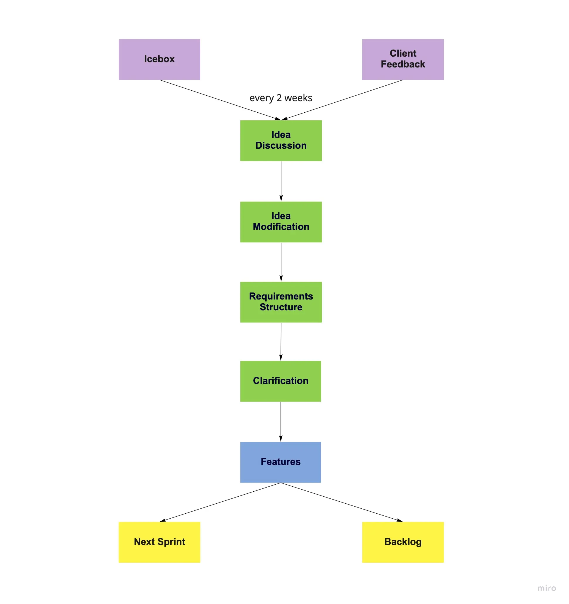
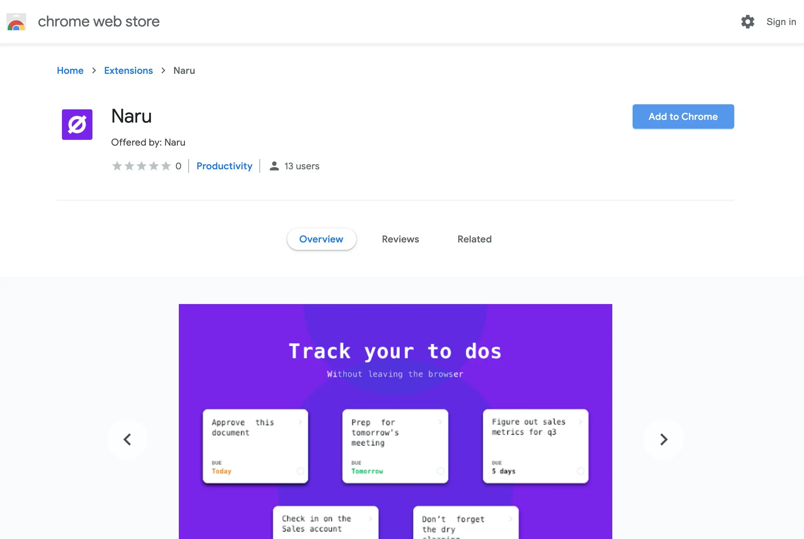
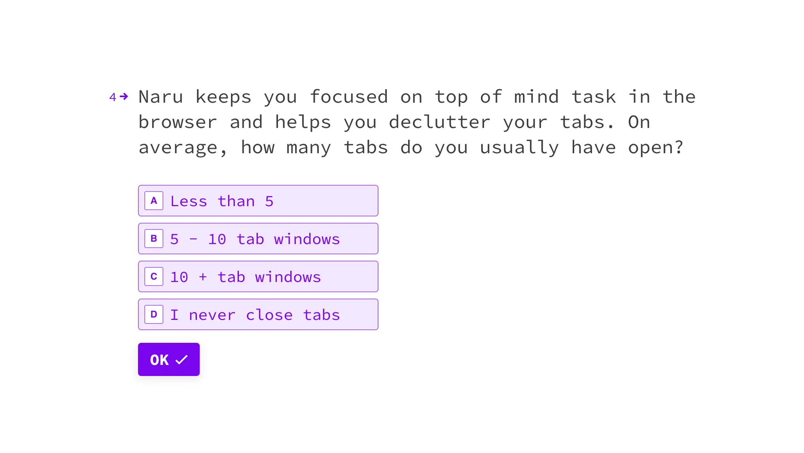

## In brief
- Being a digital designer who looks for inspiration and digital trends, Matt hopes for a productivity tool that could lend well to his browsing habit. 
- Matt got in contact with us via a connection of a friend. We were surprised by the opportunity he provides: A browser extension for works management. We did explore web extension - but never had an opportunity for real trial. 
- We take the chance to help bring it to market. A great working experience with US timezone and a notable milestone for turning web extension into viable-type product.

## Highlight
- Naru demands a render mechanism right into user's web browser. We adopt ShadowDOM for encapsulation and make the component reusable.
- Customized script for auto-release to remove manual release work 
- First time trial GraphQL instead of typical RESTful API - gave us the flexibility to query exactly what we need and nothing more. 
- Async Communication practices to decide what's important based on current timeline, roadmap and release plan. It avoids quickly jump and redundant features. 

## The Context
Naru's goal is to supercharge user workflows on web browsers. 

An enhanced version of to-do list - but acts as a widget within user's browser.

>
> Keeping the open state for the task board across tabs is the highest priority. Naru must boost the productivity.

## Engagement Model
Making a web extension behaves like an application (says Trello) is nontrivial. A web extension work by attach and execute) its own `<script>` tag to the current web page. After that, it boot up with a UI for user interaction.

**Collaboration**

Matt resides in the U.S. It's 11 hours away from us. He had to stay up at 9pm and we woke up at 8am for our daily catchup. We quickly realize such a schedule won't work in the long run. 

After 2 sprints, we proposed "Async Communication". Daily calls became daily check-in writeup.  Meeting turns to 15' quick calls: Sprint planning, Mid-sprint adjustment and Sprint retrospective. 

Daily check-in forces us to define the daily focus. It removes unnecessary ideas. It sticks us on the right track.

As we partner, more product ideas & features come up from payment plans, team collaboration and analytics. The ideas are unorganized. 

It leads us to 2 todo "list": "Icebox" and "Client feedback". This drives a sense in separating feedback and idea contribution. 

The team meet up twice a week to go through the lists, modify each item to structured software requirements, and propose for clarification. 

Once those requirements became new features. We either put to future sprints or the backlog

**Release-schedule**

- Prerelease (sideload version) every Monday morning: This gives us a week ahead to test the release. 
- Web store releases: We wrap-up a prerelease a week in advance. All features are frozen. We spend the next sprint for prerelease testing. It must be stable before deployed on the web store.

**Tech stacks**

- Backend: Elixir
- Framework: Phoenix
- Frontend: React, Typescript, Redux
- API query: GraphQL
- Infras: GCP

**Tooling**

- Basecamp: Team discussion and client advisory
- Tracked: Task management
- Async communication: Team sync-up

## Outcome
After 3 months, the very first stable version of [Naru.app](https://naru.app/) hit the web store - indicating our very first success in web extension development. 

Moving forward, we head for advanced features: team collaboration, team space and activity dashboard.

It's going to be a busy and an exciting year. Currently, the beta-user is getting invited through [Typeform](https://naruappco.typeform.com/to/d3hurf). 

