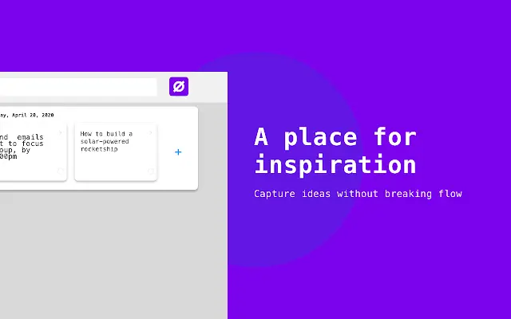
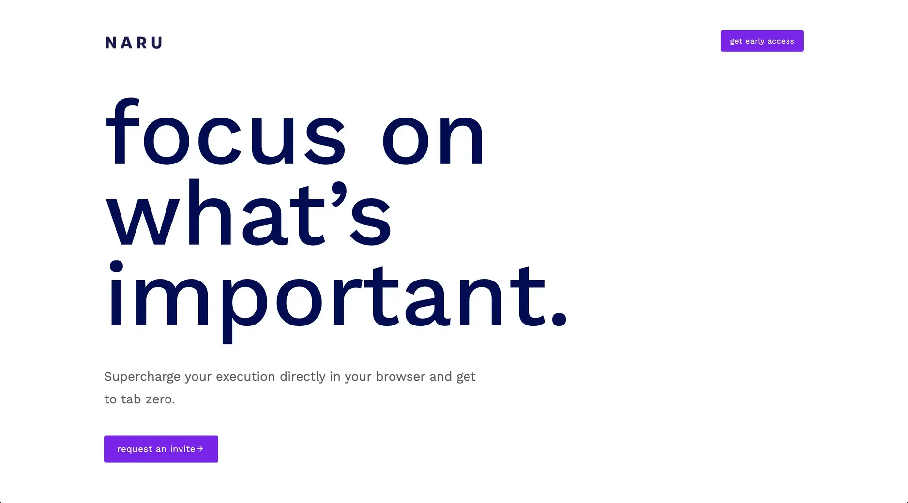
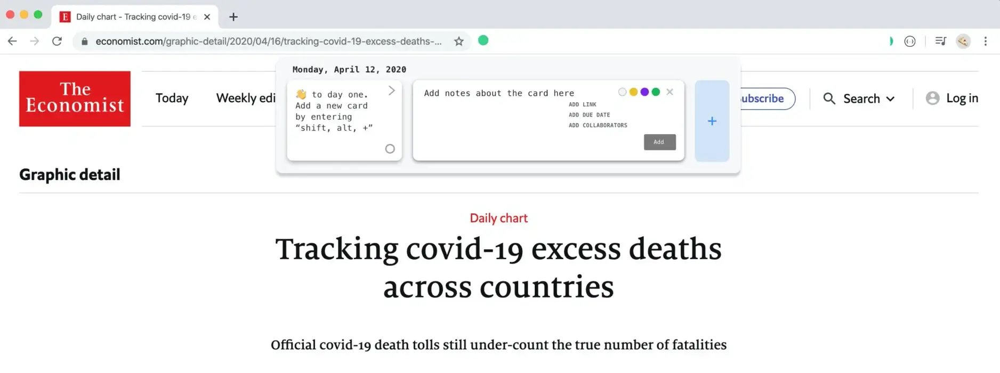
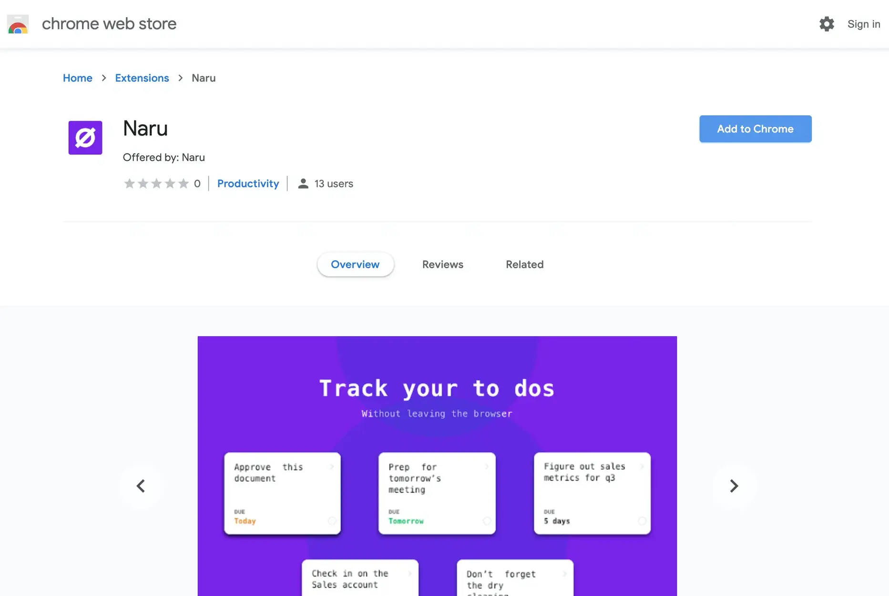
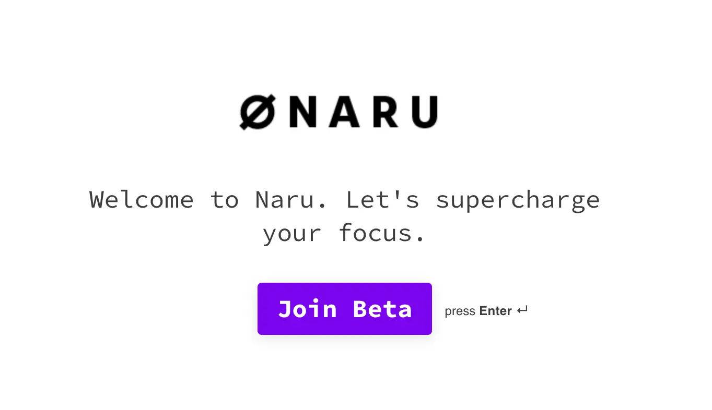

**Industry**\
Productivity Software

**Location**\
United States / Global

**Business context**\
Solo founder needed technical expertise to turn product concept into reality

**Solution**\
Built a cross-browser task management extension that works seamlessly across websites

**Outcome**\
Successfully launched on Chrome Web Store with positive user feedback

**Our service**\
Full-stack development / Browser extension development

## Technical highlights

- **Backend**: Elixir with Phoenix framework for reliable API services
- **Frontend**: React, TypeScript, ShadowDOM for isolated components
- **Data handling**: GraphQL for efficient data loading
- **Infrastructure**: Google Cloud Platform for hosting
- **Browser technologies**: Chrome Extension API, Mozilla WebExtension API
- **Communication**: WebSockets for real-time updates

## What we did with Naru

[Naru](https://naru.app/) is a browser extension that brings task management right into your web browser. It was created by Matt, a digital designer from the US who was looking for a better way to stay organized while browsing the web.

Most people have to switch between their browser and other apps to manage their tasks. Matt wanted something that would stay with him as he moved between websites, letting him capture ideas and organize his work without breaking his flow.

We helped turn this idea into reality by building a browser extension that works like a full-featured productivity app. The extension follows users across different websites and remembers their tasks no matter which tab they're using.

Think of Naru as a smart to-do list that's always available in your browser, helping you stay focused and organized without needing to switch between different apps.

## The challenge Naru solved

People who work online face several productivity challenges:

- Tasks and ideas get lost when switching between websites
- Standard to-do apps live outside the browser, breaking workflow
- Browser bookmarks don't organize information in a useful way
- It's hard to stay focused when jumping between different tabs

The biggest technical challenge was making a browser extension behave like a standalone app. Most extensions are simple add-ons that don't work the same way across different tabs or websites.

As Matt explained to us:

> "Keeping the open state for the task board across tabs is the highest priority. Naru must boost productivity, not hinder it."

We needed to create something that felt like part of the browser itself, while offering the power of a dedicated task management app.

## How we built it

Building a browser extension that works like a full application is more complex than it might seem. We had to solve several technical challenges while keeping the interface simple and intuitive.

### Technical approach

To make Naru work seamlessly across different websites, we applied several innovative approaches:

**ShadowDOM for consistent rendering**: We used ShadowDOM technology to create isolated components that maintain their appearance and functionality regardless of the website they appear on. This prevents conflicts with existing page styles and scripts.

**Cross-tab state synchronization**: We developed a system that keeps task information synchronized across all browser tabs, so users see the same tasks no matter where they're browsing.

**Minimalist interface design**: We created a clean, unobtrusive interface that doesn't compete with website content but remains easily accessible when needed.

**Automated release process**: We built a custom release pipeline that streamlines updates and ensures consistent quality across browser versions.

**GraphQL data layer**: Instead of traditional REST APIs, we used GraphQL to make data loading more efficient and reduce unnecessary network traffic.

The extension works by injecting a small interface into every web page the user visits. This interface remains hidden until activated, then smoothly reveals a task management panel that floats above the current website.

When users add or update tasks, the changes are instantly synchronized across all open tabs through WebSockets, ensuring a consistent experience throughout the browsing session.

### How we collaborated

Working with Matt in the US meant dealing with an 11-hour time difference. After trying daily video calls (with Matt staying up until 9 PM and us waking up at 8 AM), we realized we needed a better approach.

We switched to "async communication" - instead of daily calls, we:

- Wrote daily check-in notes to share progress
- Kept meetings focused and brief (15 minutes) for sprint planning and reviews
- Created two separate lists: "Icebox" for future ideas and "Client feedback" for immediate concerns
- Met twice weekly to review these lists and turn them into clear requirements

This approach helped us stay on track and reduced unnecessary back-and-forth, making the 11-hour time difference much less of an obstacle.

Our development process included:

- Weekly pre-release versions for internal testing
- Bi-weekly stable releases for the Chrome Web Store
- One-week testing periods before each public release
- Continuous integration to catch issues early
- Detailed documentation of features and decisions

## What we achieved

After just three months of development, we launched the first stable version of Naru on the Chrome Web Store. This marked our first successful browser extension project.

The extension received positive feedback from early users who appreciated how it:

- Stayed with them as they browsed different websites
- Made task management simple and intuitive
- Improved their focus and productivity
- Integrated smoothly with their browsing habits

The core features we delivered included:

- Task creation and management that persists across websites
- Custom lists and categories for organization
- Keyboard shortcuts for quick access
- Markdown support for rich text formatting
- Dark and light themes to match browser preferences
- Offline capability with background synchronization

After the initial launch, we continued developing more advanced features:

- Team collaboration tools for shared task lists
- Workspace management for different projects
- Activity dashboards to track productivity
- User analytics for insight into work patterns

The product continues to evolve through a beta program that brings in new users gradually. Our work with Naru demonstrated that browser extensions can be powerful productivity tools that enhance the browsing experience rather than just adding simple features.

Naru exemplifies our approach to product development: understanding user needs, solving complex technical challenges, and delivering a polished experience that feels natural and intuitive.
