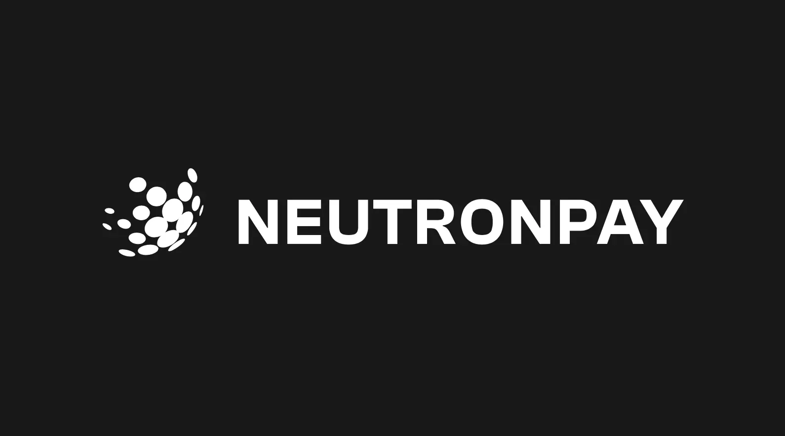
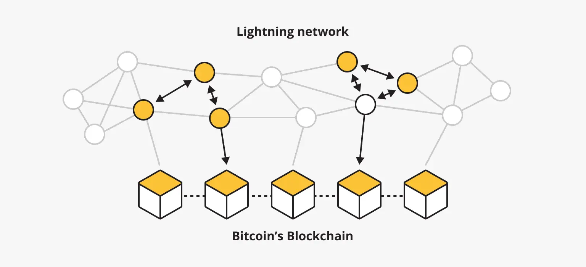
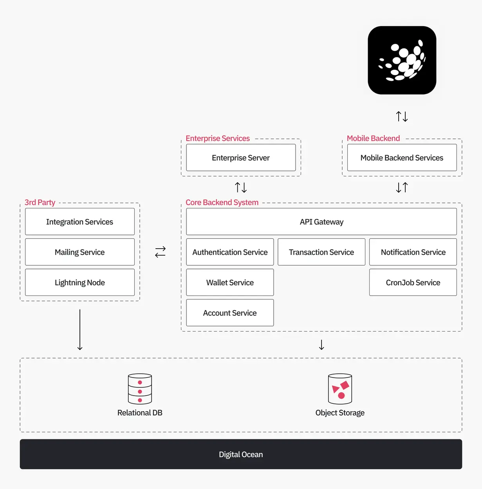
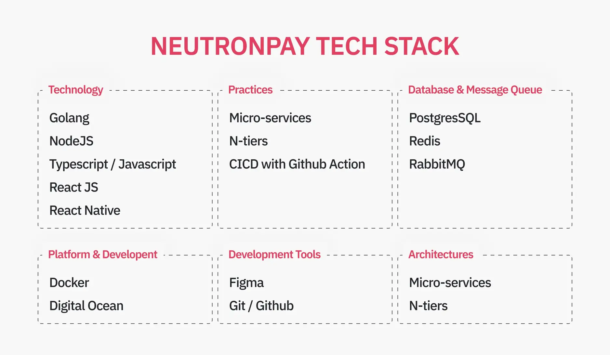

---
tags:
  - case-study
  - consulting
  - partnership
title: "Neutronpay Case Study: Innovating Global Payments with the Lightning Network"
date: 2023-12-19
description: Neutronpay, a startup funded by Silicon Valley venture capitalists, offers Lightning Network Infrastructure to businesses aiming to launch lightning products. This includes remittances, payments, spending, payouts, and banking capabilities...
authors: 
- hieuvu
menu: consulting
type: case-study
hide_frontmatter: false
---
**Industry:**\
Fintech / Blockchain / Lightning Network / Mobile payment 

**Location:**\
Canada / Vietnam / Southeast Asia / Africa

**Solution:**\
A technical partner to supercharge product development of Neutronpay.

**Outcome:**\
Integrate new payment partners and develop a new version of the payment system.

**Our Service:**\
Technical Partnership /  Product Design

## In brief
**Neutronpay**, a startup funded by Silicon Valley venture capitalists, offers Lightning Network Infrastructure to businesses aiming to launch lightning products. This includes remittances, payments, spending, payouts, and banking capabilities. The company is led by experienced professionals in the payments, compliance, banking, and bitcoin industries. Founded in 2018, **Neutronpay** is part of the initial cohort of companies building on the Lightning Network.

The **Dwarves** are proud to have partnered as the technical team, collaborating with **Neutronpay’s** in-house team to develop the new version of the **Neutronpay** payment system.

## Challenge
The need for efficient and seamless cross-border money transfer solutions has become increasingly important. Neutronpay has emerged as an innovative player in this field, aiming to revolutionize the way we transfer money across borders.

By utilizing the Lightning Network, known for its speed and scalability in facilitating blockchain transactions, Neutronpay offers efficient and reliable global money transfer solutions. This technological prowess is at the core of Neutronpay's commitment to providing fast, secure, and cost-effective cross-border payment options.

As the demand for their services grows and their integration expands, Neutronpay has strategically partnered with Dwarves to enhance its capabilities and extend its reach. This collaboration represents more than just an alliance; it is a fusion of expertise and vision, combining resources and manpower to strengthen Neutronpay's foundation for exponential growth.

## Solution
### Lightning Network

*Image Source: https://blog.ishosting.com/en/how-does-lightning-network-work/*

The most decentralized and interoperable payment network ever

- **Speed:** Lightning Network enables near-instant transactions. By utilizing its off-chain protocol, Neutronpay can facilitate swift and real-time money transfers across borders, significantly reducing transaction times compared to traditional banking systems or even on-chain blockchain transactions.
- **Scalability:** The Lightning Network is highly scalable and capable of handling a massive number of transactions per second. This scalability ensures Neutronpay's ability to accommodate a growing user base without compromising transaction speed or incurring high fees.
- **Cost-Efficiency:** The network's off-chain nature reduces transaction fees. Neutronpay can leverage this cost-efficiency to provide users with competitive rates for cross-border transfers, making their service more appealing and cost-effective.
- **Enhanced Privacy and Security:** Lightning Network operates on a peer-to-peer basis and employs advanced cryptographic techniques, ensuring a higher level of privacy and security for transactions. Neutronpay can assure its users of increased confidentiality and reduced exposure to potential security threats.
- **Global Accessibility:** The decentralized nature of the Lightning Network makes it accessible to anyone with internet connectivity, making it an ideal platform for Neutronpay to offer its cross-border money transfer services worldwide. This accessibility aligns with Neutronpay's goal of expanding its consumer base and catering to a diverse global market.
- **Interoperability and Integration:** Lightning Network's compatibility with various blockchain networks enhances Neutronpay's potential for seamless integration with existing financial systems. This interoperability allows for smoother interactions between different currencies and platforms, offering users a more cohesive and adaptable experience.

### Tech stack Design

| System | Tech Stacks |
| --- | --- |
| Front-end | React, React Native, TypeScript |
| Infrastructure | DigitalOcean as a Cloud Provider |
| Back-end | Golang, NodeJS, Message Queue |

### Architecture

**Main components**

- Core Backend System
    - Auth service: handles authentication, authorization, and user secret management
    - Account service: manages enterprise accounts
    - Wallet service: stores and manages internal account wallets
    - Transaction service: responsible for handling transactions across the system
    - Notification service: manages notifications and sends registered webhooks
    - CronJob service: manages and runs cronjobs dedicated by other services
- 3rd party services
    - Integration services: handle downstream payment requests
    - Lightning node proxy: communicates with our Lightning Node
    - Mailing service: our mail service provider
- Infrastructure
    - Relational database: store transaction and user data
    - Object storage:  storing files and user-uploaded contents
    - Auth service: handle authentication, authorization and manage user secret
    - Account service: manage enterprise account
    - Wallet service: store and manage internal account wallet
    - Transaction service: response for handling transactions across the system
    - Notification service: manage notifications and send registered webhooks
    - CronJob service: manage and run cronjob dedicated by other services

**Tech Stack**

**Development**

- **Backend Language:** migrate from NodeJS to **`Golang`** to improve performance and reliability in our micro-services.
- **Frontend Tools:** Leveraging **`ReactJS and ReactNative`** for accelerated frontend development and cross-platform mobile app capabilities.
- **Database System:** utilizing **`PostgreSQL`** as the primary database, with **`Redis`** serving as the caching layer.
- **Messaging Infrastructure:** employing **`RabbitMQ`** as the primary message queue, complemented by Restful APIs for inter-service communication.
- **Containerization:**  involves designing services with containers in mind, allowing each service to be encapsulated as a container. Deployment on Digital Ocean is supported for both Staging and Production environments.

**Deployment**

The deployment environment is divided into four separate ones. This setup helps developers develop the best technical solutions and resolve issues quickly, while users will only ever notice a new release. We utilize Docker and Docker Compose to set up our environments.
- **Local Development:** Dedicated workspace for code creation and swift testing of changes to minimize latency.
- **Continuous Integration (CI):** Automated building and testing upon any codebase alterations. Inclusive of end-to-end integration tests.
- **Staging:** Precisely mirrors the production setup, serving as a rehearsal space for changes and detailed issue debugging.
- **Production:** The robust and secure environment, is meticulously monitored and optimized periodically.

**Collaboration process**

We utilize several practices to enhance collaboration and make it more effective.

- **Gitflow**: We use Git and Github to store our source code. The master branch serves as the eternal branch, while all other branches (feature, release, hotfix) are temporary and primarily used for sharing code with other developers and as a backup precaution.
- **Early Pull Request and Code Review**: Pull Requests are a great way to start a feature conversation. It gives us a chance to think through the solution without the overhead of changing code every time we change our minds about how something should be organized. The team can also comment on the feature as it evolves, instead of providing all their feedback at the very end.
- **Release by tag**: Following the SEMVER rule, we tag each new version. Once the code is merged and tagged, it triggers the deployment process. This automated process includes various steps such as building, verifying, and deploying the system.

## Outcome
The team has successfully launched a new Platform API, which includes essential modules like the authentication module, core transaction module, and various integrated 3rd party modules. As a result, Neutronpay has successfully brought on board new enterprise partners who are utilizing the new API platform. Additionally, the core transaction service is ready for migration to the mobile platform, where it will serve as a consumer of the Platform API.

Our team at Dwarves Foundation not only brought expertise in product development, technical knowledge, and engineering quality but also contributed significantly as technical partners and venture builders.