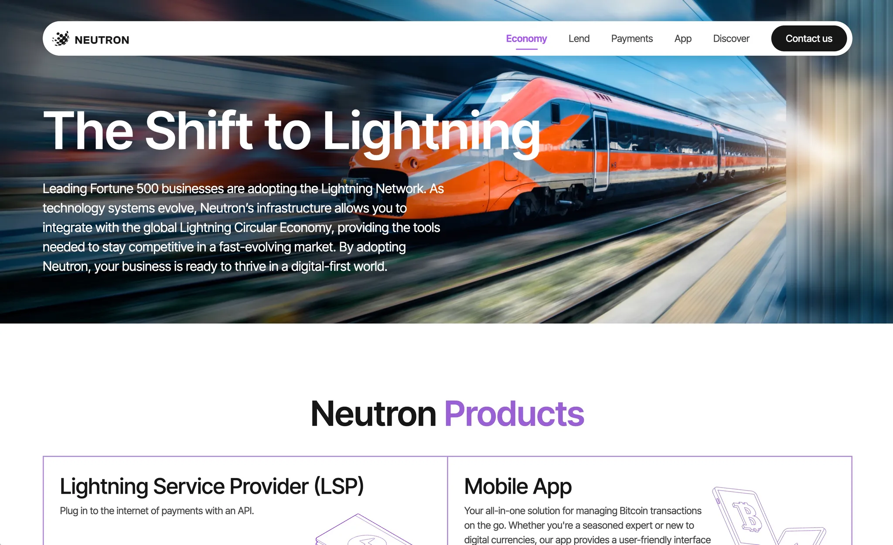

**Industry**

Financial Technology, Cryptocurrency Payments

**Location**

Southeast Asia

**Business context**

A fintech startup focused on leveraging Lightning Network technology to enable fast, affordable cryptocurrency transactions for businesses and individuals.

**Solution**

We provided engineering resources to collaborate with their technical leadership in developing a comprehensive Lightning Network-based payment platform.

**Outcome**

Our team successfully integrated with their technical leadership, delivering a scalable payment solution that significantly reduced transaction costs and processing times.

**Our services**

Blockchain Development, Payment System Architecture, Mobile App Development, System Integration

## Technical highlights

- **Lightning Network integration**: Built on Bitcoin's Lightning Network for instant, low-cost transactions
- **Multi-cryptocurrency support**: Unified wallet management across multiple digital currencies
- **Payment provider integration**: Seamless connectivity with multiple third-party payment providers
- **Cross-platform development**: React-based admin dashboard and React Native mobile wallet
- **Microservices architecture**: Scalable backend services built with Golang and containerized with Docker
- **Real-time processing**: GraphQL APIs with Redis caching for optimal performance

## What we did

The client approached us with an ambitious vision: bridge traditional finance with cryptocurrency technology using the Lightning Network. As a fintech startup, they recognized the opportunity in solving high fees, slow processing, and complex cryptocurrency management that plagued existing payment solutions.

> **Core Challenge**: The client needed engineering expertise to work alongside their technical leadership in building a Lightning Network payment platform that could handle multiple cryptocurrencies and integrate with traditional payment providers.

We provided specialized engineering workforce to collaborate closely with their technical team to design and develop a comprehensive payment ecosystem.

## The challenges faced

The cryptocurrency payment landscape presented several interconnected challenges:

### Traditional payment limitations

- **High transaction costs**: Cross-border payments involved excessive fees making micro-transactions unviable
- **Slow processing**: Legacy systems couldn't match modern digital commerce speed demands
- **Integration complexity**: Connecting multiple payment providers required significant technical overhead

### Technical complexity

- **Lightning Network implementation**: Required deep blockchain expertise for reliable infrastructure
- **Multi-currency support**: Managing different cryptocurrencies while maintaining security and performance
- **Real-time requirements**: Payment systems demand instant processing with zero downtime tolerance

### User experience challenges

- **Wallet management complexity**: Users struggled with managing multiple cryptocurrency wallets
- **Technical barriers**: Complex interfaces hindered mainstream cryptocurrency adoption
- **Trust and security**: Building user confidence in digital asset management

## How we built it

Our approach centered on **providing specialized engineering support** while focusing on Lightning Network optimization. We deployed our engineering workforce to collaborate directly with their technical leadership throughout development.

### Lightning Network foundation

Working alongside their technical leadership, we contributed to building core platform infrastructure:

- **Network integration**: Collaborated on robust Lightning Network nodes with high availability
- **Channel management**: Developed automated liquidity management for optimal transaction routing
- **Payment routing**: Built intelligent routing algorithms for reliable cross-network transactions

### Multi-service architecture

Our engineers worked with their team to design scalable microservices:

- **Backend services**: Contributed to Golang-based services handling payments and wallet management
- **Database layer**: Collaborated on PostgreSQL implementation with Redis caching
- **API gateway**: Supported GraphQL implementation for flexible data access

### Cross-platform applications

Our team contributed to developing user interfaces:

- **Admin dashboard**: Collaborated on React-based management interface
- **Mobile wallet**: Supported React Native application development
- **Integration APIs**: Worked on endpoints for third-party system integration

### Collaborative engineering approach

- **Technical partnership**: Engineers integrated seamlessly with their technical leadership
- **Knowledge sharing**: Continuous collaboration ensuring knowledge transfer and best practices
- **Agile development**: Joint development cycles with shared responsibility
- **Quality assurance**: Collaborative testing and code review processes

## What we achieved

Our Lightning Network payment platform delivered transformative results:

### Technical transformation

- **Instant transactions**: Achieved near-instantaneous payment processing through Lightning Network optimization
- **Dramatic cost reduction**: Reduced transaction fees by up to 90% compared to traditional methods
- **Scalable architecture**: Built infrastructure processing thousands of transactions per second
- **Multi-currency support**: Enabled seamless management through unified interfaces

### User experience enhancement

- **Simplified wallet management**: Abstracted complex cryptocurrency operations behind intuitive interfaces
- **Cross-platform accessibility**: Provided consistent experience across web and mobile platforms
- **Real-time monitoring**: Implemented comprehensive dashboards for transaction tracking

### Successful technical collaboration

- **Engineering integration**: Our team successfully integrated with their technical leadership, contributing specialized blockchain expertise
- **Knowledge transfer**: Established effective collaboration patterns enhancing their internal development capabilities
- **Shared development**: Joint ownership of critical platform components with clear responsibility distribution
- **Continuous delivery**: Maintained consistent development velocity through collaborative workflows

### Strategic advantages

- **Competitive differentiation**: Lightning Network integration provided significant speed and cost advantages
- **Scalability foundation**: Microservices architecture enabled rapid feature development
- **Future-ready platform**: Flexible architecture positioned for blockchain technology evolution
- **Enterprise readiness**: Robust security features enabled enterprise client acquisition

Our collaboration demonstrates how providing engineering resources can effectively augment internal technical capabilities in complex blockchain projects. By working directly with their technical leadership, we helped deliver a Lightning Network platform that makes cryptocurrency payments accessible while maintaining blockchain security benefits.

The partnership continues with our engineers working alongside their technical team, focusing on expanding cryptocurrency support and enhancing Lightning Network capabilities. This case study exemplifies how collaborative engineering approaches can accelerate fintech innovation while building internal technical capacity.
