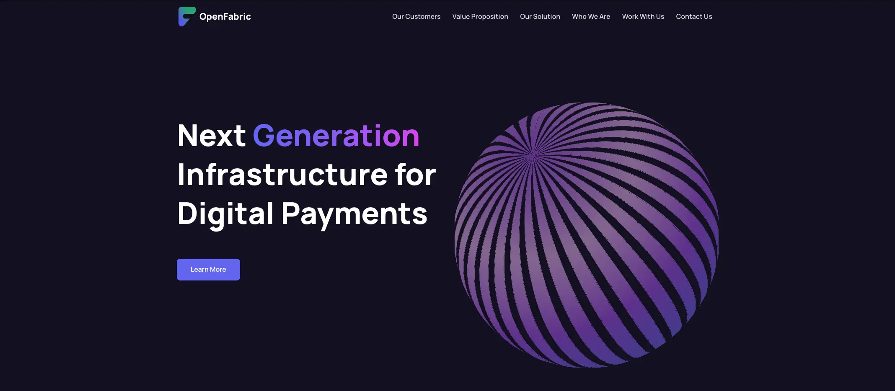
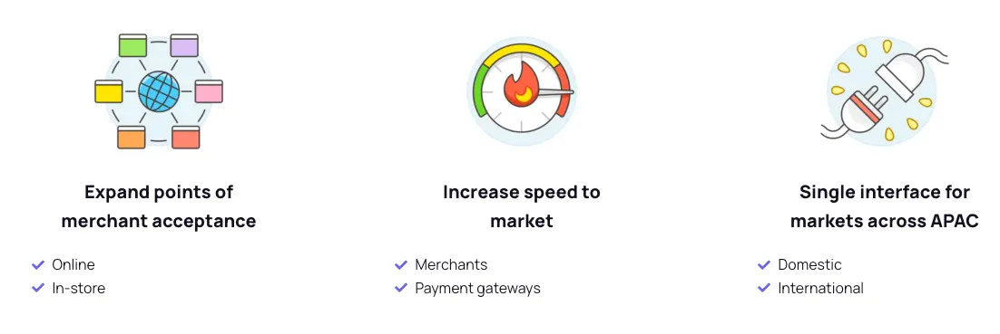
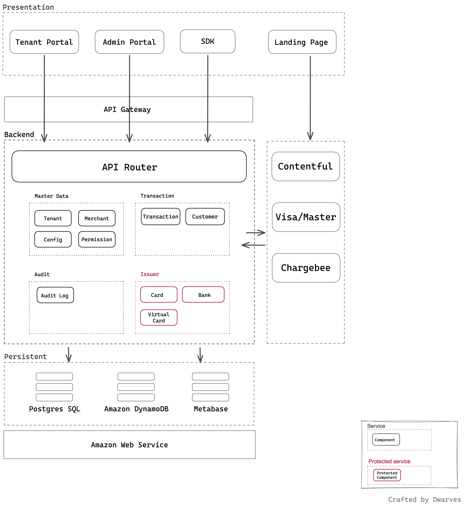
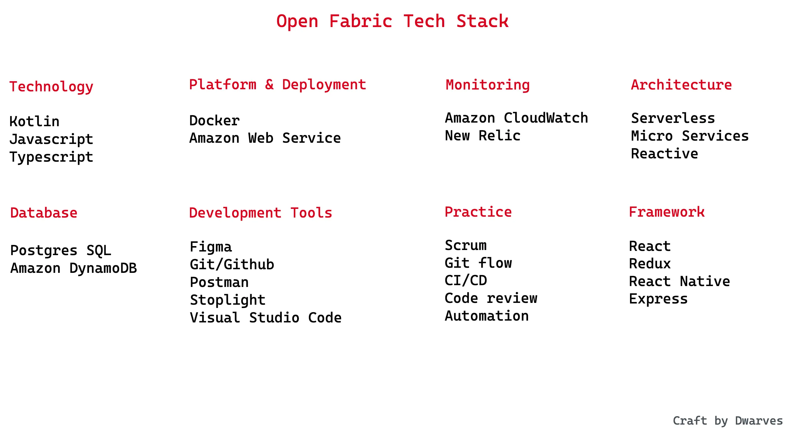
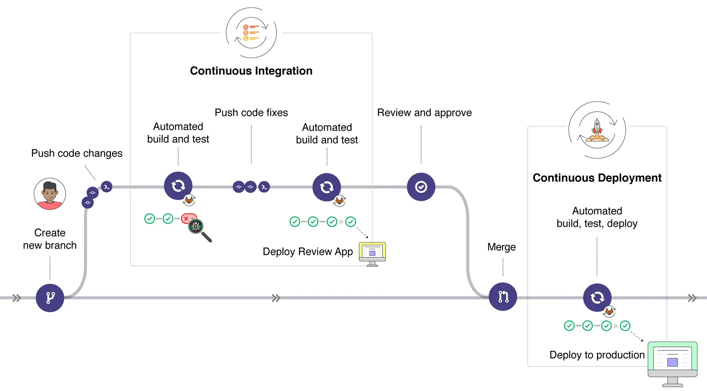

Founded and led by veterans from fintech players like Paypal & Grab, **[Open Fabric](https://openfabric.co/)** is a BNPL platform, built to enable an open commerce network for customers and credit providers in South East Asia to radically simplify merchant integrations for digital payment methods. 

With a team of 8 engineers, Dwarves helped set the tech foundation and together built an MVP from scratch. Within a year, Dwarves helped ship the system to onboard and configure payment methods for companies to the Open Fabric commerce network.

**Industry**\
Fintech

**Location**\
South East Asia

**Solution**\
A Technical Partner to co-manage Open Fabric product development.

A team of senior engineers collaborated with their in-house team to define the tech foundation and develop the MVP from scratch.

**Outcome**\
Dwarves being in charge of the core data master module. With this module completed, the MVP allowing stakeholder (customers, merchants, payment providers) onboarding and transactions was launched on time.

Released the core master data service in the MVP version

**Our Service**\
MVP Development, Tech Consulting, Staff Augmentation

## The Challenges

OpenFabric’s key value proposition includes:
- **A single interface incorporating multiple uses cases, geographies, channels and stakeholders;**
- **An entirely cloud-based platform; and**
- **Fast, frictionless international payment acceptance** for SME merchants with or without in-store POS, while employing tokenization.

These business requirements require the following technical challenges to be solved:
- The platform needs to be high-performing, in order to process a huge number of transactions at a time, while managing multiple stakeholders.
- Cloud-based data needs to be stored, backed up and protected in a secure and safe location, while data can be accessed quickly, minimizing downtime and loss of productivity.
- The system needs to follow ICCP standards for architecture, implementation and deployment to protect end user’s personal data.

At the same time, we also need to tackle the challenge which most startups encounter during their early stage: having a tech team skilled and experienced enough to align product development with business roadmap.

## The Solutions
### Rapid Team Scaling Solution
The key to this collaboration is to provide OpenFabric with engineers who are highly skilled in both coding skills and solutions design skills. In a span of 2 weeks, Dwarves managed to deploy 3 engineers meeting the required skills. 

The team consists of:
- Backend engineer: ~10 years of experience in backend development, has experience designing high-performing systems from the ground up.
- Frontend engineer: 8 years of experience in both frontend and backend development, has great understanding of integrating backend and frontend.
- DevOps: 5 years of experience in software development, 3 years of DevOps, has experience in CI/CD, configuration and automation. 

Our 3 engineers worked together with OpenFabric’s engineers as one unified team. With their prior experience working on similar products, it didn’t take long for our engineers to pick up and start performing.

### Customer Solutions
#### Vision of the product
For customers, we are a single interface that exponentially accelerates your merchant footprint across use cases, geographies, and channels. To create a friction-less experience for our customers, we help to ensure the product:
- Leverages virtual cards to tokenize closed-loop payment instruments;
- Embeds tokens into digital payment flows for automated processing; and
- Provide a white-labeled SaaS solution for alternate payment methods.

#### How we handle the product
Areas such as maintenance and production issues are risk assessed, planned, and managed as a joint effort with the engineering teams. We help to ensure a strong collaboration process between both our internal team and Dwarves team for any issues or incidents, and this requirement holds true for any remote team.

### Technical Solutions
#### Solution Design
For Open Fabric’s core business concept, in order to meet requirements for high scalability, horizontal scaling is more preferred over vertical scaling. With that, the system needs to be organized into several services in accordance to domain boundaries.

**Multi-tenancy**

Serving both payment gateway provides and merchants, OpenFabric’s multi-tenant architecture allows every user to share the same databases and applications securely, making sure transactions between stakeholders are accepted ubiquitously. 

- Multi-tenancy, is an architecture in which a single instance of a software application serves multiple customers. In recent years, multi-tenancy has become industry standard for enterprise SaaS for its simple launch process and fewer hardware needs. In comparison to single-tenancy, multi-tenancy is cheaper, has efficient resource usage, has a lower maintenance cost, and has a potentially larger computing capacity.

**Reporting Service**

Internal staff and partner teams need ways to monitor their business operations, such as revenue, transactions.

With limited resources and a rushed time to launch, we have to weigh between building our own report system and allowing easy customization or integrating an existing report service. After thorough research and evaluation, we decided to integrate Metabase to our system, as it was able to meet our requirements.

### System Design
| System | Tech Stacks |
|---|---|
| Front-end | React, Typescript |
| Infrastructure | AWS, Lambda, Postgres, DynamoDB, EC2, ECS |
| Back-end | Typescript, Kotlin |

**Architecture**

Open Fabric was designed to become a high-performance, low-latency system that follows practices for Domain-driven design. The system separates some corporate services with different databases. At the MVP (Minimum Viable Product) stage, we need to test the market as fast as possible. The team balances efforts on release milestones and application performance. However, setting boundaries for separate services is top priority for maintenance and improvement.

**List of main services**

- Master data service: this service provides the master data to be used in other services that contains metadata, configurations, and user permissions
- Transaction service: the core system orchestrating transactions between card/payment network and funding sources
- Audit service: a service to accommodate full-meaning log data from all services. It’s designed to be easily extendable with a reusable log format
- Issuer service: a **protected** service for card issuance service. In the ICCP standard, sensitive data must be protected from vulnerable issues. These issues can range from infrastructure issues, cyber-attacks, or exploits connected from other services

**Cloud Infrastructure**

We deploy our system to Amazon Web Service Cloud and keep them there. The overall Open Fabric cloud infra is as below.

- **Lambda and Serverless**: almost all of the services run on AWS lambda, a computing service that runs code in response to events and automatically manages the computing resources required by that code.
- **Docker Container**: we apply the Docker-centered workflow to offer data isolation & context separation for application deployment.
- **AWS Cloud**: Open Fabric nodes are regionally placed in Singapore, and AWS Cloud gives us operating freedom with lower administration risks in the event of a major cloud security issue.
- **AWS S3**: For both front-page websites and admin dashboards, we deploy our ReactJS sites to AWS S3. The service lets you store files and data as **objects**, and these **objects** can range from image files, video files, as well as HTML, CSS, and JavaScript files. This allows us to deploy static assets as website.

### Deployment
Open Fabric runtime is divided into 4 separate environments. This helps members develop the best technical solutions and resolve issues quickly, while only exposing new releases to users. We use Docker to compose our environments. Additionally, we use the **Sam CLI** (Command line interface) tool to invoke a lambda function in the local environment.
- **Local development**: This refers to local machines where we write code; any changes to product can be tested with minimal delay.
- **Develop environment**: builds the product and runs all automated tests for any and all changes in the codebase. Failures are reported immediately, with CI configured to run end-to-end and integration tests.
- **Sandbox**: is set up exactly like production. Changes to the production environment will not be accepted before rehearsing deployment here. Any mysterious production issues will also be debugged here.
- **Production**: The big iron. This environment is fully logged, monitored, managed periodically, squared away, and secured.

For the deployment process, we apply a few practices to make remote collaboration more effective.
- **Gitflow**: We use Github to store all of our source code. There is only one eternal branch called the **main**. All other branches (feature, release, fix) are temporary and ephemeral and is only used for convenience to share code with other developers and as a backup measure.
- **Feature Pull Requests**: A feature in a micro-service architecture can affect other services. A minor change in the **master** data service can implicitly make another change from the **transaction** service. The operational flow is to make changes to the API definition first, before submitting changes and waiting for approval and clearance to merge all pull requests in a given instance.
- **Code Review:** Pull Requests are a great way to start a feature conversation. It gives us a chance to think through the solution without the overhead of changing code every time we change our minds about how something should be organized. The team can also comment on the feature as it evolves, instead of providing all their feedback at the very end.
- **Release branches:** Using git-flow, when the code is merged to master or when a new tag is pushed, it will trigger the deployment process to automate steps in building, verifying, and deploying the application.

There are 2 releases in the sprint: a production release in the middle of the sprint (from changes in the previous sprint), and a sandbox release at the end of the sprint. QA has a week to test the release in the sandbox environment. The version in Production will always older than the Sandbox.

- **Hot-fix process**: There are occasions when we need to deploy a hot-fix or a high-impact security patch to production outside of our normal release cycle. The bug fix/patch will always be merged to the **main** branch first via a normal Pull request (PR). After it’s verified, we will cherry-pick that PR commit to the release-sandbox, and release-production branches.

This allows us to always verify a bug fix/patch in the lower environment before moving it to production, and avoid the situation of reintroducing the bug because we forget to put the fix back into the main branch.

## The Outcome
Together with the Dwarves team, we were able to release essential services that became the foundation of the system. This included the master central configuration service and portals (TSP and OSP) that connects the whole payment gateway system.

The partnership significantly impacted our collaboration in a positive way. With help from our Dwarves team, Open Fabric was able to:
- Make their way into the market faster without compromising quality and security; and
- Achieve key milestones, allowing them to establish themselves as the next-generation infrastructure in the APAC digital payment industry.

The Dwarves contributed more than just engineering quality and a smooth 100% remote collaboration on technical implementation. Without being constrained, they were able to pick up the pace of their work and continue to improve it. The staff augmentation model enabled OpenFabric to scale up their tech capability fast and lower recruiting, training expenses, invest entirely in product development, and retain our present resources.
