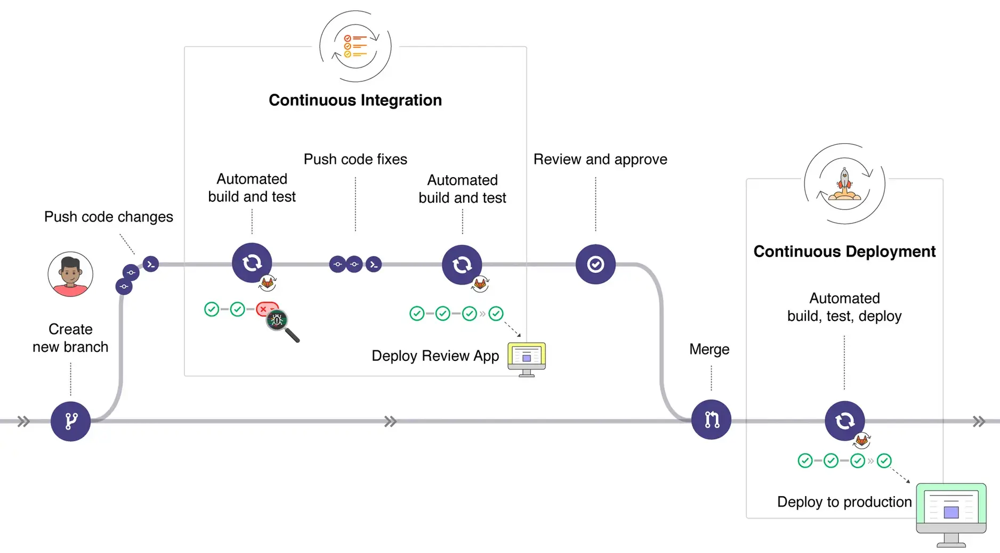

**Industry**\
Financial Technology (Fintech)

**Location**\
Singapore

**Business context**\
Payment startup needed to build a secure, scalable platform from scratch

**Solution**\
Developed a multi-tenant cloud platform that connects merchants with payment providers

**Outcome**\
Successfully launched the platform within one year, enabling expansion in Southeast Asia

**Our service**\
Backend development / Cloud architecture / DevOps

## Technical highlights

- **Backend**: TypeScript, Kotlin for reliable microservices
- **Frontend**: React, TypeScript for the merchant interface
- **Infrastructure**: AWS Lambda, EC2, S3, DynamoDB
- **Architecture**: Multi-tenant system with microservices
- **Security**: PCI DSS compliance, encryption for sensitive data
- **DevOps**: Docker, automated CI/CD pipeline

## What we did with Open Fabric

[Open Fabric](https://openfabric.co/) is a "Buy Now, Pay Later" payment platform started by experts from companies like PayPal and Grab. They wanted to create a network that makes it simple for stores to accept digital payments across Southeast Asia.

We put together a team of 8 engineers to help build the technical foundation and create a working product from scratch. We worked closely with their team to develop a system that could connect stores with different payment methods.

Our team was responsible for building the core data system – the foundation of the entire platform. This crucial part allows Open Fabric to handle transactions between customers, stores, and payment providers.

The product we delivered helped Open Fabric launch on time and start growing in Southeast Asia's competitive payment market.

## The challenge Open Fabric faced

Open Fabric needed to build a platform that could serve multiple audiences at once:

- **Merchants** who want to offer more payment options to their customers
- **Shoppers** who need secure, convenient payment methods
- **Payment providers** who want to connect with more businesses

These requirements created several complex technical challenges:

- **Processing high transaction volumes**: The system needed to handle many simultaneous payments while maintaining performance.
- **Ensuring data security**: Financial information required strong protection through encryption and secure storage.
- **Meeting industry regulations**: Payment platforms must follow strict compliance standards like PCI DSS.
- **Building for scale**: The architecture needed to support growth as more merchants and payment providers joined the platform.
- **Recruiting specialized talent**: Fintech development requires specific expertise that's difficult to find on short notice.

## How we built it

We approached the Open Fabric platform with three key priorities: scalability, security, and speed to market – all critical factors for a payment startup in a competitive landscape.

### Technical approach

**Multi-tenant architecture**: We designed the system so a single platform could securely serve many different businesses. This approach:

- Allows both merchants and payment providers to use the same underlying infrastructure
- Maintains strict data separation between tenants for security
- Reduces operational costs compared to deploying separate instances
- Optimizes resource utilization
- Enables easier scaling as the business grows

**Microservices organization**: Even at this early stage, we structured the system into discrete services to improve maintainability and future development:

1. **Data service**: The central system that manages core information used by other components
2. **Transaction service**: Handles payment processing between customers and merchants
3. **Logging service**: Maintains comprehensive audit trails across the platform
4. **Card service**: A highly isolated service that handles sensitive payment card information

**Cloud-native implementation**: We built the entire platform on Amazon Web Services (AWS):

- **Serverless computing**: Most services run on AWS Lambda, which automatically scales based on demand
- **Containerization**: Docker containers provide isolation between different system components
- **Content delivery**: AWS S3 and CloudFront host static assets like dashboards and documentation
- **Regional optimization**: We deployed in Singapore to minimize latency for Southeast Asian users

**Development environment separation**: We created four distinct environments to support the development lifecycle:

- **Local development**: Individual developer environments for initial coding and testing
- **Continuous integration**: Automated testing of all code changes
- **Staging**: A production-like environment for final validation before release
- **Production**: The secure, monitored environment that serves actual customers

Our development process incorporated several best practices for distributed teams:

- **Trunk-based development**: Single main branch with short-lived feature branches
- **Coordinated releases**: Synchronized deployments across interdependent services
- **Design reviews**: Team discussions about architecture and implementations before coding
- **Automated deployments**: CI/CD pipeline for consistent and reliable releases
- **Incident management**: Clear procedures for handling production issues

### How we collaborated

Our 8-person engineering team became an extension of Open Fabric's own technical staff. We quickly assembled a team of specialists:

- Senior backend engineers with experience in high-performance financial systems
- Frontend developers who understood both UI design and backend integration
- DevOps specialists who could automate testing and deployment processes

We established clear communication channels for different types of interactions:

- Regular planning sessions for roadmap and feature prioritization
- Daily standups for progress updates and blocker resolution
- Technical design reviews for architecture decisions
- Code reviews for maintaining quality standards
- Joint on-call rotations for production support

This approach created a seamless working relationship regardless of physical location, allowing both teams to collaborate effectively whether in office or remote.

## What we achieved

Working with Open Fabric, we successfully delivered the core components of their payment platform:

- A robust central system that manages the entire payment ecosystem
- Web interfaces for merchants, payment providers, and administrators
- A secure multi-tenant architecture that supports different business types
- A complete working product that enabled market entry

Our partnership provided Open Fabric with several significant advantages:

- **Faster time to market** without compromising on quality or security
- **Achievement of business milestones** necessary for establishing their position in Southeast Asia
- **Technical team extension** without the overhead of extensive recruitment
- **Focus on product strategy** rather than infrastructure concerns

By providing experienced engineers who integrated seamlessly with their team, we helped Open Fabric invest more in product development while leveraging our technical expertise. Our team didn't just write code – we contributed to architectural decisions and process improvements that will support Open Fabric's growth for years to come.

The platform we built continues to evolve as Open Fabric expands to new markets and adds more payment options, built on the solid foundation established through our collaboration.
