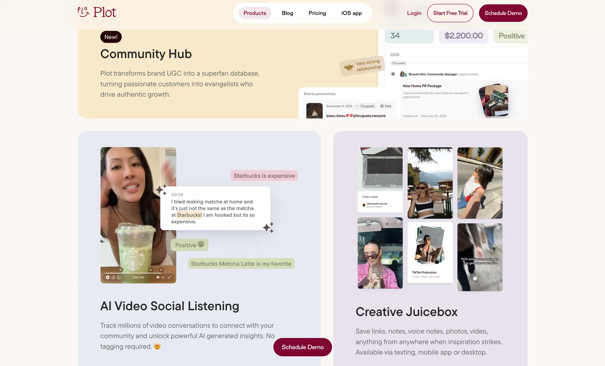
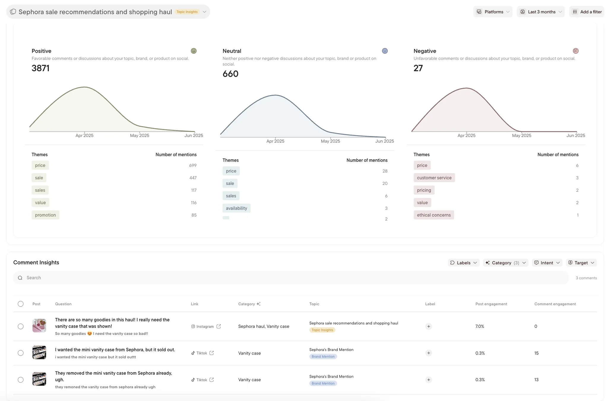
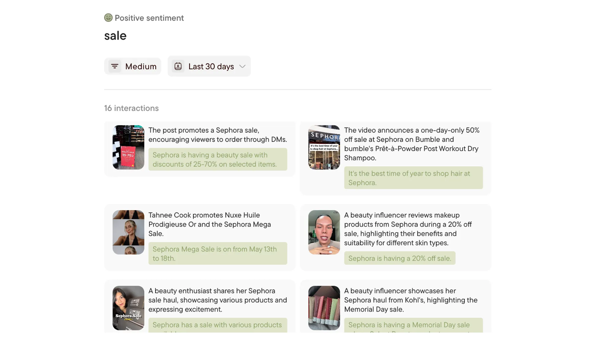

**Industry**

AI-powered tools forsocial media marketers

**Location**

United States

**Business context**

AI startup needed a robust data pipeline to process millions of social media posts for competitive intelligence

**Solution**

Built a scalable cloud-native pipeline processing 100,000+ posts daily with AI-powered content analysis

**Outcome**

Delivered a mission-critical system that became the client's core strategic advantage, enabling faster insights and business growth

**Our services**

Fullstack Development / Cloud Infrastructure / AI Integration / Data Engineering

## Technical highlights

- **Backend**: NestJS with Prisma ORM for type-safe database operations and modular architecture
- **Cloud infrastructure**: Google Cloud Platform with Scheduler and Cloud Tasks for distributed processing
- **AI integration**: Multiple LLM models for intelligent content analysis
- **Data storage**: PostgreSQL for structured data, Elasticsearch for search and analytics indexing
- **Queue system**: Cloud Tasks for reliable distributed processing with automatic retries and failure handling
- **APIs**: Social media APIs and search APIs for comprehensive data extraction

## What we did

The client leverages AI to revolutionize knowledge sharing and team collaboration. They engaged us for engineering development to build a mission-critical social listening pipeline capable of tracking millions of social media conversations and providing organizations with AI-powered competitive intelligence insights.

We provided fullstack engineering support to work alongside their core development team. The pipeline processes an average of 100,000 posts per day from multiple social platforms, along with the top 100 comments per post every hour.

## The challenge

The client needed to track millions of social media conversations to provide organizations with AI-powered competitive intelligence. The system had to handle massive scale reliably while integrating multiple AI models cost-effectively.

Key challenges included:

- **Scale and reliability**: Handle 100,000+ posts daily with consistent uptime
- **AI integration complexity**: Seamlessly integrate multiple LLM models while managing costs
- **Real-time processing**: Deliver timely insights for competitive advantage
- **Data consistency**: Ensure accurate processing across diverse social platform APIs
- **Cost optimization**: Balance performance requirements with infrastructure expenses

Working with a fast-growing AI startup meant embracing rapid iteration while building for enterprise scale alongside their existing team.

## How we built it

We collaborated with the client's team on a scalable, reliable data pipeline with intelligent AI integration. Our approach emphasized proven cloud-native patterns while incorporating cutting-edge AI capabilities.

### Technical approach

**Decoupled queue-based architecture**: The system was designed around four key principles:

- Decoupled task distribution using Google Cloud Tasks for independent scaling
- Flexible scheduling with GCP Scheduler for different content refresh rates
- Modular processing stages (collection, parsing, enrichment, indexing)
- Separated data storage: PostgreSQL for structured data, Elasticsearch for search

**Multi-stage data processing**: The core pipeline follows an ETL pattern optimized for social media:

- **Extract**: Fetches data from social media APIs with rate limiting
- **Transform**: Pre-processing, parsing (topics, creators, posts, comments), post-processing (enrichment, engagement scoring)
- **Load**: Stores structured data in PostgreSQL, indexes searchable content in Elasticsearch

**AI-powered content analysis**: Multiple LLM models were integrated for intelligent analysis, optimizing for different content types and cost considerations while delivering high-quality insights including content transcription, sentiment analysis, and contextual understanding.

### How we collaborated

Working alongside the client's team required close coordination and clear communication channels:

- Daily standups to align on progress and address challenges
- Weekly demos for progress visibility and feedback
- Iterative development cycles with regular staging deployments
- Comprehensive monitoring and alerting from day one

When scalability issues arose with initial API implementations, we collaborated to evaluate alternatives and migrate to more cost-effective and reliable solutions.

## What we achieved

The collaboration delivered a transformative social listening platform that became central to the client's business strategy. The pipeline processes social media content at enterprise scale while providing AI-powered insights.

The platform enabled enterprise clients to:

- **Track brand performance**: Monitor mentions and sentiment across platforms with real-time updates
- **Benchmark against competitors**: Access comparative analysis and competitive intelligence
- **Spot trends faster**: Leverage AI insights from automated analysis of multimedia content
- **Make data-driven decisions**: Use comprehensive reports to optimize marketing strategies

Key technical achievements:

- **Distributed processing**: Handles 100,000+ posts daily with automatic retries via Cloud Tasks
- **Flexible scheduling**: Configurable update intervals for different platforms and content types
- **Multi-model AI integration**: Contextual insights while optimizing costs across LLM providers
- **Scalable storage**: Separation between transactional data and search-optimized indexing
- **Comprehensive observability**: Structured logging enables proactive performance optimization

The pipeline's success enabled the client to expand their enterprise customer base while providing increasingly sophisticated insights. The enriched social data became a key driver for improving their AI recommendations.

This project demonstrates how strategic technical collaboration can support a startup's core value proposition. By contributing to a robust, scalable pipeline handling millions of social interactions, we helped establish a strong foundation for continued growth in the competitive AI insights market.
