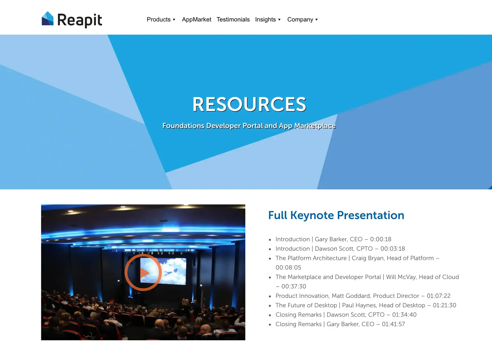

**Industry**\
Real Estate Technology

**Location**\
United Kingdom

**Business context**\
Established CRM provider needed to modernize their technology stack quickly

**Solution**\
Joined as an offshore development team to accelerate cloud migration and new feature development

**Outcome**\
Successfully delivered key platform components for their major launch event on schedule

**Our service**\
Frontend development / Cloud architecture

## Technical highlights

- **Backend**: NodeJS for API services
- **Frontend**: React.js, TypeScript for responsive interfaces
- **Testing**: Jest, Cypress for automated testing
- **Infrastructure**: AWS cloud services
- **Monitoring**: Sentry, CloudWatch for performance tracking

## What we did with Reapit

Reapit needed to move fast. With 22 years of experience as the UK's largest CRM provider for real estate agencies, they were ready for a major transformation. After being acquired by Accel KKR in 2017, they accelerated their plans to modernize their technology.

Their goal was ambitious: migrate their desktop applications to the cloud and develop a Platform-as-a-Service (PaaS) that would better serve their small and medium business customers.

We joined as their offshore development team in Vietnam, taking on prototype development and "skunkworks" projects - innovative work that needed to be delivered quickly with minimal management overhead. Our ability to ship quality code on tight timelines made us the perfect partner for their transformation.

## The challenge Reapit was solving

Reapit already had a strong engineering team of 60 people in the UK, but they needed additional talent to accelerate their growth. Building an internal team would have required headhunters, service fees, and significant onboarding time.

They were planning a major launch event for their new "Reapit Foundation" platform and needed help developing key modules for their small and medium business solutions. This would allow them to test new ideas before the big reveal.

Our team provided Reapit with skilled engineers right when they needed them. They were thrilled to form an Asia offshore team that could help them scale quickly.

Beyond just writing code, we helped Reapit qualify their Service Level Agreements (SLAs) and offered advice on long-term technical strategy.

## How we built it

We assembled a specialized cloud development team with senior React.js expertise. Our team focused on two key parts of Reapit's AgencyCloud platform:

### Technical approach

**Reapit Foundation Platform**: We helped develop their cloud-based Platform-as-a-Service (PaaS) and app marketplace, which allows third-party developers to create apps that integrate with Reapit's core services. This opened up new revenue streams and created additional value for their clients.

**Reapit Geo Diary**: We built a mobile app that lets real estate agents access and manage their appointments while on the go. This improved agent productivity and customer service by providing instant access to critical information from anywhere.

Reapit Foundation included three main applications: Admin Portal, Developer Portal, and App Marketplace (which contained Geo Diary and AML Checklist). Having multiple separate apps made the codebase difficult to manage, so we proactively suggested a monorepo approach to unify their solutions.

The monorepo structure provided several benefits:

- Reduced code duplication across projects
- Simplified dependency management
- Made it easier to maintain consistent code quality
- Allowed for shared components and utilities
- Streamlined the development workflow

### How we collaborated

Our account manager worked directly with Reapit's Engineering Team Leader to ensure smooth development progress. We established efficient team practices:

- **Sprint Planning**: Discussing milestones and weekly focus areas
- **Daily Meetings**: 4PM check-ins to sync work status and resolve problems
- **Bi-weekly Sprint Updates**: Reviewing completed work and clarifying new tickets
- **Task Selection**: Team members could choose tasks based on their capacity

This approach fostered proactivity among team members. We were able to communicate effectively, discuss roadblocks, respond quickly to incidents, and perform at our best.

Our development workflow included:

- Continuous integration to catch issues early
- Automated testing to ensure quality
- Regular code reviews to maintain standards
- Deployment pipelines for efficient releases

## What we achieved

With just two weeks for product research and two weeks for development, we delivered a working prototype that enabled Reapit to meet their launch deadline for the Reapit Foundation Launch Event.

Reapit quickly followed up with a beta version of their App Store, three mini-apps, and the Foundation Developer Portal - successfully enhancing their Foundation App Marketplace.

Our key technical accomplishments included:

- **Unified architecture**: Migrating separate apps to a monorepo structure that improved maintainability
- **Component system**: Building with React and Redux for component reusability across applications
- **Mobile support**: Creating Geo Diary with RPS software integration for field agents
- **Continuous delivery**: Implementing an integration pipeline for hourly deployments
- **System integration**: Achieving tight backend/frontend coupling for system robustness
- **Quality assurance**: Reaching 90% test coverage with end-to-end tests
- **Developer community**: Launching an open-source repository for bug reports and feature requests

These innovations helped Reapit transform their business and offer more value to their real estate customers across the UK. By creating a cloud platform with an open marketplace, they've positioned themselves for continued growth in an increasingly digital real estate industry.

Dwarves Foundation is a team of design and development experts working closely with clients to craft software, build tech teams, and invest in people who create world's next favorite things.
