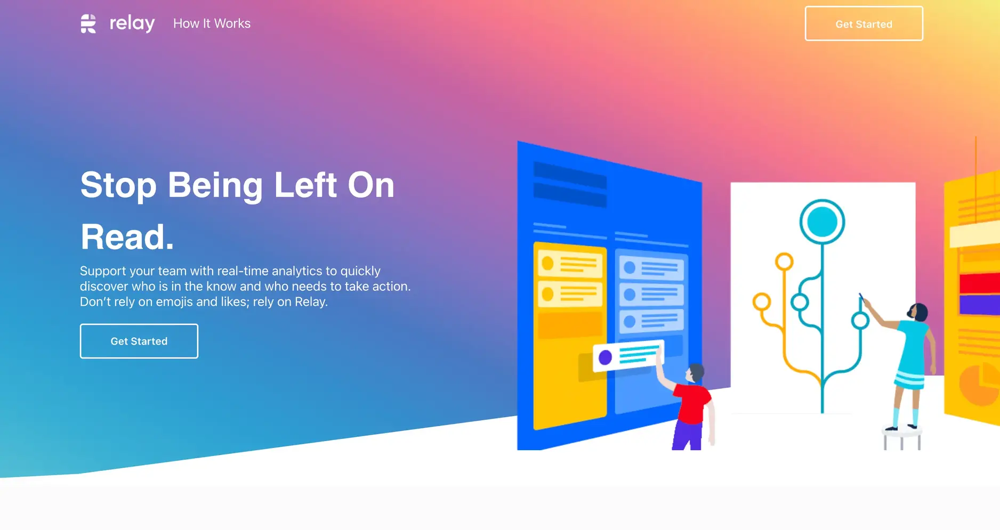
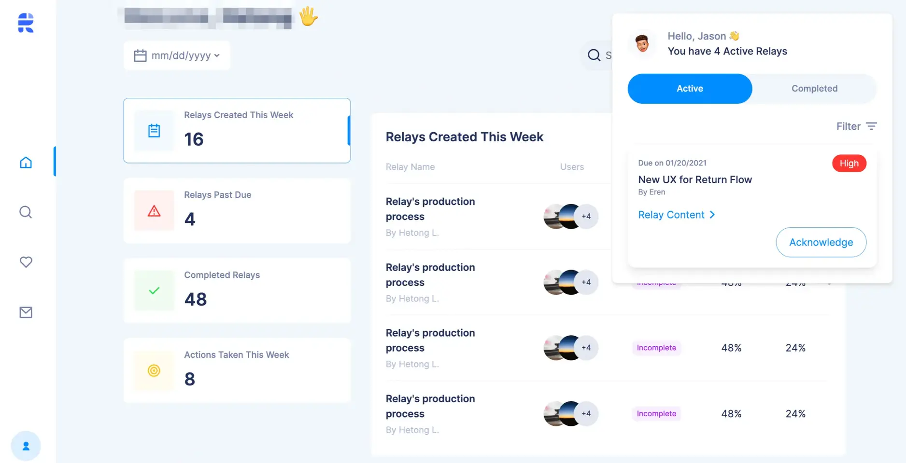
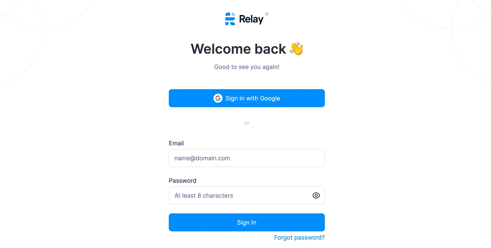

**Industry**\
Productivity tools

**Location**\
United States

**Business context**\
Early-stage startup needing to quickly launch an MVP for market testing and user acquisition

**Solution**\
Rapid development of a Chrome extension and Slack integration with clean, adjustable codebase

**Outcome**\
Successfully launched MVP that gained paying customers and positioned Relay for their next funding round

**Our service**\
Full-stack development / Agile project management

## In brief

Relay needed to quickly build and launch their workflow automation tool to test the US market and acquire early users. We provided two adaptable engineers who worked closely with Relay to develop and ship features at a steady pace. The result was a successful MVP launch that included a Chrome extension, web app, analytics dashboard, and Slack integration, which helped Relay gain their first paying customers and prepare for their funding round.

## Challenge

Relay was in the early stages of their startup journey. Their product owner, Hetong, made it clear they needed a basic but viable version with essential features to test in the market.

The MVP needed to be completed quickly and built properly so they could attract potential customers and secure their seed funding. Speed was crucial, but they also knew requirements would likely change based on market feedback. Relay wanted a team that could quickly understand the product vision and adapt to changes while maintaining a consistent pace of feature delivery.

As Hetong put it, "The context changes. We change accordingly."

## Solution

Initially, we planned to support Relay for just a few months. However, as the collaboration proved successful, our relationship evolved. Relay welcomed our ideas and contributions beyond just completing assigned tasks.

We built the solution using:

* Ruby on Rails for the backend
* React and TailwindCSS for the frontend, with Storybook for component development
* AWS Amplify for infrastructure
* WebSockets for real-time updates
* Amplitude for event tracking

This tech stack allowed us to develop quickly while maintaining quality. The combination of React, TailwindCSS, and Storybook helped us build a clean interface efficiently.

For project management, we used Slack for team communication, Notion for documentation, and Trello for task management. All designs were created and stored in Figma, making it easy for us to reference and implement the intended user experience.

## Outcome

After several months of development, we successfully delivered the first MVP with all key components:

* A Google Chrome extension that integrated with users' workflows
* A web application for managing automation settings
* An analytics dashboard to track productivity metrics
* A Relay bot that integrated directly into Slack workspaces

The launch was successful, helping Relay acquire their first paying customers and prepare for their next funding round. Following this initial success, we continued working with Relay to develop additional features like Relay Sequence Chart and Relay Progress, both designed to further boost team productivity.

As mentioned in their [May Product Updates](https://teamrelay.medium.com/relay-product-updates-may-2021-f7b3db7002c5), these new features represented significant steps forward in Relay's product evolution, and we were proud to be part of this journey.

## Technical highlights

Some of the technical aspects that made this project successful included:

* Creating both a Slack app and Chrome extension that worked seamlessly together
* Implementing custom semantic versioning for the Chrome extension to manage updates
* Combining technologies like Flipper and Sidekiq for A/B testing and gradual feature rollouts
* Designing an action tracking system to monitor user behavior
* Organizing the codebase as a monorepo for better code sharing and development efficiency
