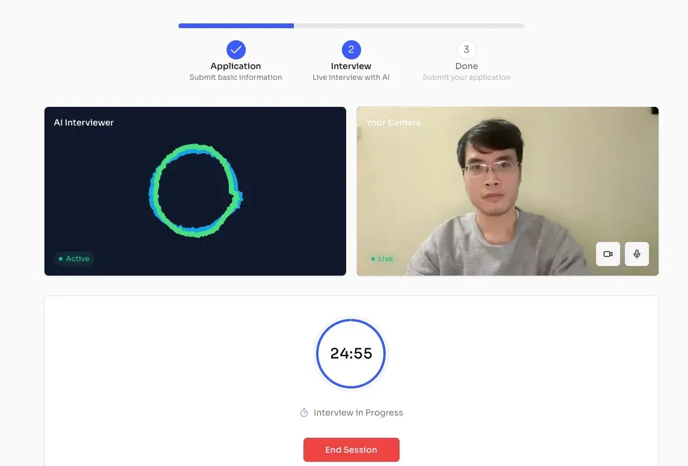
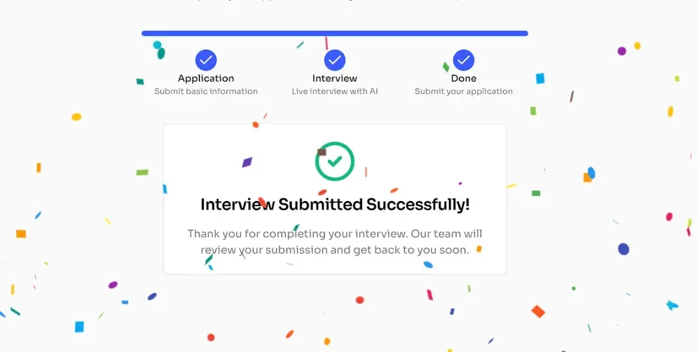
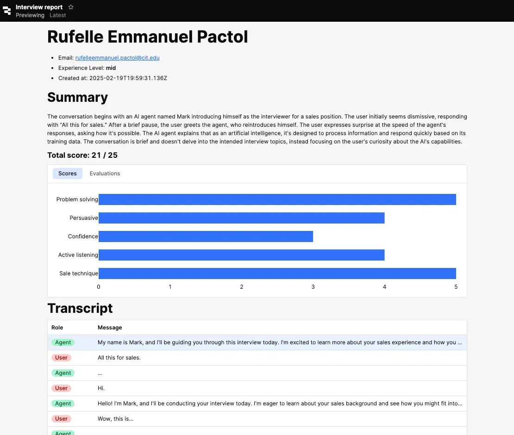

HR teams deal with a huge problem daily. Tons of CVs flood in, and going through them can take days or even weeks. Finding the best people quickly is tough when you’re buried in resumes. 

Our AI-powered tech fixes this. We teamed up with Screenz.ai and built it in just two weeks. It steps in, sorts every profile fast, talks to candidates, checks them out, and pulls HR out of the mess.

# The Hiring Problem and Our Fix

Businesses often struggle with hiring in three ways:

- **Too slow**: Checking candidates manually takes weeks.
- **Unfair picks**: People judge differently, so results vary.
- **Busy work**: Recruiters waste time on repeat tasks.

*This tool solves the problems. It uses **voice tech** to **run interviews** and **score candidates instantly** the same way every time. This makes hiring faster, fairer, and easier.*

# Real Wins for Your Business

Here’s what you get:

- **Speed**: Hiring takes less time with automatic screening.
- **Fairness**: Every candidate gets judged equally.
- **More focus**: Recruiters can skip boring tasks and plan better.

This tool grows with you. It handles more interviews without extra hassle. Early tests cut screening time a lot, helping businesses stay ahead.

# A Look at the AI

1. Watch our AI talk to candidates live, saving HR time while screening resumes fast.

2. Success! Our AI wraps up interviews, freeing HR to move forward quickly

3. The instant score updates help you choose better hires fast.

# How We Built It So Fast

We finished this project in just two weeks, half the expected time, by working smart and together. Here’s how:

- **Agile Approach**: We split the work into small chunks. Daily check-ins kept us on track. Fast feedback helped us tweak things quickly. No time was wasted.
- **Using Ready-Made Tools**: We didn’t build everything ourselves. We used trusted third-party services for voice tech and scoring. It saved time and worked well.
- **Sticking to the Basics**: We focused only on the must-haves: auto-interviews and quick scores. No extras. Just what the client needed most, delivered fast.
- **Teamwork**: Everyone worked side by side: developers, designers, testers. Tom handled the backend. Thanh built the AI. Nikki kept the client in the loop.

This kept things simple, cheap, and high-quality. What could’ve taken a month took us just two weeks.

# What We Learned and What’s Next

Building this fast taught us some important lessons to make it better.

- **Dealing with Silence:** Some candidates didn’t talk, which slowed things down. We fixed this by adding better prompts and time limits. Now, every candidate gets a fair chance, and HR stays on schedule.
- **Adding Video:** We can improve it with video. Seeing how candidates act, like how they sit or move, could show if they fit the job. Matching interviews to specific roles could also help pick the best people.

The base is strong and ready to grow with your needs. We’re eager to try these ideas and bring more help to HR teams.

# What Rob thinks of us

*"Working with Dwarves Foundation was outstanding. Nikki quickly pulled together a skilled team and delivered a project spec in half the expected time, making it easy to choose them. Tom led our interviewing tool project with expertise and kept us on track for a two-week launch, despite personal challenges. Thanh built a fast, clean AI video app and added a ReTool dashboard that streamlined our work. The team was fast, reliable, and proactive, always exceeding expectations. I’d work with them again and highly recommend them."*

**Rob, COO - [Screenz.ai](http://screenz.ai/)**

---

**Website:** https://www.screenz.ai/

# Why This Helps You

In *two weeks*, we built a tool that makes hiring faster and shows clear results. It’s simple, practical, and made just for your company. We worked quick to create something that saves time, helps you pick the right people, and keeps your business moving forward.

If you want easier product development or wonder what AI can do for you and your business, this is a start. We love turning ideas into tools that work for our partners. Ready to make things simpler and better? Let’s chat about what we can create together.