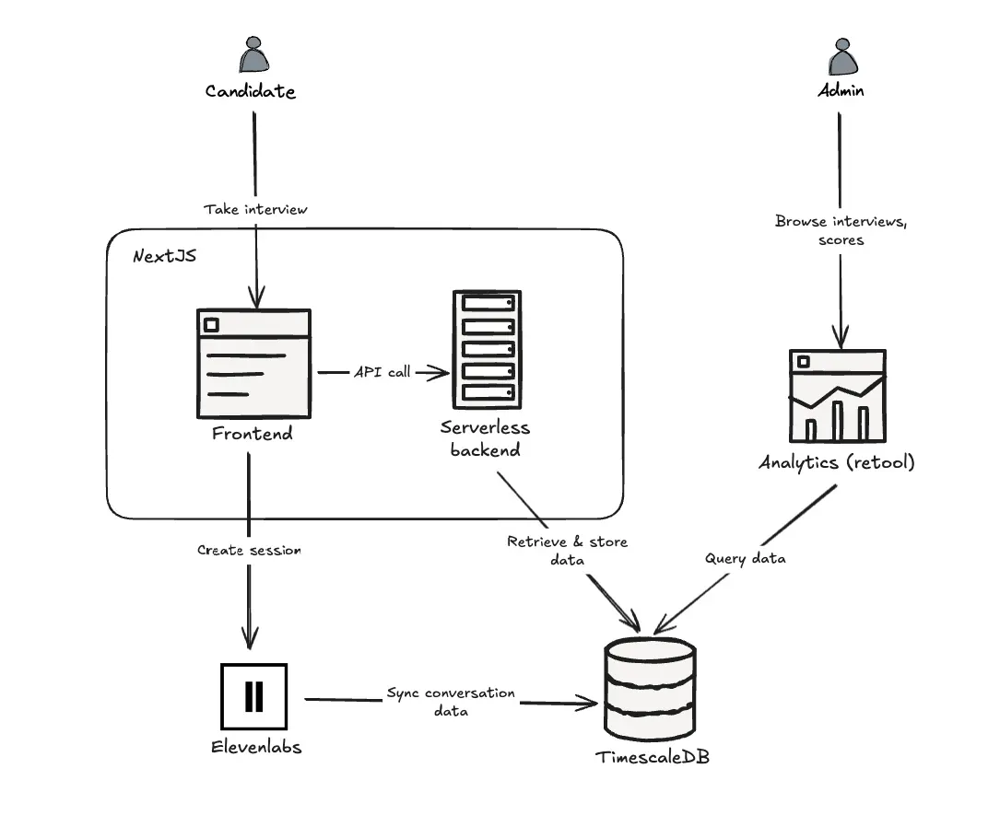
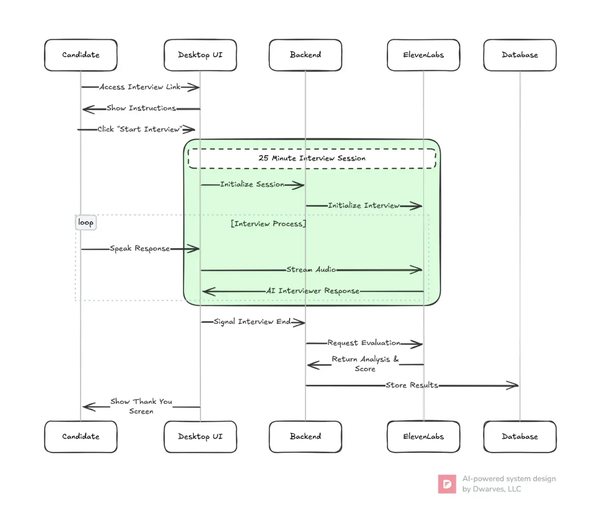

**Industry**

Human Resources Technology (HR Tech)

**Location**

United States

**Business context**

A startup needed a fast, fair, and scalable AI recruitment tool to streamline hiring processes for HR teams.

**Solution**

Designed and delivered a MVP for an AI-powered hiring platform in two weeks, enabling rapid market validation.

**Outcome**

Successfully launched an intuitive, voice-enabled hiring tool, slashing screening times and positioning Screenz.ai for growth in HR tech.

**Our services**

Product Design, UI/UX, Prototyping, Backend Development, User Research

## Technical highlights

- **Backend**: Node.js (Next.js) for a serverless backend to process interviews and orchestrate AI evaluations
- **Voice processing**: ElevenLabs API for real-time speech input and automated feedback
- **Data storage**: TimescaleDB for scalable, high-performance management of session data and analytics
- **Frontend**: Next.js for a seamless, responsive HR interface
- **Analytics**: Retool dashboards for real-time insights into candidate performance
- **Testing**: Rapid user testing cycles with HR teams for iterative refinements

## What we did with Screenz.ai

Screenz.ai is an HR tech startup improving recruitment with AI. Their mission is to build an automated hiring platform that accelerates hiring, reduces bias, and delivers top talent. In late 2024, they partnered with us to build a MVP to test their vision and validate market demand

We assembled a focused team of one designer and two engineers to work closely with Screenz.ai’s leadership. Our goal was to deliver a functional prototype in just two weeks, creating an AI-powered tool enabling HR teams to screen candidates via automated voice interviews. We managed end-to-end development from user research to backend integration, ensuring an intuitive and market-ready platform.

The MVP we delivered allowed Screenz.ai to launch on time, collect critical user feedback, and establish a foundation for a scalable hiring solution.

## The challenges Screenz.ai faced

Screenz.ai tackled a widespread HR issue. Manual recruitment is slow, repetitive, and susceptible to bias. HR teams are overwhelmed by CVs, spending days or weeks reviewing applications, while candidates face inconsistent evaluations. Screenz.ai envisioned an AI-driven platform to streamline this process, but building it presented several challenges:

- **Speed vs. quality**: Deliver a robust MVP in two weeks without sacrificing too much usability or performance.
- **Dual user needs**: Create a tool that is efficient for HR managers and transparent for candidates.
- **Real-time processing**: Enable instant voice-based evaluations with minimal latency.
- **Scalability**: Designed for internal team to easily scale after handover.
- **Market validation**: Build a prototype for rapid testing to confirm demand in the competitive HR tech market.

## **How we built it**

We approached Screenz.ai’s MVP with 2 main goals: evaluating voice processing technology and scaffolding the architecture, all essential for a startup aiming to make an impact in HR tech. Our process combined user research, lean design, and rapid iteration to deliver a high-impact prototype.

Given the ambitious goal of delivering a functional MVP for Screenz.ai in just two weeks, our approach prioritized rapid validation and foundational scalability. We had two primary objectives:

1. **Evaluate Core Voice Processing Technology:** We needed to confirm the viability and quality of using AI voice processing for real-time, automated interviews.
2. **Scaffold a Scalable Architecture:** The MVP needed a solid technical foundation that Screenz.ai's internal team could confidently build upon and scale post-launch.

These objectives, combined with the aggressive timeline, drove several key technical decisions:

1. **Selecting the Right AI Voice Platform (ElevenLabs):** The success of the MVP hinged on the voice interaction. We chose the **ElevenLabs API** after evaluating options for its remarkably human-like voice quality and low-latency processing. This was crucial for creating a seamless and positive candidate experience, directly addressing our first objective of validating the core voice technology in a real-world application.
2. **Accelerating Development with Next.js and Serverless:** To maximize speed and focus resources on the user-facing elements critical for market validation, we opted for **Node.js within the Next.js framework for a serverless backend**. This approach significantly reduced initial setup time and offloaded complex DevOps management, allowing our lean team (one designer, two engineers) to concentrate on implementing the core interview logic and user interfaces. While robust backend functionality would be needed later, the serverless model provided the speed and basic orchestration required for the MVP.
3. **Enabling Rapid Monitoring with Retool:** Understanding MVP performance quickly was vital. Instead of investing development time in building custom dashboards from scratch, we utilized **Retool**. This allowed us to rapidly create essential internal dashboards for monitoring interview processing, system health, and key user interactions, providing immediate feedback loops for iteration and validation.
4. **Designing for Data Growth with TimescaleDB:** Anticipating that successful automated interviews could generate substantial data (session details, transcripts, scores), we chose **TimescaleDB** for data storage. Its strength in handling large volumes of time-series data made it ideal. Crucially, our focus wasn't just on implementing the database but on **designing a thoughtful and scalable schema**. This upfront effort ensured that the data captured during the MVP phase would be structured effectively for future, more complex analytical tasks and reporting as Screenz.ai scaled, directly supporting our second objective of building a scalable foundation.

By making these strategic technology choices, we balanced the need for speed, the requirement to test the core AI functionality, and the long-term goal of providing Screenz.ai with a robust and scalable platform architecture. This lean, focused approach enabled us to deliver a high-impact MVP within the two-week timeframe, paving the way for Screenz.ai's internal team to take over and expand the platform.

### Technical approach

- **User-centric design**: We profiled two key personas. HR managers demand fast, accurate tools to prioritize top talent. Job seekers seek a fair, clear hiring process. These insights shaped a platform balancing efficiency and fairness.
- **Voice processing core**: The MVP’s flagship feature is real-time voice interviews powered by ElevenLabs API. This service processes speech input instantly for seamless candidate interactions, delivers automated feedback and scoring to reduce delays, and ensures consistent evaluations to minimize bias.
- **Serverless backend**: We built a Node.js (Next.js) backend to orchestrate AI evaluations. The interview service manages voice processing and candidate scoring. The session service tracks user interactions and interview progress. The analytics service feeds data to Retool dashboards for HR insights. This serverless approach optimizes costs and scales with demand.

- **Data management**: TimescaleDB powers the platform’s data layer. It stores session data and analytics with high performance, supports time-series queries for real-time insights, and scales efficiently as user volumes grow.
- **Frontend and analytics**: The HR interface runs on Next.js for a smooth experience with responsive design for desktop and mobile access and clean navigation for screening and reviewing candidates. Retool dashboards provide real-time analytics on candidate performance and customizable views for HR teams to track hiring metrics.
- **Lean development process**: To hit the two-week deadline, we streamlined workflows. Prototyping built a clickable prototype to simulate HR and candidate flows. The backend stack leveraged Node.js (Next.js) for serverless efficiency. Testing conducted usability tests with HR groups to refine functionality. \*\*\*\*

Our process incorporated best practices for rapid delivery. Daily syncs featured short standups to align on progress and resolve blockers. Iterative refinement included continuous feedback loops with Screenz.ai’s lead, Tom. User testing provided early validation with HR users to confirm usability. Version control uses Git to manage code and design assets.

### How we collaborated

Our team integrated seamlessly with Screenz.ai’s vision. We brought together engineers skilled in crafting intuitive tools, experienced in Node.js and serverless architectures, and a product researcher to align features with user needs.

Since we had just two weeks for the project, we cut back on meetings and focused on building stuff. We followed a simple plan: Week 1 was for the interview webpage, and Week 2 was for the report webpage plus final tweaks. We sent quick daily texts about what we’d done and what was next, shared early versions with demo links every day to get feedback fast, and wrapped up each week with a demo and chat to stay on track.

This approach enabled smooth collaboration, bridging remote workflows and tight deadlines to deliver a polished MVP.

## What we achieved

In partnership with Screenz.ai, we delivered a transformative AI hiring platform MVP. The voice-enabled tool for automated interviews and real-time scoring was powered by ElevenLabs API. A Next. js - based HR dashboard enabled seamless candidate management. Real-time analytics via Retool dashboards provided actionable insights. A scalable backend with TimescaleDB and Node.js was ready for future growth. A fully tested prototype was validated by HR users in just two weeks.

Our collaboration provided Screenz.ai with key advantages. Rapid market entry launched a functional MVP on schedule for real-world testing. User-driven design confirmed value with feedback showing screening times significantly reduced. A scalable foundation supported features like video interviews or role-specific scoring. Strategic focus allowed Screenz.ai to prioritize product vision while we handled design and development.

By delivering a lean, high-quality MVP, we helped Screenz.ai validate their concept and engage early adopters. The platform is poised for growth with plans to add video capabilities and advanced analytics, built on the robust foundation we established.
