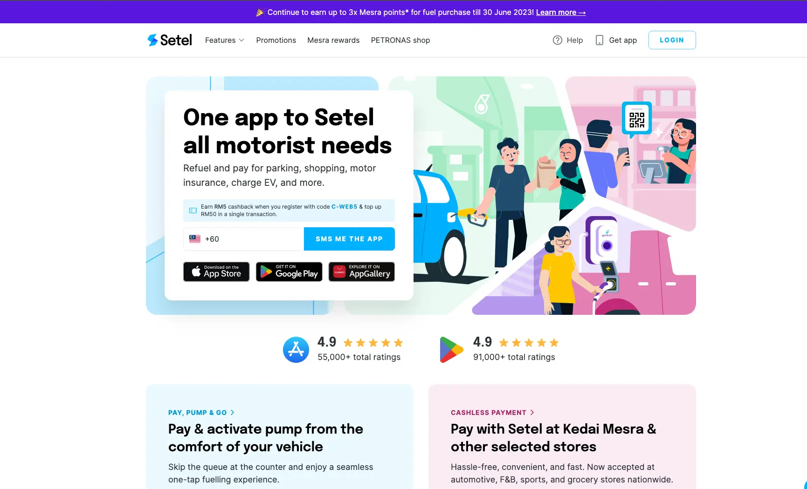
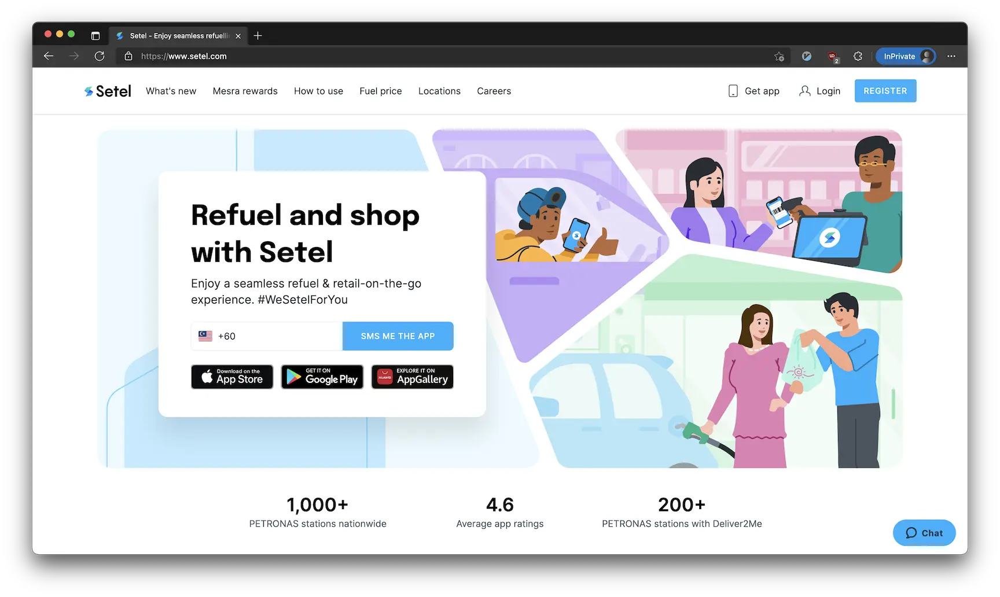

**Industry**\
Oil and gas / Mobile payments

**Location**\
Malaysia

**Business context**\
Leading fuel payment app needed to expand features and attract new users

**Solution**\
Built conversion features focused on deals, vouchers, and marketing integration

**Outcome**\
Successfully launched new features including The Food Bank Programme for community support

**Our service**\
Software development / Agile team augmentation

## Technical highlights

- **Frontend**: React for building responsive user interfaces
- **Backend**: TypeScript with Nest.js framework for API development
- **Infrastructure**: AWS, Microservices architecture for scalability
- **Testing**: Zephyr and Allure report for quality assurance
- **Process**: SWARM methodology for focused team collaboration

## What we did with Setel

Setel is Malaysia's first e-payment solution for fuel purchases, introduced by PETRONAS in 2018. The app lets drivers pay for fuel directly from their mobile phones, making the refueling process faster and simpler.

The company wanted to grow beyond basic fuel payments and create a "super-app" that would serve drivers with additional on-the-go features and platform integrations. Our team of seven developers joined Setel's engineering team to focus on user conversion - bringing new customers to the platform through deals, vouchers, and marketing campaigns.

We specifically helped build the Setel website, gift campaigns, and marketing tracking systems that formed the top of their user acquisition funnel.

## The challenge Setel faced

Setel had one clear goal: make refueling simple and friction-free. To achieve this, they needed to serve three main customer groups:

1. **Drivers** - People who need a smooth, convenient refueling experience in their daily lives
2. **Businesses** - Companies looking to engage with customers while automating payment processes
3. **Developers** - Technical partners who need to integrate with Setel's systems

The challenge was creating features that would attract new users while maintaining the simplicity that made their core fuel payment app popular. They needed to build conversion paths that would bring potential customers into their ecosystem without complicating the user experience.

## How we built it

### Technical approach

We implemented a microservices architecture that allowed different parts of the system to evolve independently. This approach gave Setel the flexibility to add new features without disrupting their core payment services.

Our team focused on building:

- The public-facing Setel website that serves as the entry point for new users
- Gift and voucher campaigns to incentivize sign-ups
- Marketing tracking systems to measure campaign effectiveness

We used React for frontend development, creating responsive interfaces that worked well on both mobile and desktop. For the backend, we built APIs using TypeScript with the Nest.js framework, which provided a structured approach to development.

### Development process

We adopted the SWARM process - a collaborative approach where the team works together on a small number of stories at a time. This method helped us:

- Share knowledge across the team
- Solve problems quickly
- Avoid distractions and stay focused
- Build consistent features

For testing, we implemented a multi-stage approach starting with manual testing, then regression testing, and finally automation. We managed all testing through Zephyr and generated reports with Allure to maintain high quality standards.

### How we collaborated

We worked as part of Setel's Conversion team, fully focused on supporting their user acquisition funnel. Since Setel is an established business with defined protocols, we formed a team that could work independently while adopting their practices.

Communication happened remotely through several channels:

- Daily discussions in Slack
- Sprint tracking in Jira
- Technical documentation in Confluence

This structured approach ensured our team integrated smoothly with Setel's existing operations while still maintaining the agility to deliver features quickly.

## What we achieved

Through our partnership with Setel, we successfully delivered several key features that expanded their platform capabilities. The most significant was The Food Bank Programme - a community support initiative by Petronas Station Business Partners that provides essential items at selected Petronas stations nationwide.

This programme exemplified how Setel was growing beyond just fuel payments to become a platform that connects the local community with valuable services. It demonstrated Setel's commitment to social responsibility while also creating new touchpoints for user engagement.

Our work helped Setel enhance their user conversion funnel, bringing more Malaysians into their digital payment ecosystem. By creating compelling offers and a smooth onboarding experience, we supported Setel's growth as Malaysia's premier fuel payment platform.

The features we built fit seamlessly into Setel's larger vision of creating a comprehensive super-app that makes daily tasks easier for Malaysian drivers. Our focus on the conversion aspects complemented their core functionality, helping transform Setel from a simple payment tool into a multi-faceted platform that serves users in various aspects of their lives.
