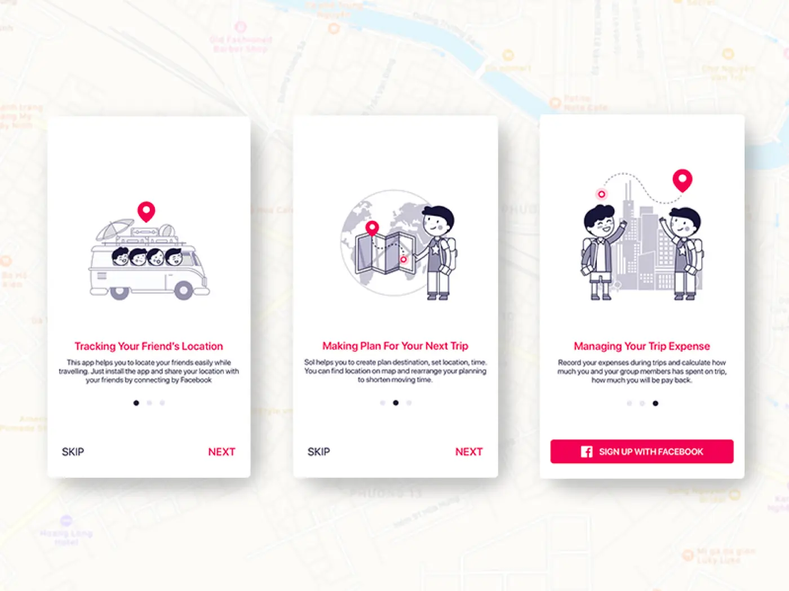
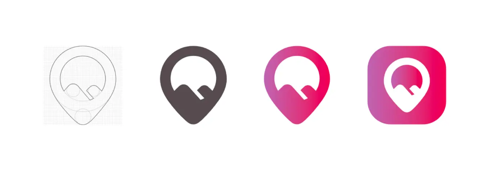

>
> Following the previous article on UX case study of Sol — Travel App, an app that was tailored to meet the needs of groups on traveling days. In this article, we will describe our creative process of the UI for it. We choose iOS as our platform to be presented, considering that it is the more favored devices being used.

As we have gone through the UX research tasks in the last article, we started brainstorming about how the mobile application should look. We all agreed that it should be not just easy to use but also attractive-looking to our target users — the young.

## Process
Sol is an app designed for location tracking and plan making so we would like to emphasize on the clarity and simplicity.
Now we are going through our process of creating the design which is composed of color, typography, icons, and components.

## Color
As a result, we start off by picking our primary color — Cerise. The color is a dark pink with some hint of red, which gives the feeling of not only energy, excitement, and youth but caring as well — the core qualities associated with the product’s personality. Those are qualities which Sol should have to serve its users.

Imaging being our future users — backpackers or road trip travelers, who mostly use Sol in varied harsh light conditions such as direct sunlight, of hazy light at sunset, we decided to focus on the legibility, hence the contrast of our color scheme needs to stands as our first priority.

According to the requirement above, we choose our color scheme as black-on-white after some research. The background color is white, and the formatted text color is Midnight Express, a dark blue color and a variation from black which both keeps us conformed to our color scheme and still a pretty match to our primary color Cerise.

Since the app is mostly map-based displayed, we would like to keep other components as simple as possible, therefore, we minimize the use of our primary color, only applying to small elements such as icons, button background, and headings.

Here is our use of color scheme in Onboarding flow.

## Logo
For the logo, we combine two elements of the app, location-tracking feature and its name “Sol” — the sun. Applying negative spaces and gradient creates modern-looking and minimal style to it as well.

“Drop me a pin” has been a trending phrase since the use of map apps became a worldwide trend, hence the term “location pin” has got the meaning of “share the location”. The sun and the mountains indicate the long journey to the wild. Taking those inspirations we create the logo for our app.

## Typography
Sol uses the default font type for iOS, San Francisco Pro Display to keep it clear and provide better reading experiences. This also maintains the app familiar to our iOS users.

The type sizes are customized to match with our use of component.

## Icons
Our icons are kept simple following the design concept. The navigation menu also use the icons to give users some hints of each section’s content, this will help them to navigate faster and make fewer mistakes.

## Components
In this app, we promote the bottom sheet to display information from users: group list, member list, location, and expenses.

The use of this component will enable users to quickly navigate between the map and their group information. Each group is displayed as a card; when swiped, it reveals an option to turn off notifications for itself.

When the user taps on a member they receive detail information about where that member is, and may later get directions to there. Users can get to the map view quickly by dragging the bottom sheet down and up to get back to the detailed view of their current group.

## Conclusion
Throughout this stage, we have had a chance to learn more about designing an app UI. It was fun trying out the color variations and arranging the elements as well. Next time, we will share our process of motion design. Hope you will like it.

Take a look at our last article on UX case study of the app View.

> Next: [Sol: Planning app part 3](sol-part-3.md)
