## Introduction
Today we shall continue our series of designing “Sol-Travel Planning” app. As we mentioned our process on UX research and UI design in the last two articles, Sol’s target users are the young so keeping the app fun with interaction is a must.

## Main Motions
According to Issara Willenskomer from UxinMotion, motion implementation in UX design can greatly help improving usability in four noticeable ways: fulfilling expectation from the users, maintaining continuity among a set of scenes, inventing narrative — story-telling flow throughout the user experience.

## Onboarding
For first-time users, we create an onboarding flow which comprises of Paging animation, enhancing a natural experience while using. The bottom button keeps the experience familiar and enables the users to get to the Sign-up button as soon as they are pleased.

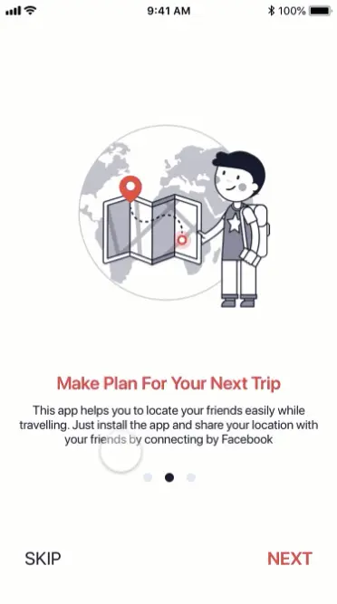

## Walkthrough
A quick walkthrough of sections area to introduce users to where and what to find in them.

## Switch between segments
Each group details are separated into 4 segments. These motions in need should replicate the movement of flipping through some notes, which may create the feeling as if the user is getting by the notes they make about their trip.

## Changing the location order
When the user wants to change the location list’s order. They need to see where their rearrangement is getting and what is being selected. Hence, we add the selected location light shadow to attract more attention to it.

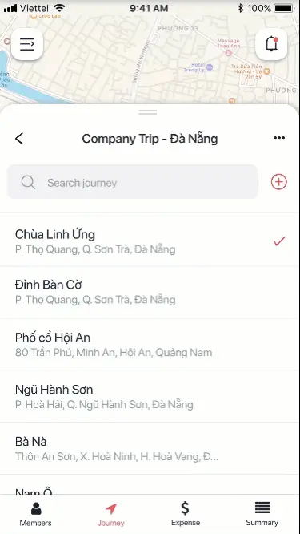

## Tracking a member
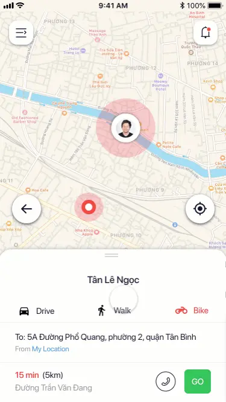

## Deleting a device
When the user swipes an item, it will slide to the left side of the screen to reveal the Delete option. When the first device is deleted, the second device moves in the first to replace its position, which also indicates it will function as the first.

## Using Protopie in creating a real-life Prototype
### Why we choose Protopie
At first, we were looking for an app that not only supports many interactions but also is able to create useful animations. We came across popular apps as inVision, Framer, and Flinto. Each has their pros and cons. For example, inVision is great for webpage prototype because websites don’t require high-level of gestures as mobile (swipe up and down perhaps), just moving between the screens is enough for you to create a viable prototype of your website. 

But, when it comes to mobile app prototype, the need for other uses of interactions is inevitable, since smartphone users are getting more familiar to a myriad of gestures. That leads us to discover advance prototyping tools like Framer. It is a powerful tool to create a prototype with no limitation of animations or interactions, though it requires a high learning curve since it involves coding, and it doesn’t support importing from Sketch very well. Whereas Protopie is a similar tool that is code-free and requires a much lower learning curve. One of the things I like most about this tool is its document, it provides sufficient info in my learning process.

## Steps to create our motions
### Switching between segments
The idea of this motion is that when the icon area of a segment is tapped, that segment will slide into the screen as respond. Breaking it down, we have the following rules to create:
- Each icon area has two states, active and disabled, and there is no more than one active icon at a time.
- Each segment appears according to the state of the icon presented.
- There are two slide-in styles of a segment: right-to-left when switched from a segment from the left to the right and left-to-right as reversed.

For the first rule, we import two images of each icon from Sketch — grey ones for disabled, the other for active.

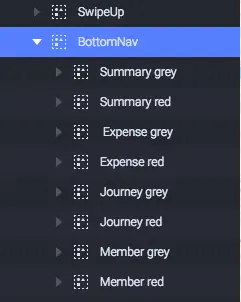

In order to create the color change property for the icons, the red layers’ opacity is set to 0%, the grey layers’ 100%, and a chain needs to be produced to bide the opacity of the two types of layer. As you can see in the picture below, the range for the opacity of **Member red** will change according to the opacity of **Member grey**.

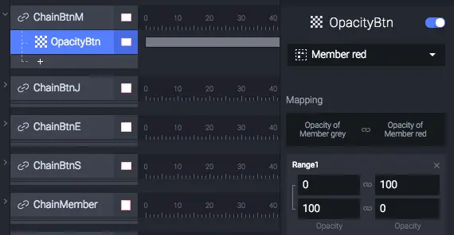

As default view for a Trip Info, the first segment to be viewed is Members, so the default opacity for **Member grey** is 0% to reveal the layer **Member red**.

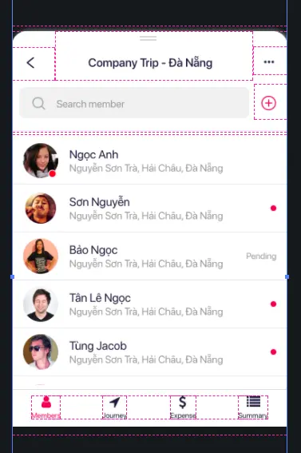

Next, we need to bide the active state of an icon to the appearance of a content component, so that when we tap an icon **both** the state of it and the appearance of the content would be triggered.

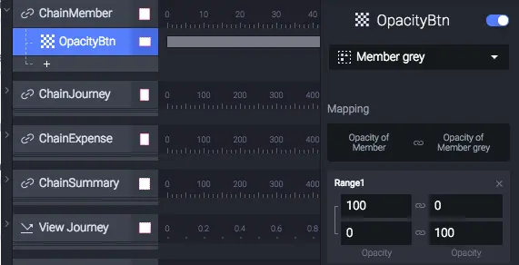

Finally, the third rule was quite more complicated to create. Let take an example. If you move from Member to Journey, the transition should be right-to-left, while from Summary to Journey, the transition would be left-to-right. So, if the user taps in a left-to-right sequence, we can arrange the content components as layers horizontally (0 400 800 1200 respectively), then each tap on an icon the **Journey**, **Expense** or **Summary** could move to the position of **Members** to create the required transition.

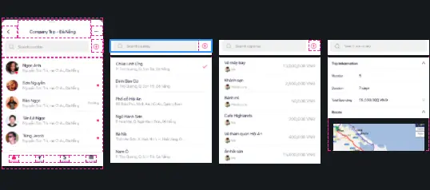

Now, to create a trigger for each icon, we use **Tap**, the opacity of **Member** content component will be changed to 100, and the state of the icon Member would be conversed to red accordingly.

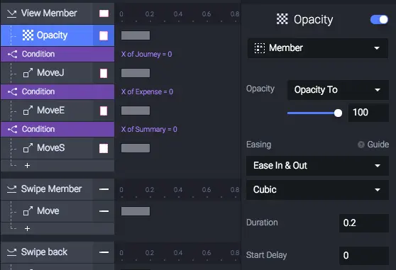

For further transitions, in some case, the user moves to another segment such as Journey and goes back Members again, then they should see the Journey disappear with the left-to-right transition. That means the Journey should Move back to its original position when the Member is navigated back. To create this we add a condition for Journey as below. The other two layers will have the similar condition.

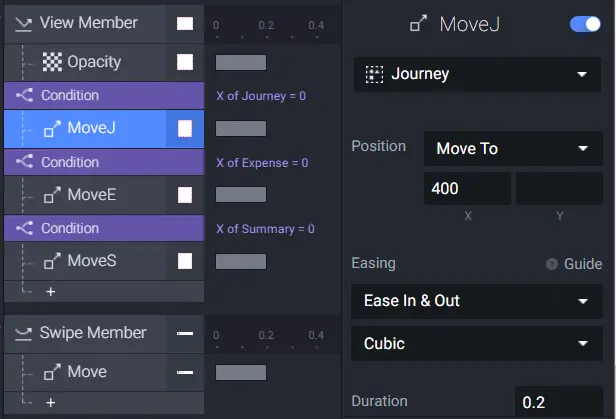

For the other three icons, we will divide into two groups: the layers on the left and the ones from the right of the selected layer. For the layers from right, we will apply the similar Condition as above. On the other hand, we should Move the layers from the left to the left side by using the negative value for the property **X.**

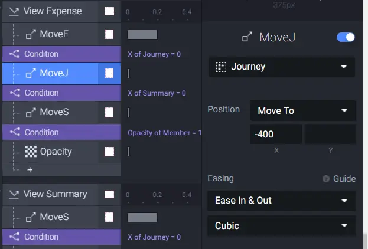

## Tracking a member's location
In this part, we will show you how we created the map route animation. Our idea is to mimic people movement from one point to the other on the map.

In Protopie, we use **Scale** and **Opacity** to pull it into practice. There is two rule for us to build in this motion:

* First, **Scale** a **Rectangle** with the size resembling that of a circle to the length of the street that the user needs to go until they make a turn.

* Second, a full-length of the Rectangle above appears after the Scale effect has gone off.

Applying the first rule, create two **Rectangle** with the **width** of 4, height depends on the length of the route.

Next, we will have the first **Rectangle** set up. There are three properties needed to rewrite: **Size**, **Rotation**, and **Origin**. As the route will start from bottom right to top left of the screen, the **Origin** should match the start point (here it is (100,100)). The **Rotation** of the route can be determined by rotating the rectangle to match it with the full-length rectangle. After setting up the Rotation, fix the height of it to 4.

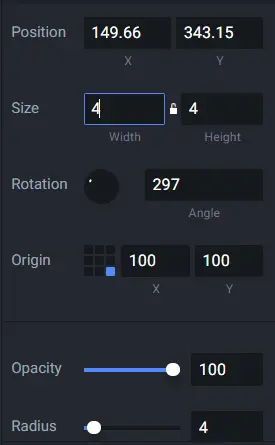

Add **Scale** motion for the first rectangle.

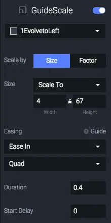

Next is the second rule, change the **Opacity** of the full-length **Rectangle** to 100 after the first rectangle finishes **Scale** motion.

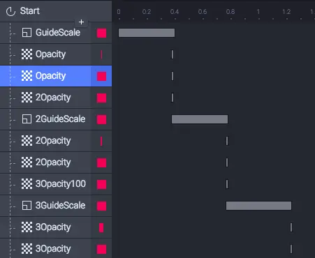

Finally, we need to set the timeline for each transition, the Scale of the first Rectangle happens first, with a duration of 0.4, then the Opacity of two Rectangles is reversed.

The result

## Reference
https://medium.com/ux-in-motion/creating-usability-with-motion-the-ux-in-motion-manifesto-a87a4584ddc
