**Industry**\
Travel / Mobile Applications

**Location**\
Global

**Business context**\
Group travelers faced challenges staying connected, organizing plans, and managing shared expenses during trips

**Solution**\
Created an intuitive travel app that combines location tracking, trip planning, and expense management in one platform

**Outcome**\
Delivered a fully functional prototype with engaging animations and intuitive user experience for young travelers

**Our service**\
UX/UI Design / User Research / Interactive Prototyping

## Technical highlights

- **Design system**: Custom color palette, typography, and components optimized for travel context
- **Interactive prototype**: Built with ProtoPie for realistic mobile interactions without coding
- **User research**: In-depth interviews with young travelers to identify pain points
- **Location features**: Custom map interface with real-time location sharing
- **Animation**: Thoughtful micro-interactions that enhance usability
- **Social integration**: Facebook connectivity for easy group formation

## What we did with Sol

Sol is a travel app designed to help friends stay connected and organized during group trips. We created an end-to-end solution for common problems travelers face: getting lost, confusion about plans, communication issues, and the biggest headache of all – managing shared expenses.

Our design team took ownership of the entire process, from initial user research through visual design to creating a fully interactive prototype. The result is an intuitive app built specifically for young, tech-savvy travelers who love backpacking with friends.

Sol allows users to connect through social networks (starting with Facebook), track each other on a map, and send alerts if they run into trouble while exploring. The thoughtfully designed interface makes group coordination simple, even in unfamiliar places.

## The challenge Sol addressed

Group travel should be fun, but the logistics can quickly become stressful. Through user interviews with young travelers, we identified several key pain points:

- **Getting separated** from friends in unfamiliar locations
- **Losing track of plans** when schedules change on the fly
- **Communication difficulties** when traveling internationally
- **Expense management** becoming a source of tension between friends

These challenges often detract from the travel experience and can strain friendships. Existing solutions typically addressed only one aspect of the problem – location sharing OR expense tracking OR planning – but not all of them together in an intuitive way.

Our challenge was to create a single, cohesive app that would solve all these problems while being enjoyable to use. The solution needed to work well for groups of varying sizes and accommodate the spontaneous nature of travel.

## How we built it

We approached the design of Sol with careful attention to both functionality and aesthetics, knowing that our target users value both.

### Research and target audience

We started by talking directly with young travelers, asking questions about their habits, frustrations, and needs. Through these conversations, we learned that people love exploring new places but struggle with group coordination, expense tracking, and staying connected.

These insights became the foundation for Sol's feature set and design approach. We focused on creating an experience for users who are:

- Tech-savvy and comfortable with mobile apps
- Social and travel frequently with friends
- Value both independence and group coordination
- Concerned about budgeting and fair expense sharing

### Visual design system

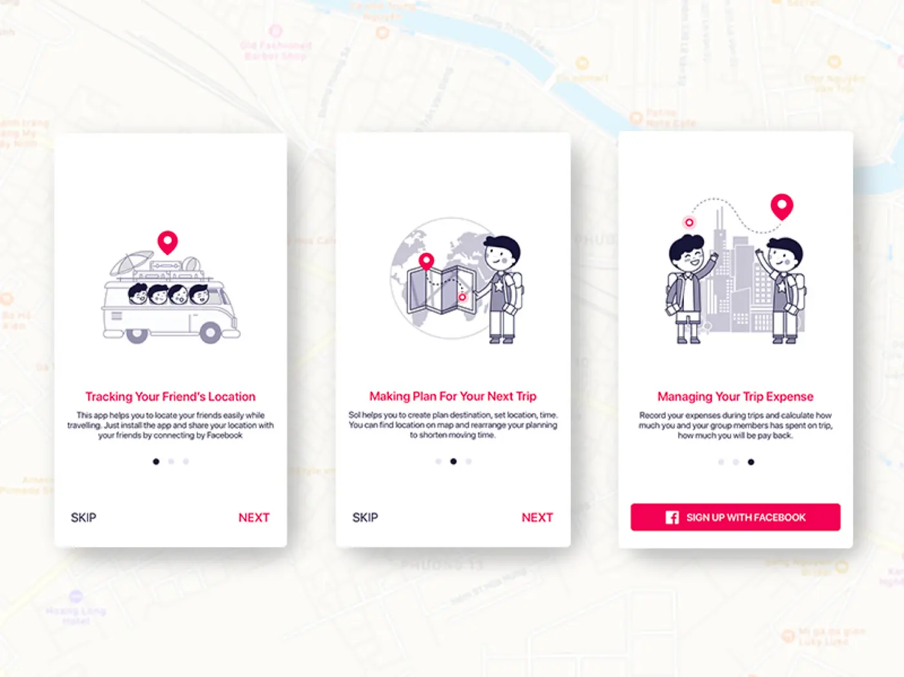

We crafted a visual identity that resonates with young travelers:

- **Color scheme**: We chose Cerise (a vibrant dark pink with red undertones) as our primary color to convey energy, excitement, and youth. For readability in various lighting conditions, we used dark blue text (Midnight Express) on white backgrounds.

- **Logo design**: Our logo combines two key elements – the location tracking feature and the app's name "Sol" (meaning sun). We used negative space and gradients to create a modern, minimal style that represents both location pins and imagery of the sun and mountains.

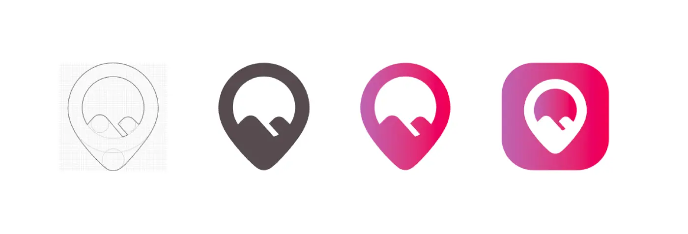

- **Typography**: We used San Francisco Pro Display, the default iOS font, to ensure clarity and familiarity for users while keeping the app feeling natural and easy to read.

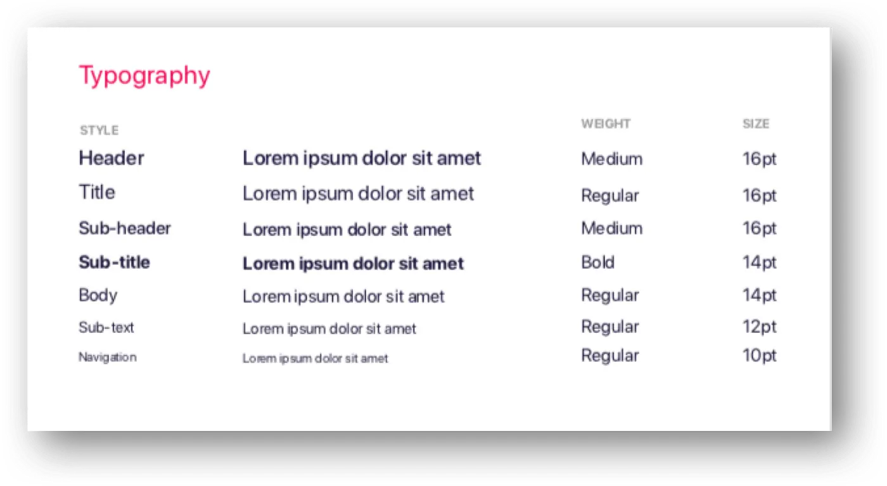

- **Icons and components**: We designed simple, intuitive icons that provide clear visual cues for navigation. The bottom sheet component gives users quick access to group information, member lists, locations, and expenses while maintaining context of the map.

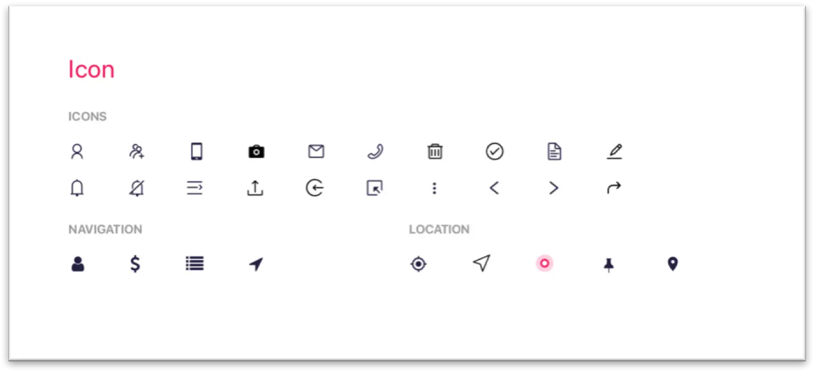

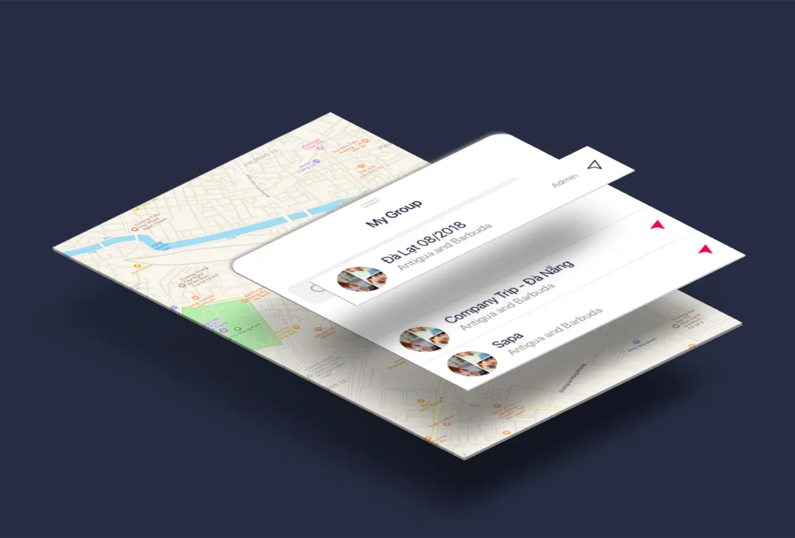

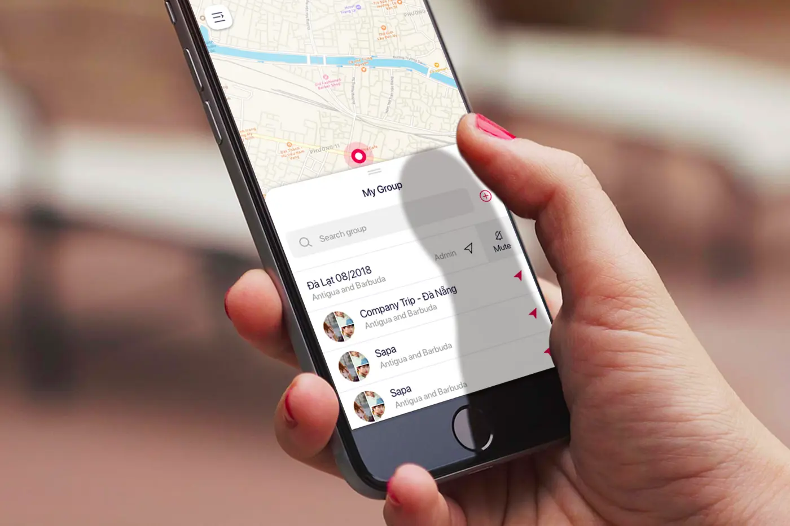

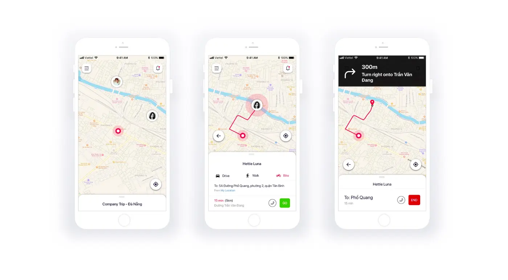

### Interaction design and animations

Since Sol targets young users, we made the app engaging through thoughtful animations that serve both functional and aesthetic purposes:

- **Onboarding flow**: For first-time users, we created a smooth onboarding experience with natural page animations and a consistent bottom button for easy progression.

- **App walkthrough**: We included a quick tour of different sections to help users find their way around.

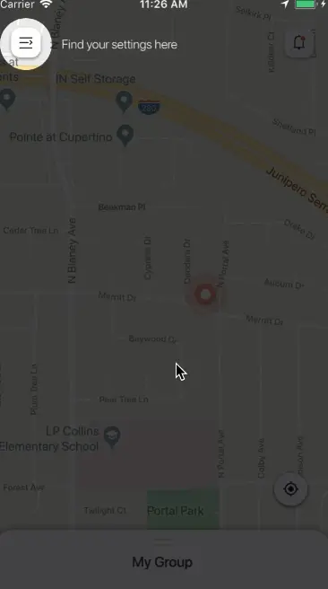

- **Information switching**: Group details are divided into four sections (Members, Journey, Expenses, and Summary) with animations that mimic flipping through notes.

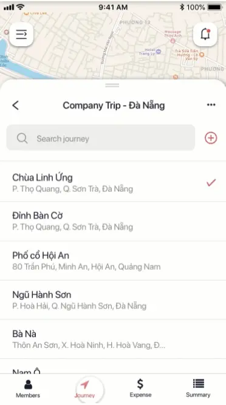

- **Location management**: When users reorder their location list, we highlight the selected location with a subtle shadow for clarity.

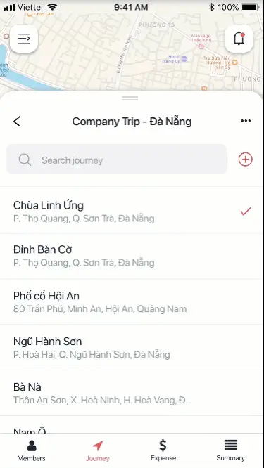

- **Member tracking**: The map features animations showing routes and movement between locations, helping users understand how to reach their friends.

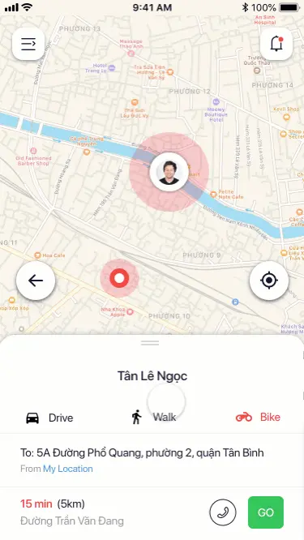

- **Device management**: Swipe gestures with smooth transitions make it easy to manage connected devices.

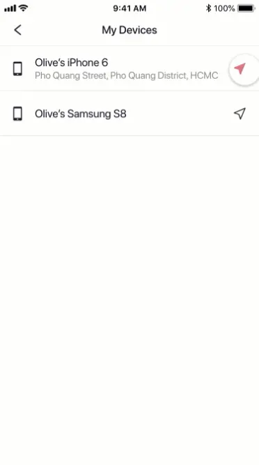

### Interactive prototyping

We built a high-fidelity interactive prototype using ProtoPie, which offered the best balance of powerful features without requiring coding knowledge. This allowed us to create complex mobile interactions and animations that users would expect.

For key features like segment switching and map routes, we created sophisticated animations:

- **Segment switching**: We built a system where tapping an icon (Members, Journey, Expenses, or Summary) triggers a natural sliding animation to that section.

- **Map route animation**: To show how people move from one point to another, we created growing path animations that simulate movement along routes.

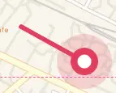

## What we achieved

Through our comprehensive design process for Sol, we created:

1. **A complete design system** with a cohesive visual language, including colors, typography, icons, and components
2. **An intuitive user experience** that addresses real problems faced by travelers
3. **Engaging interactions** that make the app enjoyable to use while serving practical purposes
4. **A fully functional prototype** that demonstrates the app's capabilities and validates the concept

The final product helps friends stay connected and organized during their adventures together. It solves key problems that typically cause friction during group travel, from coordinating meetups to splitting expenses fairly.

Sol exemplifies our approach to product design: deeply understanding user needs, creating thoughtful solutions, and delivering a polished experience that's both functional and delightful to use.
