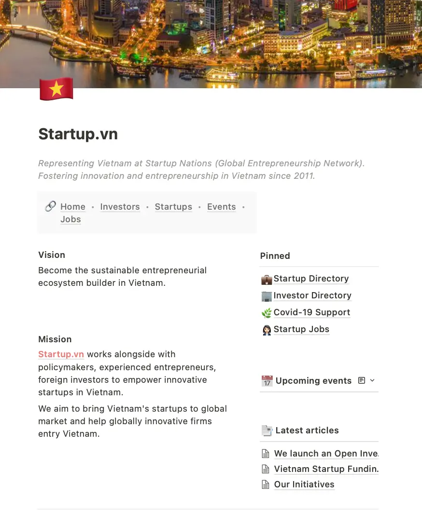

**Industry**\
Startup Community / Knowledge Sharing

**Location**\
Vietnam

**Business context**\
Vietnamese entrepreneurs needed a central platform to connect, share experiences, and find resources for their businesses

**Solution**\
Created a comprehensive online community that brings together founders, investors, and ecosystem builders in one place

**Outcome**\
Built a thriving platform that attracted thousands of entrepreneurs and facilitated valuable connections between users

**Our service**\
Full-stack Development / Community Platform / Search Integration

## Technical highlights

- **Backend**: Node.js with Express for scalable, flexible API development
- **Frontend**: React.js with Next.js for fast, responsive user experience
- **Database**: MongoDB for flexible content storage
- **Search**: Elasticsearch for powerful content discovery
- **Architecture**: Microservices design for independent component updates
- **Mobile optimization**: Responsive design for smartphone-first users
- **Security**: Robust authentication and permission systems

## What we did with StartupVN

StartupVN is a community platform designed to bring together Vietnamese entrepreneurs, investors, and ecosystem builders. In a rapidly growing startup scene, founders needed a central place to connect with each other, share experiences, and find resources to help their businesses succeed.

We collaborated with StartupVN to build this online community from the ground up. Our goal was to create a user-friendly platform that would make it easy for entrepreneurs to network, access mentorship, and discover funding opportunities - all in one place.

The platform offers several key features:

- A community forum where founders can ask questions and share insights
- Events listings for networking and learning opportunities
- Resource libraries with guides and tools for startups
- Profiles for startups and founders to showcase their work
- Mentorship connections to link experienced business leaders with new entrepreneurs

## The challenge StartupVN was facing

Vietnam's startup ecosystem has seen incredible growth in recent years, but entrepreneurs faced several challenges:

1. **Scattered Information**: Valuable resources, events, and opportunities were spread across many different websites and platforms, making them hard to find
2. **Limited Networking**: Many founders, especially those outside major cities, had few chances to connect with other entrepreneurs and investors
3. **Knowledge Gaps**: New founders often lacked access to the practical knowledge and mentorship needed to grow their businesses

StartupVN wanted to address these problems with a single, easy-to-use platform. They needed a technical partner who could not only build the solution but also understand the unique needs of the Vietnamese startup community.

## How we built it

We approached this project with a focus on creating a platform that would be both powerful and simple to use. The system needed to handle community discussions, user profiles, event management, and resource libraries while remaining fast and responsive.

### Technical approach

Our technical approach included:

- **Modern API development**: We used Node.js with Express to create a flexible and scalable API that could handle various types of content and user interactions.
- **Fast frontend experience**: We built the user interface with React.js and Next.js to provide a smooth, responsive experience that works well even on slower internet connections.
- **Flexible data storage**: MongoDB offered the flexibility we needed to store diverse content types, from forum posts to event listings to user profiles.
- **Powerful search capabilities**: We implemented Elasticsearch to help users quickly find relevant information across the entire platform.
- **Scalable infrastructure**: We deployed on Google Cloud Platform to ensure reliable performance that could grow as the user base expanded.
- **Microservices architecture**: We built the community features using microservices, allowing different parts of the platform to be updated independently without disrupting the entire system.
- **Realtime engagement**: We implemented notifications to keep users informed about community activities and relevant opportunities.
- **Smart recommendations**: We created a system that connects users with content and opportunities most relevant to their interests and needs.

### Security and accessibility

Security was essential for this platform, so we implemented robust user authentication, permission systems, and data protection measures. We also made sure the platform worked well on mobile devices, as many Vietnamese entrepreneurs primarily use smartphones to access online resources.

### Collaborative development

Throughout development, we worked closely with the StartupVN team, gathering feedback from actual entrepreneurs to refine the platform's features and user experience. This collaborative approach ensured we were building something that truly met the needs of the Vietnamese startup community.

## What we achieved

The StartupVN platform launched successfully and quickly became a valuable resource for Vietnamese entrepreneurs:

- **Growing Community**: Thousands of entrepreneurs joined the platform in the first few months
- **Active Engagement**: Users regularly participate in discussions, sharing knowledge and supporting each other
- **Resource Access**: The platform has made valuable startup resources more accessible, especially for founders outside major cities
- **Successful Connections**: Several startups reported finding mentors, partners, and even investors through the platform

StartupVN has continued to evolve, with new features being added based on community feedback. The platform has become an important part of Vietnam's growing startup ecosystem, helping founders connect, learn, and build successful businesses.

> "The platform has transformed how we support entrepreneurs in Vietnam. What used to require multiple disconnected tools and endless email chains now happens seamlessly in one place. This has allowed us to focus on building meaningful relationships within the community rather than managing logistics." — Tuan Anh, Founder of StartupVN

This project demonstrates how thoughtfully designed digital platforms can strengthen entrepreneurial communities and help drive economic growth. By creating a central hub for Vietnam's startup ecosystem, we've helped make entrepreneurial resources and connections more accessible to founders throughout the country.
