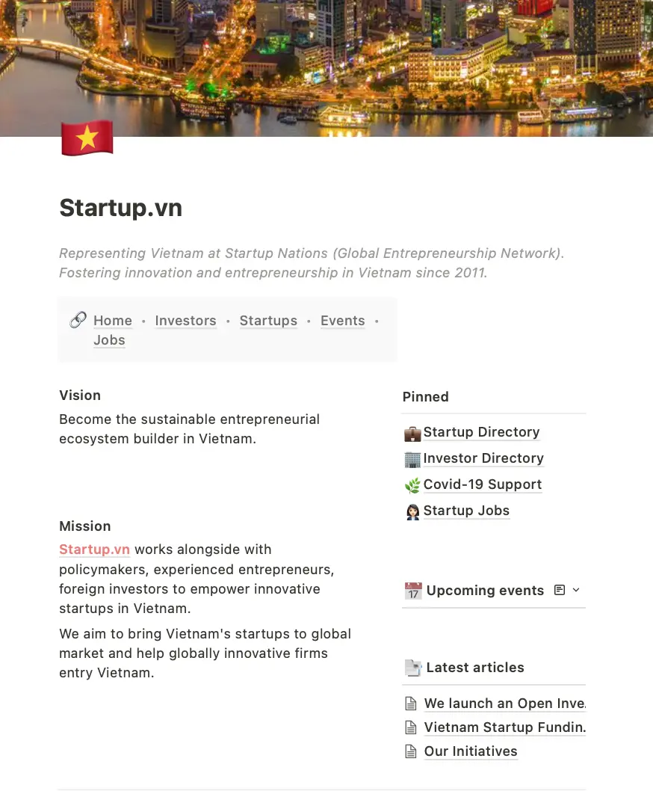

[startup.vn](http://startup.vn/) was founded 10 years ago, when the concept of "startups" was still fairly new in Vietnam. A handful of people from diverse backgrounds joined hands to create a homeland for Vietnamese who aim at building and growing their own businesses.

### Fostering innovation and entrepreneurship in Vietnam since 2011.
What started out as a weekend passion project quickly progressed into a strong, proud, aspiring community. 10 years in, [startup.vn](http://startup.vn/) is now one of the fast-growing entrepreneurial ecosystems in Vietnam, representing Vietnam at Startups Nation ([Global Entrepreneurship Network](https://www.genglobal.org/)).

With the true intention of community goodwill, we're honored to have joined forces with the [startup.vn](http://startup.vn/) team to bring the ecosystem to the next level. The first initiative is a complete revamp of [startup.vn](http://startup.vn/)'s official site, announcing the community's long-awaited digital footprint.

[startup.vn](http://startup.vn/) is now an access and connect point for over 490 Viet startups, 220 active investors all around the globe, 130 special deals, and a vast network of supporters.

>
> Moving forward, Dwarves will continue the support, as a way to elevate the community that we are a part of.

### Technical Highlights
- Notion website & database
- Form integration & automation